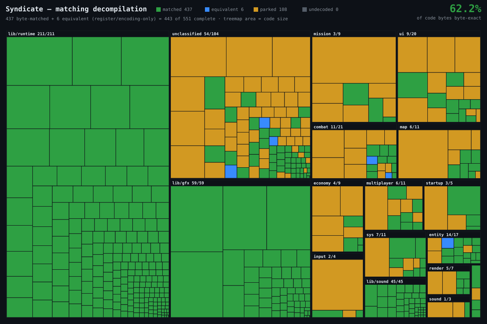

# Syndicate matching decompilation

<!--PROGRESS--><a href="https://github.com/WildPress/vibesynd/wiki"></a><!--/PROGRESS-->

A matching decompilation of the original 1993/95 DOS *Syndicate*: C source that,
compiled with the period Watcom toolchain, reproduces the game's machine code byte
for byte, one function at a time. A project to learn how decompilation works.

## Progress at a glance



Every function in the code segment, area proportional to its size, grouped by subsystem.
**Green** = our C compiles byte-identical to the original; **blue** = complete but not byte-identical
(same instructions, differs only in a register or equivalent encoding the compiler chose); **amber** =
decoded but still parked on a codegen wall. Regenerate with `python tools/treemap.py`; a live,
hover-able version and a matched-over-time chart are in `tools/progress.py` (local `dashboard/progress.html`).

## Start with the wiki

The **[project wiki](https://github.com/WildPress/vibesynd/wiki)** explains
everything in plain language: what a matching decompilation is, the DOS and Watcom
toolchain, the core concepts (stack frames, calling conventions, relocations and
OMF, compiler flags, register allocation), a running journal of the work, and a
growing map of what the game's code actually does. The wiki is generated from the
[`docs/`](docs/) folder in this repo, so it lives here too.

## Legal and hygiene

This works only from static and dynamic analysis of a binary you own. No original
source is used. The copyrighted game binary and extracted data (`inputs/`), the
Ghidra databases (`ghidra/`), and the abandonware Watcom toolchain (`toolchain/`)
are git-ignored and never committed. To use it you must supply your own copy of the
game. *Syndicate* and Watcom are © their respective owners; this project is
independent and unaffiliated.

## Layout

```
docs/            the wiki source: explainers, journal, game notes
src/             our written, matched C
tools/           the matching harness and analysis scripts
manifest/        functions.json (status), library map, recipes
ghidra_scripts/  headless inventory scripts
docker/          the pipeline image
inputs/ ghidra/ toolchain/ build/    git-ignored
```
