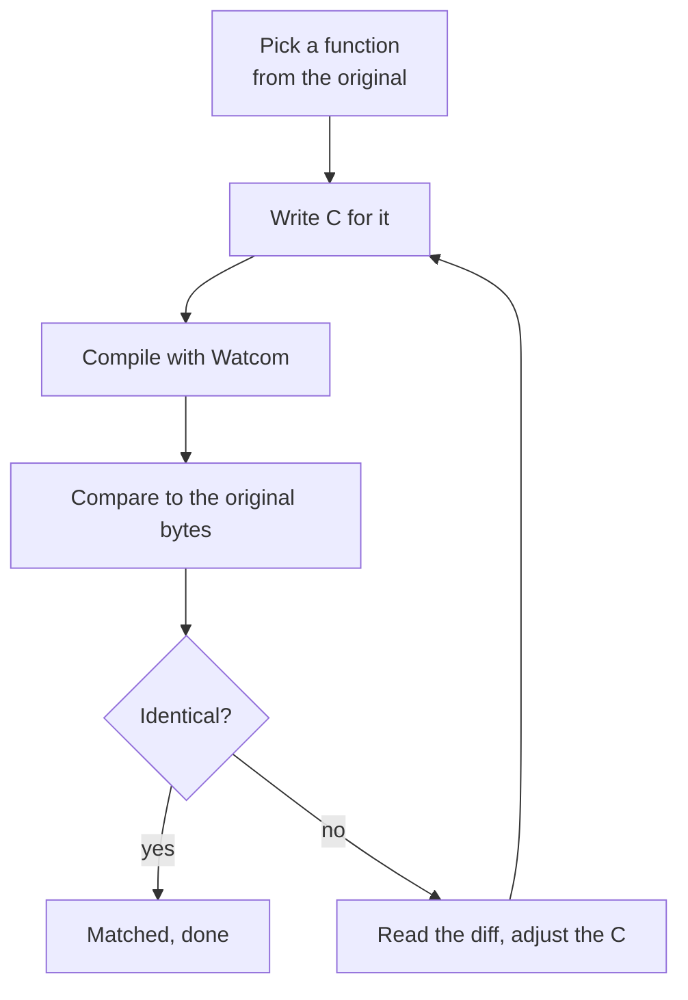

# Syndicate decompilation: my learning notes

This is a personal project to learn how decompilation actually works. I'm taking the
original 1995 DOS game *Syndicate* and rebuilding it as C source that compiles to the
exact same machine code, one function at a time.

I'm new to this and I'm not a reverse engineer. These pages are my own notes, written so
I can understand each idea from scratch and come back to them later when I've forgotten.

The work is a tight loop, run once per function until the bytes line up:

## What the project actually is

The game is a compiled program from 1995, a big block of machine code. I don't have the
source it was built from. The goal is to write C that, compiled with the same old
compiler, produces the identical bytes. Not code that behaves the same. Code that is the
same.

The point of being this strict is certainty. If my C compiles to the original bytes, it
does exactly what the original does in every case, because it is the original. There's
nothing to test and no edge cases to worry about. When a function matches, it's finished.

The page on [matching decompilation](matching-decompilation.md) covers why that's worth
the extra effort. Once enough of it is rebuilt this way, the whole game builds from
source, and after that it could be ported to a modern machine with real understanding of
every line.

## Start here

If the ideas are new, read them in roughly this order. Each page defines its terms as it
goes.

- **[The CPU, registers, and instructions](cpu-basics.md)**. The foundation the rest sits
  on. Come back here whenever a register or instruction is unfamiliar.
- **[DOS, protected mode, and DOS/4GW](dos-and-dos4gw.md)**. The platform the game runs
  on, and why it needs an extender to start.
- **[The Watcom compiler and toolchain](watcom.md)**. The tools that built the game, and
  the ones we use to reproduce it.
- **[Matching decompilation](matching-decompilation.md)**. The goal, and why byte-for-byte
  rather than "works the same".
- **[Stack frames](stack-frames.md)**. Framed and frameless functions, and what a stack
  frame even is.
- **[Calling conventions](calling-conventions.md)**. How a function receives its
  arguments, on the stack or in registers.
- **[Relocations and OMF](relocations-and-omf.md)**. Why addresses are blanks until link
  time, and how we compare around them.
- **[Compiler flags](compiler-flags.md)**. What the flags mean, and how we worked out
  which ones the game was built with.
- **[Register allocation](register-allocation.md)**. Why the compiler's choice of which
  register holds which value is the hardest thing to match.
- **[Game code vs the library](game-vs-library.md)**. A program is the game plus the
  compiler's runtime, and we only decompile the game.

The game itself, as we come to understand it:

- **[How the game works](game-systems.md)**. What the code actually does, the systems that
  make Syndicate run, filled in as we map them.
- **[The object model](object-model.md)**. The pools, records, and fields the whole game
  is built on.

And the running log of the actual work:

- **[Reverse-engineering journal](journal.md)**. What we tackled function by function, the
  thinking, the false starts, and how each one got matched.

A side experiment with the extracted art:

- **[A LoRA that draws new tiles](tile-lora.md)**. Training an image model on the game's
  own tiles so it can draw new ones in the same style. Not part of the game, a proof the
  extracted art is good enough to teach a model.

## Quick glossary

- **Machine code**. The raw bytes the CPU runs. The game is a big block of it, and our job
  is to produce the same bytes from C.
- **Disassembly**. Machine code shown as readable instructions like `mov eax, [esp+4]`. A
  view of the bytes, not the bytes themselves.
- **Decompilation**. Going further, from machine code back towards C source.
- **Matching**. Our discipline, where the C must compile to the exact original bytes, not
  just behave the same.
- **Relocation**. A spot where an address gets filled in later, at link or load time,
  rather than when the function is compiled.
- **Watcom**. The C compiler the game was built with. We run a preserved copy to reproduce
  its output.
- **OMF**. Object Module Format, the object-file format Watcom produces. Reading it tells
  us exactly where the relocations are.
