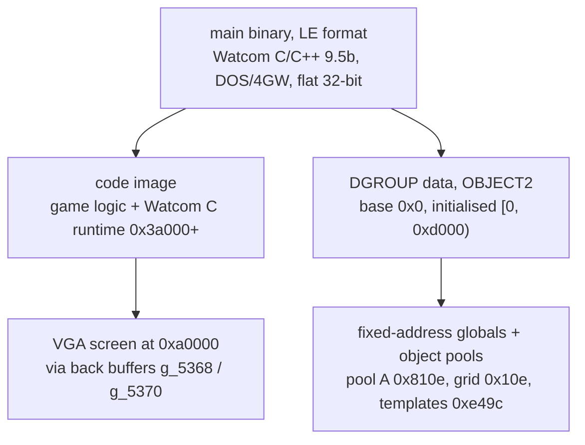
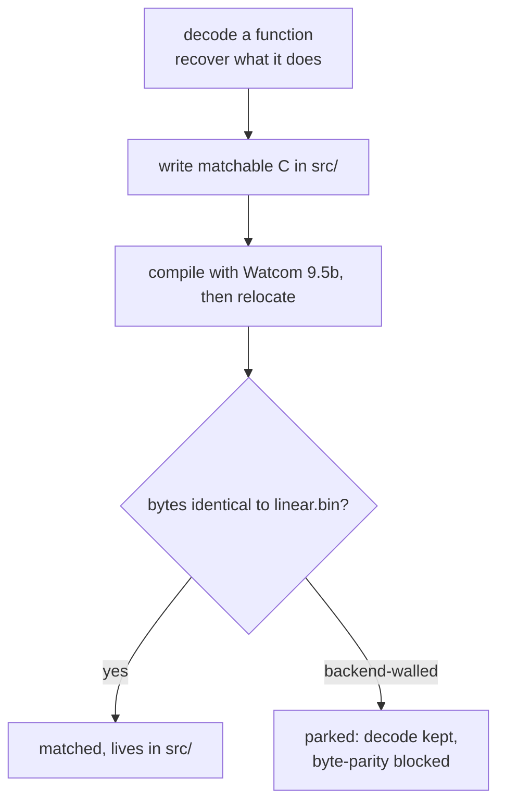

# Syndicate (1993/95 DOS): reverse-engineered architecture map

This is the map of how Syndicate's DOS executable fits together, drawn from the functions
we've decoded so far. It works from the ground up: the object pools and spatial grid that
hold the world, then startup, memory and file loading, the map, combat, UI, input,
multiplayer, sound, and the compiler's own runtime library. Each subsystem lists its
functions with a mark for whether we've reproduced the original bytes exactly or only
recovered what the code means.

Synthesised from 297 function-level decodes (175 byte-matched ✓, 122 parked-but-decoded ~) as of
cont. 25.

Companion docs: `object-model.md` (entity/pool field maps + global catalogue), `game-systems.md`
(map + command-interpreter subsystem deep-dives), `matching-playbook.md` (the byte-match method).

Status key: **✓** = byte-identical match in `src/`. **~** = decoded near-miss (semantics recovered,
byte-parity walled). Addresses are manifest (linear.bin) addresses.

This is the game's runtime structure, recovered bottom-up. Watcom C/C++ 9.5b, DOS/4GW, flat 32-bit
protected mode. The binary is `main` + a linked-in Watcom C runtime (`0x3a000+`).

---

## 1. Data model (see object-model.md for field-level detail)

- **Pool A, entities** (`g_810e`, records 0x5c=92B, `node = g_810e + id`, links are 16-bit ids).
  Agents, peds, vehicles, projectiles. Coords s16 `+4/+6/+8`, flags `+0xa/+0xb`, type/frame
  `+0x18/+0x19`, facing `+0x1a`, links `+0/+2/+0x1c/+0x24/+0x3a/+0x44`, health `+0x14`(w)/`+0x54`(b).
- **Pool `g_15e70`**, 256×0x1e records (bullets/effects). **Pool `g_11670`**, 0x24 records.
- **Spatial grid `g_10e`**, 128×128 u16 cell heads. Entities are threaded into a per-cell
  doubly-linked list keyed by their tile coords (insert/unlink below).
- **Map column table `g_5358`**, offset→pointer table. Tile class read via `g_10ac0[tile]`.
  The heavily-walled subsystem (register ties on the column-index chain).
- **Template/economy records**, `g_e49c`, stride **0x417** (1047B), indexed by `g_10b16`
  (current player). Equipment, research, funding. `g_e551[idx*0x417]` = agent base-slot header.
- **10-byte claim records `g_539c`/`g_539e`** (claim word +0, owner byte +2, value +6) for target
  claiming. **19-byte rows `g_b069`/`g_b072`**. **Shot accumulators** `g_10b5e`(x)/`5c`(y)/`5a`(z).
- **Direction tables** `g_ab60`(cos/dx), `g_ad60`(sin/dy), s16[256] indexed by facing byte.
- **Screen buffers** `g_5368`/`g_5370` (back buffers), VGA at `0xa0000`.

---

## 2. Startup & session init

- **✓ 0x24be8** command-line / `main` arg loop. BIOS video-mode save, build command string,
  set ~20 default flags, dispatch `-c/-d/-h/-i/-l/-n/-p/-s/-?` options, subsystem bringup + teardown.
- **✓ 0x12ca8** session init (clears bit 4 in each of 0x80 records). **✓ 0x254a8** keyboard-hook
  install (zeroes the 0x80-byte key-state table). **✓ 0x252d8** PIT timer setup + `d_setvec`.
- **~ 0x22858** mission/map init sequence (builds the `g_5358` column table, 3 pools, palette).
- **~ 0x20fc8** player/team record init (0x417 template records + `g_5788`/`g_539c` tables).

## 3. Memory, file I/O, decompression

- **✓ 0x184b8** DOS/DPMI memory-block (re)allocator. **~ 0x18158** alloc/init. **✓ 0x180f8**
  open+read+close wrapper. **✓ 0x18828** open(path,0x200).
- **✓ 0x179f8** container-file total-size scan. **~ 0x17b48** the matching container LOADER
  (3-phase: segment+chunk copy, relocation patch). **✓ 0x188e8** load+unpack. **✓ 0x18958** read
  header + detect RNC magic. **✓ 0x17998** buffered-read helper.
- **~ 0x27e78 / 0x28728** far (conventional-memory) allocation via DPMI int 0x31.

## 4. Entity pool & spatial grid

- Chain walks (matched, the reliable vein): **✓ 0x13bc8, 0x376f8, 0x37738, 0x37778, 0x37a48,
  0x36c28, 0x36c78**. Link/unlink leaves **✓ 0x37658 / 0x37878**.
- Grid threading: **✓ 0x26e18** head-insert into a cell list. **~ 0x26da8** unlink from cell.
  **~ 0x26c78** move entity to (x,y,z) (unlink old cell → insert new). **~ 0x2fbc8** detach from
  its type list. **~ 0x37918** drop/scatter carried items.
- Spawns: **✓ 0x1c178** into `g_15e70`. **✓ 0x22b38** free-slot scan of `g_15e70`. **✓ 0x22ba8**
  into `g_11670`.

## 5. Map / tile / minimap

- Grid-hit scans **✓ 0x33c38 (x) / 0x33cf8 (y)** twins. **✓ 0x33fb8** map-passability check.
- **~ 0x2d5b8 / 0x2d468** path/passability probe twins (16-entry tile-class jump table). **~ 0x34368**
  4-way compass tile-type probe. **✓ 0x28ec8** column lookup. **~ 0x20d18** column-table relocate.
- Minimap: **✓ 0x1a8c8 / 0x1a918** grid fill. **~ 0x19608** the full radar/tactical-map renderer
  (3474B, 3 jump tables: terrain/blip/objective, see game-systems.md).

## 6. Economy, equipment, research, funding

- **~ 0x223c8** apply an equip template row. **~ 0x12da8** build one. **~ 0x23158** the 5280B,
  41-body mission/orders command interpreter that consumes them (see game-systems.md).
- **~ 0x15f58** daily economy tick (busy-wait on game speed, funding commit, 50-region economic
  sweep + target reassignment). **~ 0x33568** funding-entry commit. **✓ 0x35b68** save-game (taxes
  cash at `g_e49c + p*0x417`). **✓ 0x164c8** per-player target reassignment sweep.
- Target claiming: **~ 0x264a8** slot-claim eligibility. **✓ 0x265d8** stats-panel drawer.
  **✓ 0x165f8 / 0x16638** claim-record scans.

## 7. Combat & weapons (the `0x34xxx` cluster)

- **~ 0x34858** top-level weapon fire (writes the `g_10b5e/5c/5a` accumulators). **~ 0x34198** shot
  march (loop-split). **✓ 0x34118 / 0x34168** damage core (`health -= dmg`). **~ 0x34088**
  collision query. **~ 0x34608** pick passable direction. **~ 0x34048** snap direction toward target.
- Projectile step twins **✓ 0x2d738 / 0x2d6c8 / 0x2d358**. **✓ 0x2e4f8** 4-direction step search.
  **~ 0x2e5f8 / 0x2e808** line-of-sight trace. **~ 0x30868** (re)acquire+engage target. **~ 0x2def8**
  projectile aim/turn selection. **✓ 0x2d3b8** shot-cursor commit. **✓ 0x30508 / 0x30708** entity
  update+HP. Reticle-ramp interpolators **~ 0x2d7a8 / 0x2d808 / 0x2d868**.

## 8. UI / rendering / text

- Text engine: **~ 0x36698** the core glyph drawer (6-byte font records). **~ 0x363d8** word-wrap
  layout. **~ 0x365e8 / 0x36648** width measure. **✓ 0x361a8 / 0x36208 / 0x36298 / 0x36338**
  centre+draw and hit-test+draw marshalling.
- Panels/menus: **~ 0x205f8 / 0x20728** menu list twins. **~ 0x20018** list select.
  **✓ 0x20158** item-detail panel. **✓ 0x265d8** stats panel. **~ 0x25d58** agent detail.
- Primitives: **✓ 0x1ff98** gauge bar. **✓ 0x35538 / 0x35588** bulk copy. **✓ 0x355d8** VGA blit.
  **✓ 0x263f8** masked blit. **✓ 0x35638** message line. **~ 0x36808** keyboard line-editor widget.
  **~ 0x19318** circle outline. **~ 0x26778** dashed line. **~ 0x1bc28** selection-marker dispatcher.
- HUD: **✓ 0x29c58** icon/text selector. **✓ 0x29ad8** status-line builder. **~ 0x2a288** radar panel.

## 9. Input

- **✓ 0x254a8** keyboard hook. **~ 0x20c88** keyboard sequence state machine. **✓ 0x28b88** mouse
  init (INT 33h). **~ 0x2ad58** mission-cursor target-action resolver (3694B).

## 10. Multiplayer (NetBIOS over DPMI)

- **~ 0x27428** session setup (player-count prompt, name broadcast, peer connect, ready-wait).
  **✓ 0x272b8** player-record sync barrier. **✓ 0x284a8 / 0x28558** NCB send/receive (DPMI mailbox
  opcodes 0x94/0x95). **~ 0x28228 / 0x28368** session ops (0x91/0x90). **~ 0x27d88** NCB submit.
  **✓ 0x279f8** far-ptr slot-table scan. **✓ 0x28878 / ~0x288f8** chunked transfer. **✓ 0x14078**
  net-sync message builder. Channel table `g_10644` (6-byte far ptrs, off@+0/sel@+4).

## 11. Command/mission interpreters (jump-table dispatchers)

The game's scripting layer. All co-locate their jump table before the code (see the JT-aware match
method). **~ 0x23158** (59-entry, 41 bodies, orders). **~ 0x2bca8 / 0x2bee8 / 0x2c218** command-list
interpreters. **✓ 0x37ad8 / 0x37d08** best-weapon-in-range selectors (19-entry). **✓ 0x149e8**
(10-entry). **~ 0x1a458** sprite-frame selector (45-entry). **✓ 0x29ad8** status line. **~ 0x2d0d8**
rate-driven byte drift.

## 12. Animation

- **✓ 0x2d228** animation tick (frame counter wrap). **~ 0x2bbe8** anim ticker. **✓ 0x13ac8 /
  0x13b38** palette-flash effects.

## 13. Sound / music

- **~ 0x35d08** sound-driver load+init. **~ 0x38cf8** XMIDI music-system init. **✓ 0x38fe8** sound
  channel select. **✓ 0x39xxx** a bank of `mov eax,imm; jmp 0x392ac` dispatch stubs (AIL-style
  driver entry points).
- **Driver dispatch (traced end to end).** The game loads sound drivers as separate resources, a
  digital driver and a music driver, each into its own heap block. A driver is a "Copy"-format
  resource: its header carries the marker `"Copy"` at offset 4 and a pointer to a dispatch table at
  offset 0. The table is a list of eight-byte entries, an opcode dword followed by a handler pointer,
  terminated by an opcode of `-1`. The pointers inside are relocated to the driver's load address as
  it loads.
- The bank of `mov eax,imm; jmp 0x392ac` stubs are the named entry points, one per operation. Each
  loads its opcode into `eax` and jumps into the dispatcher `0x39280`, which reads the current
  driver's table pointer from the per-driver slot array at DGROUP `0xbcfa`, walks it for the opcode,
  and returns the matching handler. `0x398d7` registers a loaded driver, checking the `"Copy"` marker
  and storing its table pointer into that slot array. `0x39625` installs a handler into one of the
  sixteen timer-callback slots at DGROUP `0xbbf4`, which a periodic dispatch loop at `0x39345` then
  calls. That dispatch, `CALL [ESI+0xbbf4]`, is where the long-standing sound crash lived, and the
  cause was ours, not the game's: our rebuild emitted the instruction's `0xbbf4` relocation across a
  record boundary, so the loader fixed up only its low byte and the dispatch read `0xbbf4` as `0xf4`.
  It called into a format string and died, but only with sound on. Fixed by keeping each relocation
  inside one record (see the journal entry on the sound crash); the driver itself was innocent.

## 14. C runtime (`0x3a000+`, Watcom CLIB3S, NOT game code)

Linked-in stdlib, identified by RTL fingerprint (`libname.py`). Matched via the leaf recipe
`-3s -d2` or `#pragma aux` transcription: **✓** strcpy, open, lseek, tell, labs, toupper, tolower,
isatty, outp, segread, d_getvec/d_setvec, qread, chktty, nibble-hex, and the framed forwarders.
Residual near-misses (atol, stricmp, strncmp, strnicmp, fgetc, ftell) are register-role/version
ties. The DOS-asm primitives (int 21h, in/out, Sreg) are hand-asm. Don't grind these as game code.

---

## Matchability map (why most match and the rest are walled)

Each function runs the same route, and the last step decides whether it counts as matched or
parked:

Matches concentrate in **clean subsystems**: startup, memory/DPMI/file-I/O, entity chain walks,
UI list/detail drawers, dispatchers (via the JT-aware method), and the C runtime. Parks concentrate
in **walled subsystems** whose register/scheduler choices aren't source-reachable with 9.5b:
- the **`g_5358` column-lookup** register triangle (map/tile/radar/combat),
- the **0x417-template selector** per-body register-pressure variation (economy/orders),
- the **NetBIOS EAX↔ECX** cascade (multiplayer),
- **encoding tie-breaks** (imm8/imm32, cross-byte xor, fixed in the encoder, not the allocator),
- **spill-slot / accumulator-selection** ties in loop-carried code.
See `matching-playbook.md` §3 for the full wall taxonomy. The parks are complete decodes. Their
byte-parity is blocked by the compiler's backend, not by missing understanding.
