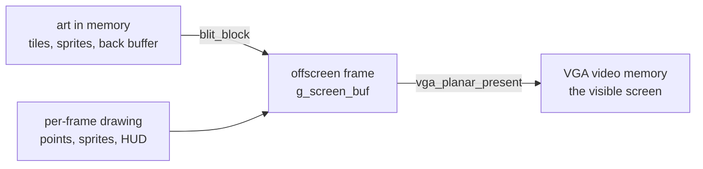

# Blitters, and how the game draws

A blitter is a routine that copies a rectangular block of pixels from one place to
another, quickly. The name is old graphics slang from "block transfer", shortened to
BLT and then blitter. Syndicate has no graphics chip to do this for it, so the copying
is done by the CPU, and the routines that do it are hand-written assembly so they run
as fast as possible.

That is the whole idea in one line: a blitter moves a block of pixels. The rest of this
page is what that means for Syndicate and why the code reads the way it does.

## Why the game needs them

This is a 1993 PC game running on VGA hardware with no graphics acceleration. Nothing
draws itself. Every single thing you see, the isometric map, the agents, the cars, the
HUD panels, the menus, is pixels that some routine copied into place. Doing that
thousands of times per frame, fast enough to feel smooth, is the job of the blitters.

## Draw offscreen, then show it

The game does not draw straight to the screen. It builds the whole frame in an ordinary
block of memory first, the offscreen buffer, and only when the frame is finished does it
copy the lot to video memory in one go. Drawing to a buffer the monitor isn't reading
means you never see a half-drawn frame, so the picture doesn't tear or flicker.

## Mode-X and the four planes

The part that makes the VGA code look strange is a display mode called mode-X. In
mode-X the video memory is split into four separate banks called planes. They all share
the same addresses, and a byte you write lands in whichever planes are switched on at
that moment. Which planes are on is set by one hardware register, the Sequencer's Map
Mask, reached through I/O port `0x3c4`.

So to copy a full image you can't just stream it in one pass. You switch on plane 0,
copy the quarter of the pixels that belongs to plane 0, switch on plane 1, copy its
quarter, and so on for all four. That is exactly why the present routine has four nearly
identical loops, one per plane, writing the masks `0x01`, `0x02`, `0x04`, and `0x08`.

Mode-X was popular with game programmers because it gives you more than one screen's
worth of video memory to work with and lets the hardware do fast fills, at the cost of
this awkward four-plane addressing.

## The three shapes of blit in Syndicate

There are commented, readable listings for one of each next to the raw bytes the build
uses. The `.c` file is the byte-exact build input; the `.asm` is the human-readable
companion (see [game code vs the library](game-vs-library.md) for why these functions
are raw bytes).

- **Plot a point** — `src/lib/gfx/`plot_point`.asm` (`plot_point`). Draws a single
  pixel with clipping, into either a 1-bit mask layer or an 8-bit buffer. The simplest
  possible case, one pixel.
- **Fill a region** — `src/lib/gfx/`fill_bytes`.asm` (`fill_bytes`). A size-optimised
  memset: set a run of bytes to one value, four at a time where the count allows. Used
  for clears.
- **Copy a block** — `src/lib/gfx/`blit_block`.asm` (`blit_block`). Copies a rectangle
  from one offscreen buffer to another, doing all four planes so the whole colour image
  moves. The workhorse that stamps tiles into the frame.
- **Draw a masked sprite** — `src/lib/gfx/`draw_sprite_rle`.asm` (`draw_sprite_rle`). Draws a
  character or object from run-length-encoded pixel data, skipping the transparent parts
  so the sprite layers cleanly over what's behind it. This is how the agents, cars, and
  objects appear. It has a fast path for fully-visible sprites and trimmed variants for
  each screen edge.
- **Present the frame** — `src/lib/gfx/`vga_planar_present`.asm` (`vga_planar_present`). Pushes
  the finished offscreen frame to the actual VGA display, one plane at a time through the
  Map Mask register. This is the step that makes a built frame appear on the monitor.

Two of these are the heart of it: `draw_sprite_rle` builds each frame by stamping masked
sprites into the offscreen buffer, and `vga_planar_present` shows the finished frame.

## Why they're hand-written assembly

These routines are the hottest code in the game. They run every frame, over huge numbers
of pixels, so every instruction counts. They lean on things a C compiler wouldn't reach
for on its own: `rep movsd` to copy four bytes per step, free use of every register, and
direct hardware port writes. You can tell they're assembly rather than compiled C because
each one saves and restores all the registers, including the ones a compiler treats as
scratch and never bothers to preserve.

That is also why we don't reconstruct them from C. There is no C source that makes the
compiler emit this exact code, so the build carries their original bytes verbatim and
these annotated listings stand in as the readable version.
