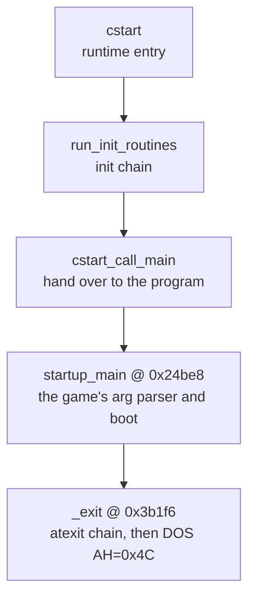

# The Watcom C runtime (CLIB)

Every C program links in a runtime library, and Syndicate is no exception. Under the game's own code sits a slab of Watcom's standard C library: the startup that runs before `main`, file I/O, `printf`, `malloc`, string and memory helpers, and the low-level DOS glue that makes all of it work. This is vendor code. The authors of Syndicate never wrote it, they just called it. We identify it and name it so the seam is clear, but we do not reconstruct it by hand. When the whole thing is rebuilt, the real library drops back in unchanged.

This page is an orientation to that library region, not a full standard-library reference. For why it sits apart from the game and how we proved it, see [game-vs-library.md](game-vs-library.md). For the toolchain, see [compiler-version.md](compiler-version.md): the runtime is Watcom C/C++ 9.5, small-model `CLIB3S`, proven byte-identical to the shipped library files.

## Where it lives

The library sits clustered near the top of the image, from about address `0x3a000` upward. The game's own logic is spread through the lower region. That boundary is the seam. Functions above it are the ones matched against the real Watcom library files, so their bytes are literally present in `CLIB3S` and did not come from the game's source.

The source files for this region live in `src/lib/runtime/`. Most are named `FUN_<addr>.c` after their address, with the real identity in a header comment at the top of each file. A few carry proper names (`heap_alloc.c`, `int386.c`, `segread.c`).

A note on shape. Much of this region is not plain C. The allocator core, the interrupt wrappers, the string primitives and the startup are hand-written assembly, transcribed byte-for-byte via `#pragma aux` rather than reconstructed from C. That is expected: these routines talk straight to DOS and to the CPU registers, which no C compiler would emit. We match their bytes, we do not pretend they are C we wrote.

## The startup path

Before `main` runs, the C runtime sets up the world. It runs the initialiser chain, then hands control to the program's entry, and on return it tears everything down and asks DOS to terminate.

`cstart`, `run_init_routines` and `cstart_call_main` are the vendor entry sequence. `startup_main` is where the game's own code begins: it parses the command line, sets defaults, brings up the subsystems and starts the timer. `_exit` runs the cleanup chain and terminates through DOS `int 21h`, `AH=0x4C`.

## The grouped map

### File I/O (the DOS handle layer)

The raw layer over DOS file handles. `open` and `sopen` open a file (via a shared `open`/`sopen` core), `read` and `write` transfer bytes with the text-mode CR/LF translation folded in, `close` releases the handle, `lseek` and `tell` move and report the position, `filelength` measures a file by seeking to the end and back, and a `setmode`-style helper switches a handle between text and binary. Errors from DOS pass through the error layer below.

### Stdio (buffered streams and `printf`)

The buffered `FILE*` layer on top of the handle layer. `fopen` opens a stream, splitting into a core opener and a mode-string parser. `fclose` flushes and tears the stream down. `fread`, `fseek`, `fgetc`/`getc`, `fgets` and the `fputc`/`fputs` writers move data through the buffer, with `fill_buffer` and `flush_stream` doing the actual refill and drain. Stream slots come from a free-list search (the `alloc_stream`/`_getstream` helper) and an `fd`-to-stream lookup.

The formatter is `_doprnt`, the engine behind `printf` and `sprintf`. It walks the format string, and for each `%` it runs a flag parser, a conversion-spec parser, a specifier dispatcher, and the field and fraction formatters. `sprintf` tails into `_doprnt` with a string sink.

### The near heap (`malloc`)

Small-model `malloc`/`_nmalloc` over a near heap. The allocator core rounds the request, walks the arena free-list, splits or unlinks a block and returns the payload. `free`/`_nfree` returns blocks. A heap-grow (sbrk-style) core extends the arena when it runs dry, and underneath that a DPMI/DOS paragraph allocator asks the extender for more DOS memory. `heap_alloc.c` holds the register-calling allocator core, transcribed as two `#pragma aux` blocks.

### String and memory

The usual primitives: `strlen` (with bounded far byte and wide variants), `strcmp`, `strcpy`, `memcpy` and `memset`, plus a byte-fill core and an aligned dword-fill core. Character helpers `tolower` and `toupper`, and `labs`. These are tight hand-asm and match the library byte-for-byte.

### Conversions

Number-to-text: `itoa` and `utoa`, plus an integer-to-padded-field helper shared with the `printf` path. `atol` lives on the game side of the calls but leans on the same conversion style.

### Process and path

Higher-level services. `system` runs a command by spawning a shell, built on a DOS exec (`dos_exec`) core with a switch-char and command-prefix helper. Path handling has a split-path and a make-path routine, and a path-separator normalise helper. `getenv` reads the environment, and an environment-setup routine (`setenvp`) builds the block at startup. There is also a temp-filename builder.

Two of the path names here are best-guesses. The window heuristic that first labelled these files mislabelled one nibble-to-hex helper as `fclose` and one path-separator normaliser as `makepath`, and the header comments say so. Treat `splitpath2` and `makepath` as working labels for the path family rather than confirmed exports.

### Interrupts and low-level glue

The register-level bridge to DOS and the BIOS. `int386` and `int386x` fire a software interrupt with a caller-supplied register set, `int386` reading the segment registers via `segread` first and delegating to `int386x`. Underneath sits the interrupt-call core that loads the registers, does the `int`, and copies the results back. Port I/O (`inp`, `outp`) and interrupt-vector get/set (`d_getvec`, `d_setvec`) round out the layer.

### The error layer

The thin bottom layer that carries DOS error codes up to C. A DOS-error handler stores the raw error and remaps it to a C `errno` value, and an `errno`-pointer accessor hands callers the location. The file I/O and process routines route their failures through here.

## What we do with it

Nothing, by design. We name the functions so the boundary between game and library is unambiguous, and we match their bytes so a full rebuild reproduces the original image. We do not hand-write C to recreate `strcpy` or `fopen`, because that is not the authors' code and there is no intent to reconstruct. At link time the real `CLIB3S` supplies these functions, exactly as it did in 1995. For the eventual port, everything below the seam is thrown away and replaced with the modern compiler's own runtime. Only the game above it carries across.
