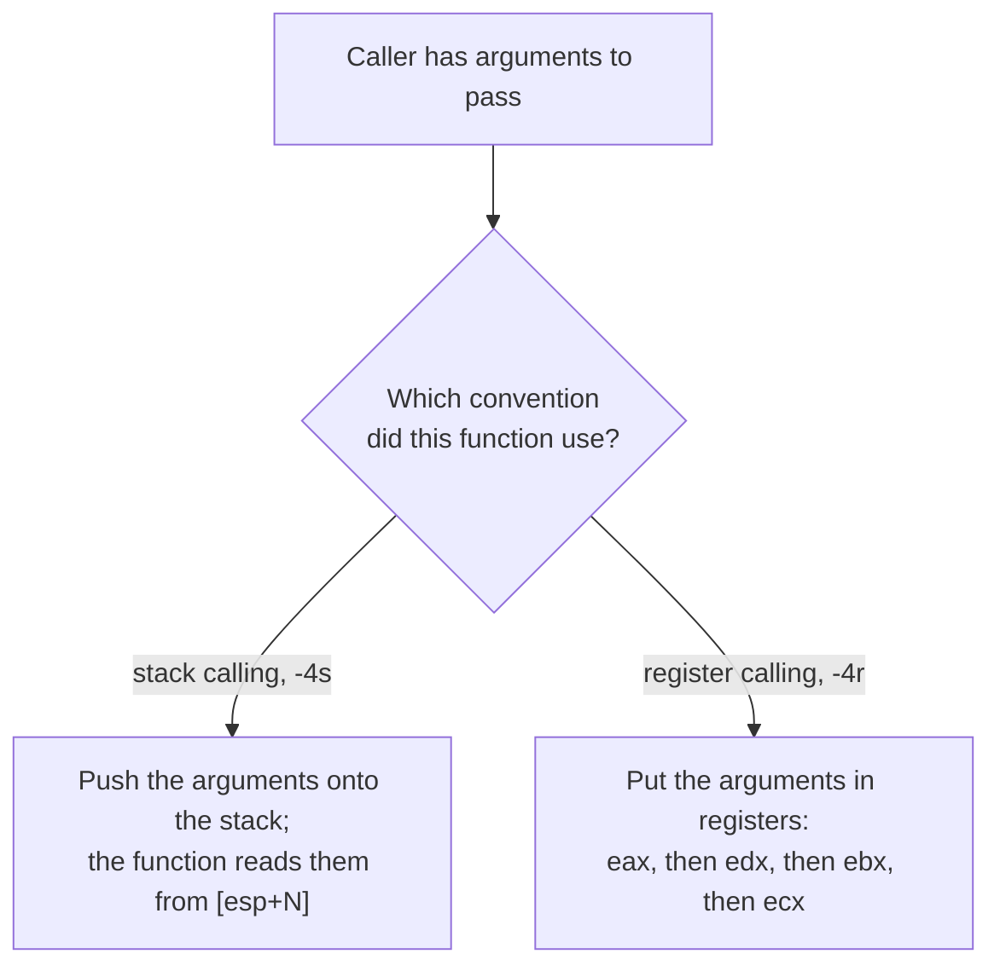
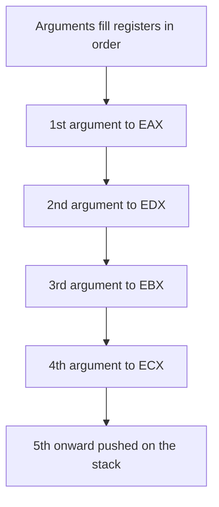

# Calling conventions

When one function calls another, they need a shared rule for where the arguments go
and where the answer comes back. This game uses two such rules, and this page shows
how to tell them apart from the disassembly. One passes arguments on the stack, the
other passes them in registers for speed.

A **calling convention** is the agreed rule for how a function receives its
arguments and hands back its result. Both sides, the caller and the function,
have to agree on it, or they'd be reading and writing different places.

There are two conventions in this game. Which one a given function uses is
something we read straight from its disassembly.



## Stack calling

In **stack calling**, the caller pushes the arguments onto the stack before making
the call, and the function reads them back off the stack. In the disassembly you
see the function fetch its arguments from positions like `[esp+4]` or `[ebp+8]`.

```
mov eax, [esp+4]     ; first argument, read from the stack
```

Watcom's flag for this is `-4s` (the `s` is for stack). It's what C programmers
would recognise as the ordinary way arguments get passed.

## Register calling

In **register calling**, the caller puts the first few arguments directly into
[registers](cpu-basics.md) instead of the stack, which is faster because registers
are quicker to reach than memory. Watcom's order is EAX, then EDX, then EBX, then
ECX. So a function's first argument arrives in EAX, its second in EDX, and so on.

The registers fill in that fixed order, and anything past the fourth argument spills
onto the stack:



```
; no reading from the stack; the argument is already in EAX
```

Watcom's flag for this is `-4r` (the `r` is for register).

## Reading which one a function uses

This is the practical skill. Look at how the function first touches its arguments:

- If it reads them from `[esp+something]` or `[ebp+something]`, it's stack calling,
  so we compile it with `-4s`.
- If it uses EAX or EDX straight away without loading them from the stack, it's
  register calling, so we compile it with `-4r`.

## Why one game has both

You might expect the whole game to use one convention. It doesn't, and that
surprised us at first. The answer is that Watcom lets a single program mix
conventions through markers in the source called `#pragma aux`. The original
author tagged some functions one way and some the other, most likely for speed on
the hot paths.

So the mix isn't two different builds. It's one build where individual functions
were marked by hand. That's why we pick `-4s` or `-4r` per function, matching the
marker the original author used, rather than choosing a single setting for
everything. It's the one flag that varies function to function. The rest are the
same across the whole game, covered in [compiler flags](compiler-flags.md).
