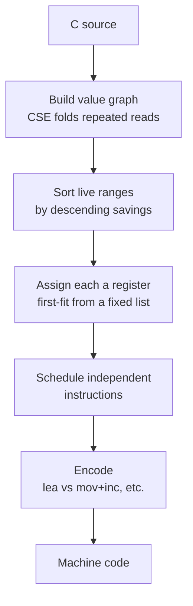
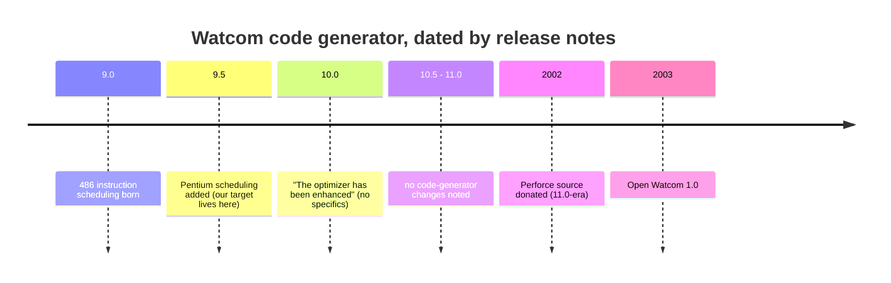
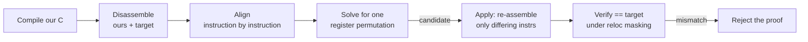
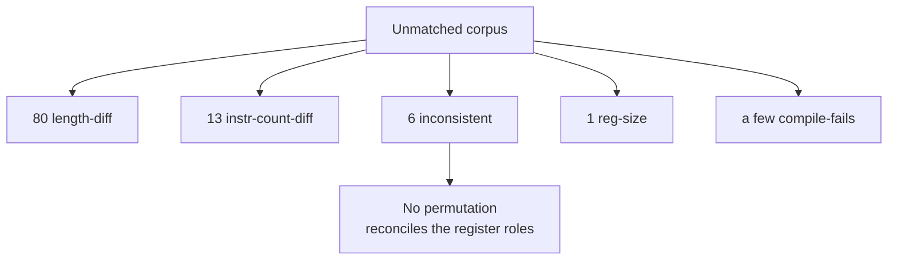

# Watcom codegen ties

Most of the functions this project cannot byte-match are not wrong. The C is correct and the behaviour is identical to the original. They miss by a handful of bytes because Watcom 9.5 had small internal freedoms where more than one machine-code encoding was equally valid, and the 1995 build happened to take a different one from ours. We call those a codegen tie, and they are the ceiling this decompilation runs into.

This page explains what that freedom actually is, why a few ties yield to rewriting the C and most do not, and why we cannot simply read the deciding rule off the compiler source. It draws on a reading of the real Open Watcom code generator, the Watcom release-note history, and a batch of controlled compile experiments against our own 9.5 toolchain.

The short version: the compiler has no randomness. Every byte is a deterministic function of the exact source, types, and flags. A tie is not the compiler flipping a coin. It is us not having a source form whose deterministic path through the code generator lands on the original's bytes. Sometimes that form exists. Often it provably does not.

## What the freedom actually is

When the compiler turns C into machine code, several stages have a legitimate choice between equivalent outputs. Three of these produce nearly all our ties.



**Register assignment.** Two values that are both live at once have to go in different registers. Which value gets which is where most ties live. The original might put a pointer in `ESI` and a counter in `EDI`, ours the other way round. Same instructions, same result, different register bytes.

**Instruction scheduling.** When two instructions do not depend on each other, their order is free. The original emits `load a; load b`, ours emits `load b; load a`.

**Encoding of one operation.** `x + 1` can be `inc eax` or `lea eax,[eax+1]`. A constant into memory can be one instruction or two. These are picked late, at encode time, and usually follow from the register choice rather than being a free choice of their own.

## The one rule we can trust: the register preference order

The code generator does not score all registers symmetrically. Each value gets a fixed, ordered list of candidate registers and takes the first one that is free and scores best. For 32-bit values the order is:

```
EAX, EDX, ECX, EBX, ESI, EDI, EBP, ESP
```

and for byte values:

```
AL, AH, DL, DH, BL, BH, CL, CH
```

These come from `bld/cg/intel/386/c/386rgtbl.c` (the `DoubleRegs` and `ByteRegs` tables) in the Open Watcom source, consumed first-fit in `GiveBestReg` (`bld/cg/c/regalloc.c`), where a strict greater-than means that on a pure score tie the earlier-listed register wins.

This order is the part we can rely on for 9.5. It is the register calling-convention order, anchored to the ABI, and it is the kind of hand-written table that does not drift between releases. When we know two values are competing, we know the compiler prefers to seat them `EAX` before `EDX` before `ECX`, and so on. What we cannot rely on is the rule that decides which value is the higher-priority competitor. That is where the ceiling sits, and the next two sections explain why.

## Why a few ties yield and most do not

A source rewrite can only change one thing the allocator sees: the value graph, meaning which values exist and how they fold together. It cannot reach in and reorder the allocator's priorities directly.

That distinction is the whole story. When a rewrite changes the value graph, it can crack a tie. When the values are fixed and only their register assignment differs, it cannot.

The functions we have matched by rewriting are all the first kind. `flag_hp_adjust` (0x36d18) is the clearest example. Re-reading `p[0xc]` inline in each branch, instead of caching it in a named local, makes the compiler fold the four reads into one common sub-expression held in a single register. That folded value then avoids `AL` for reasons downstream, and the bytes match. The lever worked because it changed what values existed, not because it renamed a register.

A controlled experiment mapped how far the levers reach. We took the cleanest register-role ties, some differing by as little as two bytes, and tried three axes in turn: source-spelling changes (use count, operand order, declaration order, temporaries), then a per-function compile-flag sweep, then a value-provenance restructuring. The results were mixed, and the mix is the point.

The source-spelling and register levers closed none, for consistent reasons.

- **Use count is not the tiebreak.** In `walk_sound_record_table` (0x35e68), a function byte-identical bar a three-way register rotation, the original ranks its *most-used* value last. Raising use counts is refuted by direct counterexample, not merely unproductive.
- **Some originals are simply less optimised than ours.** In `entity_event_dispatch` (0x2dd48) the original keeps a dead `mov eax,edx` and uses longer byte-tests, making it seven bytes larger than ours. No behaviour-preserving C produces a de-optimisation, so there is no form that reaches it.
- **The choice can be a pure internal tiebreak.** In `homing_step` (0x2e408) the whole residue cascades from one `imul` destination: the original writes the product to `EAX`, ours reuses a now-dead `EDX`. Both compute in the same order with the same liveness, and no source spelling, flag, or provenance change moves it.

But two further axes did reach some ties, and this is the correction to an earlier, too-pessimistic reading.

- **A per-function compile flag can flip a register colouring.** `load_tagged_resource` (0x38c28) was a clean `esi`/`edi` transpose that no source spelling moved. Dropping the single optimisation letter `a` (relax-alias) from the bundle, recipe `-4s -oentx`, treats the `fread`-written globals more conservatively and seats the two pointers exactly as the original, so the whole function matches. Watcom already allows per-function flags (there are hundreds of such overrides), so this is a legitimate match, recorded in `recipes.json`.
- **Changing where a value originates can flip its role.** `entity_aim_helper` (0x2f608) held two coordinates in the swapped register pair. Swapping the arguments of a provably-symmetric helper, `isqrt32(a*a+b*b)`, is inert to behaviour but changes the two values' live ranges enough to seat them as the original did, taking the diff from 22 bytes to 14. The remainder is now an instruction-scheduling tie, not a register one.

So register-role ties are not uniformly unreachable. Some yield to a per-function flag, some to a change in where a value comes from, and many yield to neither. Where none of the levers reach, it is because the residue is a pure internal tiebreak between equally valid choices, the `walk_sound_record_table` rotation and the `homing_step` `imul` destination being the clearest, and that tiebreak is the part no source form or flag we have touches. The register *order* is source-visible, its *resolution* among equally-scored registers usually is not, and that is the line between a reconstruction gap, which is fixable, and a codegen tie, which mostly is not.

## Why we cannot just read the rule off the source

The obvious next thought is to read the exact tiebreak out of the code generator and reverse it. We tried. The problem is provenance.



The open-source code generator is the 2002 Perforce donation, which is the 11.0-era codebase, byte-frozen. Every later commit is cosmetic cleanup. There is no open-source 9.5 or 10.0, so 11.0 is a hard upper bound on how close the source can get us to our compiler.

Between us and that source sits one undocumented event. The authoritative Watcom "Major Differences" changelog records the 9.5 to 10.0 transition as a single line, "the optimizer has been enhanced", with no detail. That is the change that breaks our 9.5 matches when we test 10.0, and its content was never written down.

Reading that against the seven rules we extracted, the register preference order survives as trustworthy, because it is ABI-anchored and 10.0's own notes say C code needed no recompilation. The tie-resolution heuristics, the savings weights and the move-scoring and the scheduler tiebreaks, are exactly the kind of thing an opaque "optimizer enhanced" release retunes, they leave no trace in the ABI, and for one of them, the `lea`-versus-`mov`-`inc` choice, our own compiler already disagrees with the 1995 target. So the rules that decide our ties are precisely the ones we cannot recover from any surviving source. The only oracle for them is the real 9.5 binary, which is what the project already leans on.

## What this means in practice

Treat a far-off function as a reconstruction gap and fix the C. Treat a function that is within a few bytes with every instruction already correct as a tie, and check its source header before spending compile budget on it.

For a tie, work three levers before parking it. First, whether a source rewrite can change the value graph: fold or unfold a repeated read, split or merge a temporary, change a type, or, as with `entity_aim_helper`, change where a value originates so it seats in a different register. Second, a per-function compile-flag sweep: dropping or adding a single optimisation letter can flip a colouring, as `-oentx` did for `load_tagged_resource`, and Watcom allows per-function recipes so this stays a legitimate match. Only if both of those fail, and the residue is which register two fixed values landed in or the order of two independent instructions, is it a genuine tiebreak no lever we have reaches, and the header should record that so nobody re-grinds it.

Our permuter (`tools/cpermute.py`) already searches the source side of this automatically. It mutates the C abstract syntax tree in semantics-preserving ways, recompiles hundreds of variants, and keeps a byte-match, the same idea as the N64 and PlayStation decomp-permuters. That is exactly the value-graph search above, mechanised. For these ties it converges to a best near-miss and stops, which is itself the signal that a wall is genuine rather than a spelling we have not tried.

The tempting next thought is a tool that rewrites the compiled machine code directly, relabelling registers in our object until it matches. This was scoped and set aside (see commit `49ad2b3`): a triage of the parked functions found zero clean register bijections. When Watcom seeds a value into a different register the choice cascades into a different instruction shape downstream, different modrm bytes, different fold decisions, different lengths, because some registers carry short-form encodings others lack (`test ax,ax` is shorter than `test dx,dx`). A plain register-renamer only works when the two versions have identical instruction shape and differ solely in the register fields, and essentially none of our ties are that. A tool that genuinely crossed them would have to reproduce those downstream shape changes as well, which is closer to forking Watcom 9.5's own code generator and enumerating its alternative valid choices than to a byte-level rewrite, and 9.5's code generator is exactly the thing no surviving source gives us. So there is no single cheap lever that clears the class.

But the class is not a uniform floor either, which is the honest correction to an earlier draft of this page. The per-function flag sweep and the value-provenance change are real levers that each reached a tie the source-spelling and register levers could not, and both are worth trying before parking a function. What is left after all of them is a genuinely stuck residue: pure allocator or scheduler tiebreaks between equally valid choices, resolved inside a 9.5 code generator we cannot inspect. Those are the floor. The rest is worth another look.

## Building the permuter and what it proved

The section above left the machine-code route as scoped and set aside. This session built its first slice and ran it over the whole unmatched corpus. The result is a firm negative: zero functions are a clean register renaming of their target. That confirms the earlier coarse triage in commit `49ad2b3` rather than overturning it, and the way the confirmation arrived is the part worth recording.

The tool is `tools/cg_permute.py`, a codegen permuter whose first slice is a register-permutation solver. It compiles our C, disassembles both our output and the target with capstone as x86-32, aligns them instruction by instruction, and solves for a single consistent permutation of the eight general-purpose registers that would turn our bytes into the target's. If such a permutation exists, the function is a clean register bijection: our provably-correct C compiled to nothing more than a relabelling of the original's registers.

### The bug the verifier caught

The first version had a soundness bug, and it is a useful one. It skipped instructions that were already byte-identical between the two versions, on the assumption they carried no information. They do. An unchanged instruction pins every register it names to itself. Skipping them meant the solver never recorded those fixed points, so it accepted permutations that an identity constraint should have forbidden. It reported three confident bijections: `vehicle_exit`, `shot_collision_query`, and `walk_sound_record_table`.

Building the applier is what exposed the bug. The applier is keystone-based. It re-assembles only the instructions that actually differ in a register field, applies the candidate permutation to those, keeps our own bytes everywhere else, and checks the result equals the target under reloc masking. Run against `vehicle_exit`, it failed. The function contains an `add eax,0` that is byte-identical in both versions, so `eax` is pinned to `eax`. A global `eax` to `edx` remap cannot hold when an instruction already keeps `eax` unchanged. The proof was false, and only the applier said so.



The lesson generalises past this one tool. Build the verifier or applier before trusting a solver's proof. The confident three bijections were an artefact of a missing constraint, and nothing short of re-assembling the bytes would have surfaced it.

### The sound result

The fix was to add identity constraints for every byte-identical instruction, so a register used unchanged is recorded as fixed. The sound re-run over the whole unmatched corpus returned zero clean register bijections. The taxonomy of why each function fails divides cleanly.



Most fail before the solver even reaches the register question. Eighty differ in total length and thirteen in instruction count, so there is no instruction-by-instruction alignment to permute in the first place. One differs in register size. The interesting bucket is the six inconsistent cases, where a register is used fixed in some instructions and would need remapping in others, and no single permutation reconciles the two. Those are the cases where the target places values in registers in a way that transforming our output cannot reach at all.

### What this rules out

The reading is narrow but firm. Pure register renaming matches nothing in our corpus. Every remaining tie also differs in encoding, scheduling, or length, which is the same downstream-cascade point the previous section made, now measured rather than argued.

A tool that genuinely crossed these would need far more than a relabelling. It would need re-encoding with length fixups and an instruction-scheduling search, which is superoptimiser-class work over x86, and the six inconsistent cases hint that some targets are not reachable by transforming our output under any permutation. That is a large and uncertain research project rather than a quick win, and this session's result is best read as closing the cheap version of the idea for good while leaving the expensive version honestly open.

## The compiler-flag sweep and what it proved

The permuter closed the "reshape our output" idea. A separate question stayed open: are the recorded compile recipes even right? One function proved they can be wrong outright. `new_campaign_reset` was tagged `-4r` (register calling) but the real target passes arguments on the stack, so it needed `-4s`. Under `-4r` no source edit could ever match it, because the call sites were the wrong shape from the start. That is not a tie, it is a mislabelled recipe, and the fix is a flag.

So `tools/flag_sweep.py` hunts the rest of that class. For every unmatched function it takes the recipe the compiler actually uses, generates a focused matrix of flag variants, compiles each with the period 9.5b toolchain, and runs the same reloc, register and slot-aware verdict as `regdiff`. The matrix covers the calling convention flip (`-4r` against `-4s`), five optimisation bundles (`-ox`, `-os`, `-ot`, `-oaxt`, and the inline modifiers `-oi`, `-oe`), the architecture model (`-3` and `-5` against the usual `-4`), and struct packing (`-zp4`, `-zp1`). That is twelve variants a function.

The result is a clean negative. Across 105 functions and 1260 compiles, with no compile failures, nothing reached a match the recipe missed, and nothing even climbed the verdict rank. Baseline recipes came in at 101 structural and 4 register-role, and no variant improved on any of them.

| Outcome | Count |
| --- | --- |
| Variant reaches a match the recipe missed | 0 |
| Variant improves the verdict rank | 0 |
| Recipe already the best of its matrix | 105 |

Two smaller findings came out of it. The `-oh` repeated-optimisation flag is a 10.x and 11.x option that does not exist in 9.5, so that axis is not real here. And the architecture flip is a genuine dead end rather than an untested guess: every matched function in the corpus builds under `-4`, and `-3` or `-5` improved nothing among the unmatched.

The reading is the same as the permuter's, now measured on the flag axis too. The recipes are right, and the residues are Watcom 9.5 codegen differences that no flag in the compiler reaches. `new_campaign_reset` was the one real recipe bug, and the sweep found no others.

## See also

- [Matching decompilation](matching-decompilation) for the overall method.
- [Register allocation](register-allocation) for the allocator background.
- [The matching playbook](matching-playbook) for the source levers that do work.
- [Compiler version](compiler-version) for why the toolchain is 9.5.
