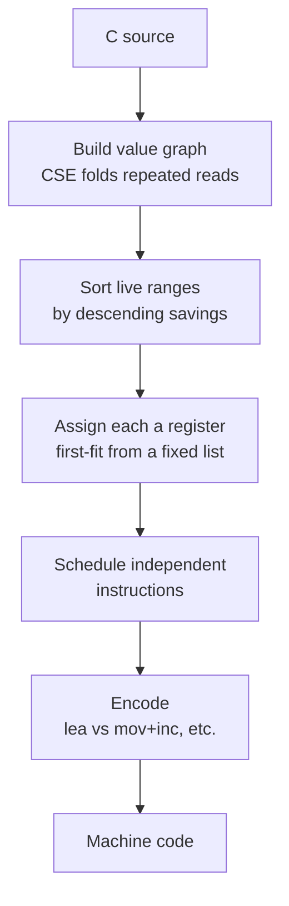
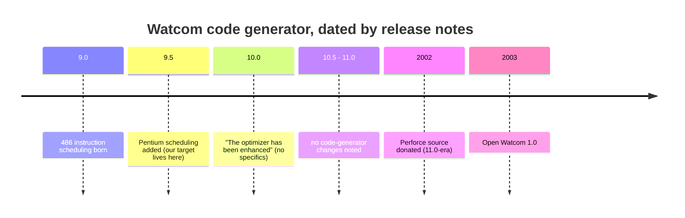

# Watcom codegen ties

Most of the functions this project cannot byte-match are not wrong. The C is correct and the behaviour is identical to the original. They miss by a handful of bytes because Watcom 9.5 had small internal freedoms where more than one machine-code encoding was equally valid, and the 1995 build happened to take a different one from ours. We call those a codegen tie, and they are the ceiling this decompilation runs into.

This page explains what that freedom actually is, why a few ties yield to rewriting the C and most do not, and why we cannot simply read the deciding rule off the compiler source. It draws on a reading of the real Open Watcom code generator, the Watcom release-note history, and a batch of controlled compile experiments against our own 9.5 toolchain.

The short version: the compiler has no randomness. Every byte is a deterministic function of the exact source, types, and flags. A tie is not the compiler flipping a coin. It is us not having a source form whose deterministic path through the code generator lands on the original's bytes. Sometimes that form exists. Often it provably does not.

## What the freedom actually is

When the compiler turns C into machine code, several stages have a legitimate choice between equivalent outputs. Three of these produce nearly all our ties.



**Register assignment.** Two values that are both live at once have to go in different registers. Which value gets which is where most ties live. The original might put a pointer in `ESI` and a counter in `EDI`, ours the other way round. Same instructions, same result, different register bytes.

**Instruction scheduling.** When two instructions do not depend on each other, their order is free. The original emits `load a; load b`, ours emits `load b; load a`.

**Encoding of one operation.** `x + 1` can be `inc eax` or `lea eax,[eax+1]`. A constant into memory can be one instruction or two. These are picked late, at encode time, and usually follow from the register choice rather than being a free choice of their own.

## The one rule we can trust: the register preference order

The code generator does not score all registers symmetrically. Each value gets a fixed, ordered list of candidate registers and takes the first one that is free and scores best. For 32-bit values the order is:

```
EAX, EDX, ECX, EBX, ESI, EDI, EBP, ESP
```

and for byte values:

```
AL, AH, DL, DH, BL, BH, CL, CH
```

These come from `bld/cg/intel/386/c/386rgtbl.c` (the `DoubleRegs` and `ByteRegs` tables) in the Open Watcom source, consumed first-fit in `GiveBestReg` (`bld/cg/c/regalloc.c`), where a strict greater-than means that on a pure score tie the earlier-listed register wins.

This order is the part we can rely on for 9.5. It is the register calling-convention order, anchored to the ABI, and it is the kind of hand-written table that does not drift between releases. When we know two values are competing, we know the compiler prefers to seat them `EAX` before `EDX` before `ECX`, and so on. What we cannot rely on is the rule that decides which value is the higher-priority competitor. That is where the ceiling sits, and the next two sections explain why.

## Why a few ties yield and most do not

A source rewrite can only change one thing the allocator sees: the value graph, meaning which values exist and how they fold together. It cannot reach in and reorder the allocator's priorities directly.

That distinction is the whole story. When a rewrite changes the value graph, it can crack a tie. When the values are fixed and only their register assignment differs, it cannot.

The functions we have matched by rewriting are all the first kind. `flag_hp_adjust` (0x36d18) is the clearest example. Re-reading `p[0xc]` inline in each branch, instead of caching it in a named local, makes the compiler fold the four reads into one common sub-expression held in a single register. That folded value then avoids `AL` for reasons downstream, and the bytes match. The lever worked because it changed what values existed, not because it renamed a register.

The functions we cannot match are the second kind, and a controlled experiment made that concrete. We took eight of the cleanest register-role ties, some differing by as little as two bytes, and tried both plausible source levers on each: raising a value's use count, and restructuring so a move lands the value in the target register. None closed. The reasons were consistent and instructive.

- **Use count is not the tiebreak.** In `walk_sound_record_table` (0x35e68), a function that is byte-identical bar a three-way register rotation, the original ranks its *most-used* value last. Raising use counts is refuted by direct counterexample, not merely unproductive.
- **There is often nothing to restructure.** In the clean transposes like `load_tagged_resource` (0x38c28) and `draw_slot_record_chain` (0x1b908), the competing values arrive by plain loads with no adjacent register-to-register move to collapse or relocate. The surgical lever has no material to work with.
- **Some originals are simply less optimised than ours.** In `entity_event_dispatch` (0x2dd48) the original keeps a dead `mov eax,edx` and uses longer byte-tests, making it seven bytes larger than ours. No behaviour-preserving C produces a de-optimisation, so there is no form that reaches it.
- **The choice can be a pure internal tiebreak.** In `homing_step` (0x2e408) the whole residue cascades from one `imul` destination: the original writes the product to `EAX`, ours reuses a now-dead `EDX`. Both compute in the same order with the same liveness. It is an internal preference with no source handle at all.

So the register order is source-visible, but the tiebreak among equally-scored registers is not. That is the line between a reconstruction gap, which is fixable, and a codegen tie, which is not.

## Why we cannot just read the rule off the source

The obvious next thought is to read the exact tiebreak out of the code generator and reverse it. We tried. The problem is provenance.



The open-source code generator is the 2002 Perforce donation, which is the 11.0-era codebase, byte-frozen. Every later commit is cosmetic cleanup. There is no open-source 9.5 or 10.0, so 11.0 is a hard upper bound on how close the source can get us to our compiler.

Between us and that source sits one undocumented event. The authoritative Watcom "Major Differences" changelog records the 9.5 to 10.0 transition as a single line, "the optimizer has been enhanced", with no detail. That is the change that breaks our 9.5 matches when we test 10.0, and its content was never written down.

Reading that against the seven rules we extracted, the register preference order survives as trustworthy, because it is ABI-anchored and 10.0's own notes say C code needed no recompilation. The tie-resolution heuristics, the savings weights and the move-scoring and the scheduler tiebreaks, are exactly the kind of thing an opaque "optimizer enhanced" release retunes, they leave no trace in the ABI, and for one of them, the `lea`-versus-`mov`-`inc` choice, our own compiler already disagrees with the 1995 target. So the rules that decide our ties are precisely the ones we cannot recover from any surviving source. The only oracle for them is the real 9.5 binary, which is what the project already leans on.

## What this means in practice

Treat a far-off function as a reconstruction gap and fix the C. Treat a function that is within a few bytes with every instruction already correct as a tie, and check its source header before spending compile budget on it.

For a tie, the productive question is whether a source rewrite can change the value graph: fold or unfold a repeated read, split or merge a temporary, change a type so a value is held differently. If the only difference is which register two fixed values landed in, or the order of two independent instructions, no source form will reach it, and the header should record that so nobody re-grinds it.

Our permuter (`tools/cpermute.py`) already searches the source side of this automatically. It mutates the C abstract syntax tree in semantics-preserving ways, recompiles hundreds of variants, and keeps a byte-match, the same idea as the N64 and PlayStation decomp-permuters. That is exactly the value-graph search above, mechanised. For these ties it converges to a best near-miss and stops, which is itself the signal that a wall is genuine rather than a spelling we have not tried.

The tempting next thought is a tool that rewrites the compiled machine code directly, relabelling registers in our object until it matches. This was scoped and set aside (see commit `49ad2b3`): a triage of the parked functions found zero clean register bijections. When Watcom seeds a value into a different register the choice cascades into a different instruction shape downstream, different modrm bytes, different fold decisions, different lengths, because some registers carry short-form encodings others lack (`test ax,ax` is shorter than `test dx,dx`). A plain register-renamer only works when the two versions have identical instruction shape and differ solely in the register fields, and essentially none of our ties are that. A tool that genuinely crossed them would have to reproduce those downstream shape changes as well, which is closer to forking Watcom 9.5's own code generator and enumerating its alternative valid choices than to a byte-level rewrite, and 9.5's code generator is exactly the thing no surviving source gives us. So there is no cheap lever waiting here. The register-role class is, on the current evidence, the floor.

## See also

- [Matching decompilation](matching-decompilation) for the overall method.
- [Register allocation](register-allocation) for the allocator background.
- [The matching playbook](matching-playbook) for the source levers that do work.
- [Compiler version](compiler-version) for why the toolchain is 9.5.
