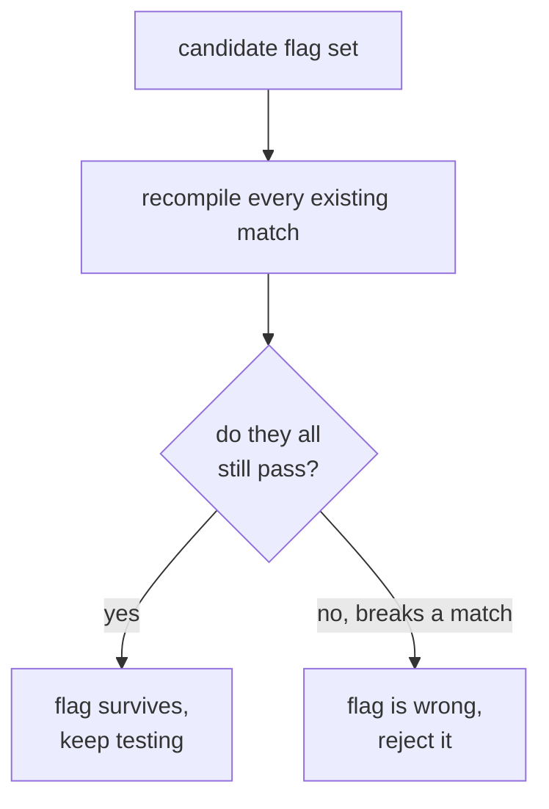

# Compiler flags

This page covers the exact compiler options the original game was built with, and why
ours have to match them precisely. The same C compiled with different flags gives
different bytes, so we pinned the flags down by recompiling every function we already
match and keeping only the settings that never break one. Below is what each flag
does and how sure we are of each.

A **compiler flag** is an option you pass to the [compiler](watcom.md) to change how
it turns your C into machine code. The same C, compiled with different flags,
produces different bytes. Since we need the *exact* original bytes, we have to use
the exact flags the original was built with.

The flags we settled on are `-4s -oneatx -zp8 -s -zq` (with `-4r` instead of `-4s`
for register-calling functions). Here's what each part means and how sure we are of
it.

## What each flag does

- **`-4`**: the CPU level. It tells the compiler which processor to optimise for.
  `-4` means the 486. This matters because newer chips have instructions the
  compiler will happily use if you let it, and the original doesn't have them. We
  know it's `-4` because one function uses a `movsx` instruction that the Pentium
  setting (`-5`) would replace with something else.
- **`s` or `r`**: the calling convention, stack or register. This is the one thing
  that varies per function. See [calling conventions](calling-conventions.md).
- **`-oneatx`**: the optimisation bundle. Optimisation is the compiler working
  harder to produce faster or smaller code. `-oneatx` is a particular set of
  optimisation options bundled together. Different bundles produce different code.
- **`-zp8`**: struct packing. This controls how the compiler lays out the fields of
  a struct in memory, specifically how much padding it inserts between them.
- **`-s`**: turn off stack overflow checks. Release games disabled these, and if
  they were on we'd see extra checking instructions in every function's prologue,
  which we don't.
- **`-zq`**: quiet mode. Just tells the compiler to print less. It has no effect on
  the output bytes.

## How we worked out the flags were right

This is the interesting part, because we didn't just assume. We built a way to
check.

The idea is a **regression baseline**. We already have a set of functions that
match. If a candidate set of flags is correct, it has to still reproduce *all* of
those. So for any flag we want to test, we recompile every existing match with it
and count how many still pass. Anything that breaks an existing match is wrong,
because we know those functions are genuinely correct.

Running that check settled things:

- The optimisation bundle `-oneatx` is **pinned**. Every alternative we tried
  breaks matches we already have. `-ox` breaks a few, `-ot` breaks more, `-os`
  breaks a lot. So `-oneatx` isn't just one setting that happens to work, it's the
  one that survives when the others don't.
- The CPU level is `-4`, pinned by that `movsx` instruction.
- Stack checks are off, because we never see the checking instructions.
- Struct packing (`-zp8`) is the one flag we *cannot* confirm from what we have.
  `-zp8`, `-zp4`, and `-zp1` all keep every existing match, because none of our
  matched functions have a struct whose layout would change between them. So we
  assume `-zp8` but haven't proven it. We can sidestep it anyway by writing struct
  layouts out by hand.

The tools for this are `tools/recipes.py`, which records the flags each match
needs, and `tools/caltest.py`, which tries a candidate set against the whole
baseline.

## The build was module profiles, not one flag

It is tempting to think the whole game was compiled in one go with a single set of
flags. It wasn't, and it wasn't per-function either. The truth sits in between: a
small number of profiles, one per module or library, exactly as a real makefile
produces.

We tested this directly. `tools/arch_audit.py` recompiles every matched function
under both `-3s` (386) and `-4s` (486), holding the other flags, and records which
one the original bytes agree with. The result across 394 functions:

| bucket | count | meaning |
| --- | --- | --- |
| matches under both | 240 | the two arches emit identical bytes, so the arch is arbitrary here |
| only `-4s` | 118 | 486 scheduling, and the original agrees |
| only `-3s` | 21 | 386 scheduling, and the original agrees |
| neither | 15 | needs an extra flag (`-of` or `-d2`) beyond arch |

The 118-to-21 split is the tell. Where the arch actually changes the bytes, the
original overwhelmingly agrees with `-4s`, so the game's own code was built for the
486. The 21 that want `-3s` are almost all C runtime routines (`malloc`, `printf`,
`fopen`, `strchr`, `free`), which is the Watcom library, shipped precompiled for the
386 and linked in. The 15 that need more are almost all `snd_cmd_*` sound handlers,
a module built with its own flags again.

So there are three profiles: the game code at `-4s -oneatx`, the C runtime at `-3s`,
and the sound module with `-of` or `-d2` on top. The binary corroborates the
toolchain from the outside: it embeds the `DOS/4GW` extender (so flat 32-bit model)
and the run-time banner "WATCOM C/C++32 Run-Time system (c) 1988-1993", which puts
it in the 9.5 era.

The practical rule that falls out: pin each function to its module's profile, not to
whatever flag happened to match it first. A function whose recipe drifts from its
module's profile is the signal to look at, because the odd flag is usually hiding a
C bug rather than reflecting a real build choice.

## Why this discipline matters

Pinning the flags does something quietly important. Once you know the flags are
right, a function that comes out wrong can only mean one thing: your C is not what
the original author wrote. It can't be blamed on a flag any more.

So instead of fiddling with flags when something doesn't match, we hold them fixed
and work on the C. The byte difference becomes a clue about the original source,
not an excuse to go flag-hunting. That's the right way round for a matching decomp.
