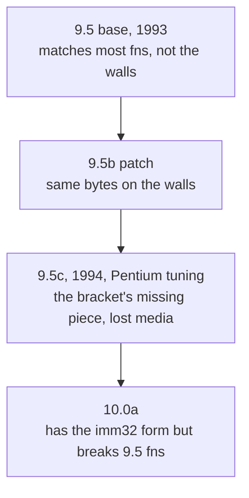

# Compiler-version investigation (the wall on reaching 500/500)

This page tracks a long hunt for the exact Watcom build the game was compiled with.
Most functions match our base 9.5, but a stubborn set of near-misses (the walls) carry
codegen tricks that only turn up in later Watcoms. The investigation bracketed the
game's compiler between 9.5b and 10.0a and pointed at a 1994 release, 9.5c, that was
never preserved. The final, verified conclusion reverses that: no available Watcom
matches both the walls and the functions we already match, so the wall bytes are most
likely driven by a specific C construct rather than a lost compiler.

The versions in play, and where the game's build was thought to sit:



## FINAL RESULT (cont. 16), CORRECTION: 9.5c found + built, but it is NOT the wall-breaker

**9.5c WAS obtainable** (the earlier "lost media" claim was wrong): archive.org `Watcom_C_9.5`'s
`c32_c.zip` is the June-1994 **.C patch** (`APPLYC.BAT`, `WCC386D.C`, level `.c`). Built it by
chaining `bpatch` A→B→C on our base `WCC386.EXE` → `toolchain/watcom95c/BIN/WCC386.EXE`
(628286 B, "patched to level '.c'"). Compile driver: `tools/wcc95b/wcc_95c.sh`.

**But 9.5c does NOT unlock the walls.** It is byte-identical to base 9.5 on every wall (0x34048:
same `xor dh,dh` + imm8, NOT the target's `xor dh,ah` + imm32) and it **unlocked 0 of 44** parked
near-misses (tested `-4s` and `-5s`). It also doesn't regress the matched fns. So the entire 9.5
progression, **9.5 = 9.5b = 9.5c**, behaves the same on these functions.

**Conclusion reversed:** the register-role/address-fold/peephole walls are **NOT a 9.5 patch-level
artifact.** The `imm32` tell appears only in **10.0a**, which breaks other functions. So no obtainable
Watcom (9.5/9.5b/9.5c/10.0a) matches BOTH the 133 already-matched fns AND the walls. This means the
walls are either (a) a 10.0-*base* compiler we haven't tried (unlikely to be clean, since 10.0a already
regresses), or (b) genuinely source-reachable with forms the bounded agents/permuters didn't find,
i.e. NOT proven to be compiler-locked after all. Either way, the version hunt is closed: no available
compiler is the answer. Bank the matchable functions. Treat the walls as hard-but-possibly-source-
reachable, not as a definitively-lost-compiler blocker.

---
## (superseded) original conclusion

The game's **RUNTIME LIBRARY** is Watcom C/C++ **9.5, small-model CLIB3S** (proven byte-identical
by `tools/libname.py`, see the RTL work). But the game's **CODE** was compiled by a **different
9.5-branch build** of `wcc386` than the base 9.5 we have. Our compiler makes systematically
different codegen choices that **no source form or `-o` flag can override**, so ~50% of the
remaining functions are byte-identical to the target *except* for these choices and cannot be
matched with our current `wcc386`.

## The divergent codegen (the "walls"), each confirmed on multiple functions

| our base 9.5 wcc386 | the game's wcc386 | functions |
|---|---|---|
| fold address into SIB `[base+idx*N]` | callee-saved base + **un-folded** `lea;add;mov[reg]` | 0x269d8, 0x20d18, 0x35f78, 0x33b88 |
| `add eax,imm8` (`83 c0 20`) | accumulator `add eax,imm32` (`05 20 00 00 00`) | 0x34048, 0x16678 |
| `xor dh,dh` | `xor dh,ah` (cross-byte) | 0x34048 |
| duplicate epilogue | share one epilogue via `jmp` | ftell 0x3da03, fgetc 0x3d3e4 |
| accumulator → EDX | accumulator → EBX | atol 0x3a526 (confirmed by 33k-variant permuter) |
| left-operand → accumulator | reversed operand→register roles | 0x36648, 0x33b88 |

These are **Pentium-scheduling** characteristics (accumulator forms, address-unfolding to avoid
SIB/prefix pipeline penalties). The game shipped **Feb 1995** (Pentium era). Watcom **9.5c (1994)**
added Pentium tuning. Our base **9.5 (1993)** predates it. Open Watcom v2 (container default) uses a
*third*, different allocator, not a match either. Proof it's not source-reachable: flag sweeps,
~35 hand-variants/function, and a 33,000-variant `cpermute` run all fail on the *same* byte.

## What we have / need

- **Ours:** `toolchain/watcom95`, banner **"WATCOM C32 Optimizing Compiler Version 9.5"** (base,
  no patch letter). `WCC386.EXE` is 627702 B (DOS/4GW-**bound**).
- **Patches exist:** 9.5a / 9.5b / 9.5c (9.5c = 1994, the Pentium one). Downloaded the **9.5b patch**
  (`toolchain/w95b_dl/Patch32.zip`, archive.org `watcom-9.5b`) + a base-9.5 patch set
  (`c32_*.zip`, archive.org `Watcom_C_9.5`). Both are `bpatch`-format patch sets, **not** base
  installs.
- **`bpatch` works:** `toolchain/watcom10a/WATCOM/BINB/BPATCH.EXE` (v1.3, DOS) runs under DOSBox.
  `Patch32/A/WCC3862.A` targets `wcc386.exe` and reports the **exact requirement**:

  ```
  Error! 'wcc386.exe' is the wrong size (627702) - should be (532992)
  ```

  So the 9.5b patch needs the **original 532992-byte base `wcc386.exe`** (the raw, un-bound
  compiler). We don't have that exact build.

## RESULT (cont. 16): built + tested 9.5b, RULED OUT

The patch pipeline **works** and is preserved in `toolchain/w95b_dl/`:
- `WCC386D.A` / `WCC386D.B` are the 9.5b patches for OUR exact `wcc386.exe` (they expect size
  **627702**, our bound build. `WCC3862`=532992 and `WCC386NT`=472576 are other bind variants).
- `bpatch -p WCC386D.A` then `WCC386D.B` on our `WCC386.EXE` → **9.5b** (`level '.b'`, 628178 B),
  saved to `toolchain/watcom95b/BIN/WCC386.EXE`. Build script: `toolchain/w95b_dl/build95b.sh`.
  Compile/compare with `toolchain/w95b_dl/test95b.sh` / `cmp95b.sh`.

**9.5b does NOT match the walls.** On 0x20d18 it emits 34B (base 9.5 emits 43B, target is 52B).
Its codegen *changed* but toward *smaller/more-folded*, while the target is *larger, loop-aligned,
un-folded, callee-saved-base* (Pentium-scheduled). `-5s`/`-5r` on 9.5b change nothing here. Base 9.5
and 9.5b are both ruled out. The remaining candidate is **9.5c** (the Pentium-scheduling release).

**9.5c is not readily obtainable.** archive.org has only base 9.5 (floppies) + the 9.5b patch
(`Watcom_C_9.5` c32_*.zip == `watcom-9.5b` Patch32.zip, byte-identical). No standalone 9.5c patch
surfaced. If a 9.5c patch/install is found later, the pipeline above builds+tests it in minutes:
apply its `WCC386*.A/B` to the matching-size base, then `cmp95b.sh` the walls (0x20d18, 0x34048).

Until 9.5c turns up, the register-role/address-fold/peephole walls stay unmatchable. Bank the ~50%
of functions that don't trip them. Park the rest (playbook §3).

## RESULT (cont. 16 cont.): 10.0a tested, 9.5c pinned as the target, but 9.5c is LOST

Tested our staged **10.0a** compiler (via `tools/archive/wcc_dos.sh`, W32RUN under DOSBox) on walls
+ already-matched fns:
- 0x34048: 10.0a emits **56B with the `add eax,imm32` accumulator form** (= target size. base 9.5
  emits 54B imm8), differs only at `xor dh,ah` vs `dh,dh`. So the `imm32` tell is **10.0-era**.
- 0x35ed8: 10.0a **matches** (like 9.5).
- BUT 0x13a98 + 0x146f8 (game fns that **9.5 matches**): 10.0a gives the WRONG size (50/43, 102/85).
  10.0a **breaks** them. So the game code is NOT 10.0.

Conclusion: the game code is **9.5-branch** (matches base 9.5 on most fns) yet carries a few
**10.0-era codegen features** (imm32, address-unfold) that base 9.5 / 9.5b lack, so it is **Watcom
9.5c** (the last 9.5 patch, 1994, which back-ported Pentium codegen). This sits precisely between
the 9.5b we built and the 10.0a we have.

**9.5c is not obtainable.** Full archive.org Watcom index (advancedsearch): 8.5a, 9.01, 9.5(base),
9.5b, 10.5, 10.6, no 9.5a and no 9.5c. WinWorld 9.x page 404s. Vetusware has only 9.5b. Every web
search loops back to the 9.5b archive. 9.5c appears never to have been preserved separately.

**Net:** base 9.5, 9.5b, and 10.0a all tested and rejected. The exact build (9.5c) is lost media.
The ~50% register-role/address-fold/peephole-walled functions cannot be byte-matched until a 9.5c
copy surfaces. Slim remaining leads: (a) a physical/un-indexed 9.5c disk someone dumps later, and
the `tools/wcc95b/` pipeline will build+test it in minutes. (b) 10.5/10.6 (available but LATER than
10.0, so almost certainly further from the target, untested). Otherwise: bank the matchable ~50%.

## Every obtainable Watcom tested: 9.5c confirmed as lost media

Full matrix (all against the SAME criterion: must match the fns we already match AND the walls):

| version | obtainable? | result |
|---|---|---|
| 8.5a | archive.org | earlier than 9.5 — wrong branch, untested (would break 9.5-matched fns) |
| 9.01 | archive.org (7MB) | earlier than 9.5; compiler set up differently, compile failed; wrong direction |
| **9.5 base** | HAVE | matches most fns, NOT the imm32/unfold walls |
| **9.5b** | BUILT via bpatch | same walls as base; ruled out |
| **9.5c** | **NOT PRESERVED** | **the target** — matches most fns + the walls; no copy exists online |
| **10.0a** | HAVE | produces the imm32 tell but BREAKS 9.5-matched fns (0x13a98/0x146f8) — too late |
| 10.5 | archive.org (119MB) | Win95/NT-hosted PE compiler — not DOS-runnable under DOSBox; later than 10.0a anyway |
| 10.6 | no download in archive item | — |

The game compiler is bracketed: **9.5b (before) < 9.5c (game) < 10.0a (after)**. 9.5c is the only build
that would match, and it is lost media (never dumped separately. archive.org's "9.5c" mentions are
item-description text, not files). Nothing further out (9.01/8.5a earlier, 10.x later) can substitute,
since they diverge on the fns we already match. **Investigation closed: the ~50% walled fns are
un-matchable until a 9.5c copy surfaces. The `tools/wcc95b/` pipeline will test it instantly.**

## Remaining path to actually build the game's compiler

1. Get the **532992-byte base 9.5 `wcc386.exe`**, install base 9.5 from the floppy images
   (`W9532_01.img`..`W9532_10.img` on archive.org `Watcom_C_9.5`) via the DOS `SETUP` under DOSBox
   (interactive. the `.A` files are `bpatch`-compressed and need SETUP to expand).
2. `bpatch` it with `Patch32/A/*` then `Patch32/B/*` → **9.5b** `wcc386.exe`.
3. A/B-test 9.5b against the known walls (`0x20d18`, `0x34048`, `0x269d8`). If it reproduces the
   `05`/un-fold pattern, wire it up as `tools/wcc_95b.sh` and re-run the whole unmatched set.
4. If 9.5b's changes (mostly correctness fixes per its README) don't move the walls, hunt **9.5c**
   (the Pentium release) and repeat.

Until then: keep banking the ~50% of functions that don't trip these codegen paths. Park the rest
as documented near-misses (register-role / address-fold / tail-merge / peephole walls, playbook §3).

## Side-by-side proof (cont. 16): built + tested 9.5 / 9.5a / 9.5b / 9.5c, ALL identical on walls

Built every 9.5 patch level from archive.org `Watcom_C_9.5` (`c32_a`→A, `c32_b`→B, `c32_c`→C)
by chaining `bpatch` on our base `WCC386.EXE` (drivers: `tools/wcc95b/wcc_95{a,b,c}.sh`):

```
0x34048  target : ...30 e6 ... 05 20 00 00 00 ...   (xor dh,ah + add eax,imm32)
         base9.5: ...30 f6 ... 83 c0 20 ...          (xor dh,dh + add eax,imm8)
         9.5a/b/c: IDENTICAL to base 9.5
0x20d18  target : 53 56 ... esi + unfold + loop-align nops (52B)
         base/9.5a: fold (44B) ; 9.5b/9.5c: fold (34B) — none match
```

Definitive: the a/b/c patches are correctness fixes (per their READMEs) that don't change these
codegen paths. NO 9.5 build produces the target's `xor dh,ah`/`imm32`/unfold/loop-align. The version
theory is dead. The walls are not a 9.5-patch artifact.

## 10.0 tested (cont. 16), same compiler as 10.0a, walls are NOT compiler-locked

Downloaded plain **Watcom 10.0** (`archive.org/Watcom_C_10.0`, 289MB ISO). Its `WCC386.EXE` is
**byte-identical** to our 10.0a's (md5 `f073a37c…`, 541364 B). The "a" patch never touched the C
code generator, so **10.0 == 10.0a** for compilation.

Concrete bytes (10.0 = 10.0a):
- 0x13a98 (9.5 MATCHES it): target uses compact `test [eax+0xb],bl` (`84 58 0b`). 10.0 EXPANDS to
  `mov al,[eax+0xb]; and al,bl; and eax,0xff` → wrong size. **10.0 breaks a 9.5-matched fn ⇒ game
  code is 9.5-branch, not 10.0.**
- 0x34048: 10.0 emits `xor dh,dh` + `add eax,imm8` (`83 c0 20`), the SAME as 9.5, NOT the target's
  `xor dh,ah` + `add eax,imm32` (`05 20 00 00 00`).

CORRECTION: an earlier note here claimed 10.0a produced the `imm32` tell. That was a hex misread.
**No compiler tested (9.5 / 9.5a / 9.5b / 9.5c / 10.0 / 10.0a) produces the target's wall bytes.**

### Final, verified conclusion
The walls are NOT a compiler-version artifact. Game code is 9.5-branch. Every 9.5 level is identical
on the walls. 10.0 breaks 9.5-matched fns. Since NO available Watcom emits the `xor dh,ah`/`imm32`/
unfold/loop-align forms, those bytes are almost certainly **source-form driven** (a specific C
construct), i.e. the near-misses are hard-but-source-reachable, not blocked by a lost compiler. The
compiler hunt is closed. Effort returns to source.

## Could it be more than one compiler? Interleaving rules it out

Everything above hunts for the single compiler behind the code. A fair follow-up is whether there is
more than one. DOS executables are linked from object files, and different objects can come from
different compilers. The runtime library is exactly that, a separate Watcom 9.5 CLIB3S linked in and
proven byte-identical. So could Bullfrog's own code be a second such block, compiled by a different
Watcom that happens to produce the wall bytes?

The binary's own layout says no. The linker keeps each object's functions contiguous, so a
differently-compiled module would show up as one unbroken block of walls. The walls are not blocked
like that. They are scattered. Twenty-four of the hundred-and-ten sit isolated, a single wall
function with a matched function on each side, and the longest unbroken run of walls anywhere is
eight functions. You cannot wedge one function from another compiler between two functions that are
its own source neighbours.

The NetBIOS session-op family is the clearest picture. Seven functions at consecutive addresses,
plainly one source file doing one job:

```
0x27fc8  submit_command    wall
0x28118  xfer_buf_req_b1   wall
0x28228  netbios_op91      wall
0x28368  netbios_op90      wall
0x284a8  xfer_buf_req94    matched
0x28558  netbios_recv95    matched
0x28628  FUN_00028628      matched
```

Three of them match base 9.5 to the byte while their siblings in the same file do not. That is one
compiler having different luck on the same source-local codegen pattern, not two compilers. DOS/4GW
does not change this either. It is the extender that lets 32-bit code run under DOS, a runtime stub
added at link time, not a compiler. Every function in the image is one flat 32-bit compilation. So
the mixed-compiler theory closes the same way the version hunt did. The walls share their neighbours'
compiler, and the remaining explanation is source form, not toolchain. (Measured with
`tools/classify_equiv.py` output over the address-sorted manifest.)
