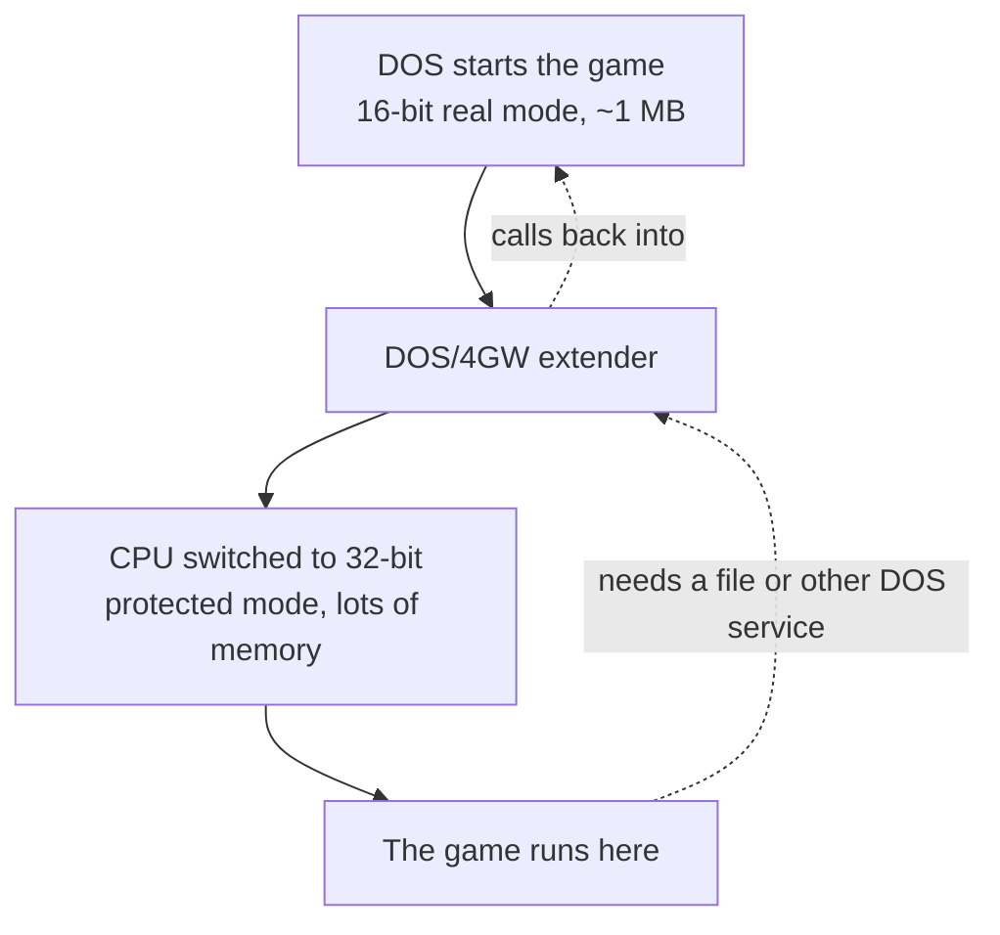

# DOS, protected mode, and DOS/4GW

This page explains the DOS world the game runs in and how it reaches memory beyond the
old 1 MB limit. Syndicate is a 32-bit protected-mode program, so it ships with a DOS
extender called DOS/4GW that flips the CPU into 32-bit mode and passes DOS services back
and forth. The last section covers the two things that matter to the decompilation: the
LE executable format and the fixed load address.

## DOS, the operating system

The game is from 1995, and it runs on **DOS** (specifically MS-DOS), the operating
system most PCs used before Windows took over. DOS is small and plain: it mostly
just loads your program and gets out of the way, handing it near-total control of
the machine.

## The 1 MB problem

Early PCs ran the CPU in **real mode**, a backwards-compatible mode that can only
reach about 1 megabyte of memory and works in 16-bit chunks. By the mid-90s that was
nowhere near enough for an ambitious game.

The 386 chip and its successors had a better mode, **protected mode**, which is
32-bit and can reach far more memory. The snag is that DOS itself doesn't run there,
and flipping the CPU into protected mode, while still being able to call back into
DOS for things like reading files, is fiddly low-level work.

## What a DOS extender is

A **DOS extender** is a small piece of software bundled into the game that does that
fiddly work for it. It switches the CPU into 32-bit protected mode, runs the program
there with all that memory available, and quietly translates whenever the program
needs a DOS service that only works in the old mode.

**DOS/4GW** is one specific, very common DOS extender, made by Rational Systems and
shipped with the Watcom compiler. If you played DOS games in the 90s you probably
saw its banner flash up on startup. Syndicate is a 32-bit protected-mode program, so
it carries DOS/4GW to launch itself.

## Why this matters to us

Two consequences shape the decompilation.

First, the game's executable is in a format called **LE** (Linear Executable), the
format DOS/4GW loads. It's split into a few chunks called objects: one big block of
code and a couple of data blocks. The code we're matching lives in the code object.

Second, and more usefully, DOS/4GW loads the program at a **fixed, known base
address**. That means references to the program's own internal data sit at concrete,
predictable addresses in the finished binary. So when we reconstruct a function that
touches one of those, we can write the address as a plain number and get the exact
bytes, instead of leaving a blank to be filled in later. The
[relocations and OMF](relocations-and-omf.md) page explains why that distinction
matters, and [the Watcom toolchain](watcom.md) is what actually built and bundled
all this.
