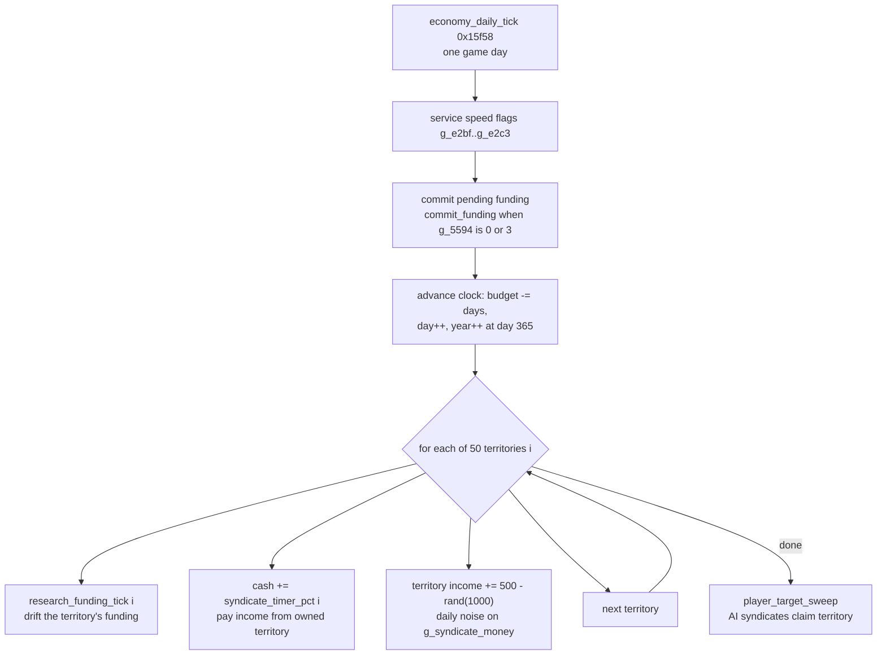
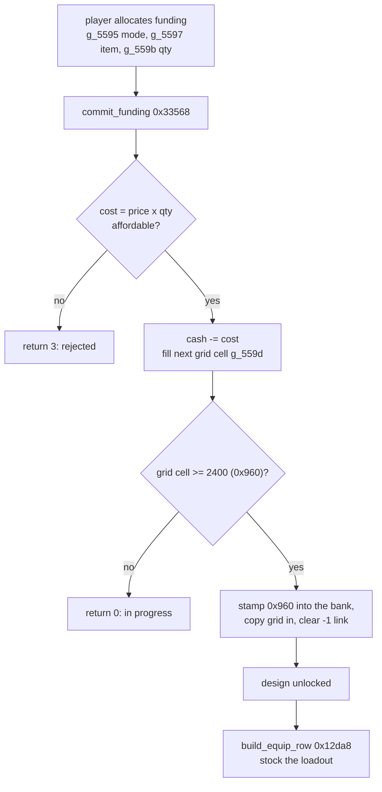

# Money, research and equipment

Syndicate runs a small strategy layer under the missions: eight syndicates, fifty
territories, a bank balance, and a research tree. This page explains how that economy works,
read out of the reverse-engineered functions in `src/economy/`. The short version is that the
player has a cash balance and owns territories, each game day the world advances one tick that
pays income and lets rival syndicates grab territory, cash buys research and equipment, and
finished research stocks the squad's loadout.

Everything here comes from matched or decoded C. Where the code is clear the claim is stated
plainly. Where a field's meaning is still a guess it says so.

## The per-player record and where the money lives

Each of the eight players (you plus seven AI syndicates) owns one `0x417`-byte record in the
table at `g_player_recs` (0xe49c), indexed `g_player_recs + player * 0x417`. The strategy
layer reads and writes two separate money-like fields in that record, and it helps to keep
them apart.

- **Cash**, the dword at record `+0`. This is the spendable balance. `commit_funding` deducts
  research and equipment costs from it, `save_game` taxes it, and daily territory income is
  added to it. `new_campaign_reset` starts it at **30,000** (`0x7530`), or **100,000,000**
  under the unlimited-funds flag.
- **Time budget**, the dword at record `+4` (the field-view global `g_player_budget`, 0xe4a0).
  `economy_daily_tick` spends this down as days pass, and the day and year counters sit right
  after it at `+8` and `+0xa`. The manifest still labels `+4` "budget" from an earlier reading,
  but the daily tick treats it as a countdown of days, so it looks like the campaign time
  budget rather than a second pot of money. That reading is inferred, not proven.

`draw_player_budget_label` (0x16678) draws the on-screen status from these fields. It divides
the `+4` dword by 168, clamps the result to 23, and formats that index together with the day
and year words. The exact label it produces is not pinned.

The `g_e4xx` and `g_e5xx` globals are field-views into this same record (their address is
`0xe49c + offset`), so a name like `g_player_budget[player * 0x417]` reads that one field for a
given player. The [object model](object-model.md) has the full field map.

## Territories and the syndicate records

The world map is fifty territories, held as fifty 10-byte records at `g_syndicate_recs`
(0x539c). The fields, from `new_campaign_reset`, `research_funding_tick` and
`syndicate_timer_pct`:

| offset | global | type | meaning |
|--------|--------|------|---------|
| `+0` | `g_syndicate_recs` | u16 | funding level (also the claim word, `0xff` reads as unclaimed) |
| `+2` | `g_539e` | u8 | owner syndicate id (0 = none, else 1..7) |
| `+3` | `g_539f` | s8 | funding rate, starts 30 (`0x1e`) |
| `+4` | `g_53a0` | u8 | rate reload value, starts 30 |
| `+6` | `g_syndicate_money` | s32 | the territory's income pool |

`new_campaign_reset` seeds each territory with a random owner (`lcg_rand(7) + 1`) and a random
income of `(lcg_rand(20) + 40)` million. The keep-syndicate-colours flag forces every owner
after the first to 0 instead.

## A game day: `economy_daily_tick`

`economy_daily_tick` (0x15f58) is called once per frame from the main loop. It advances the
strategy world by a number of days passed in as its argument. Three things happen: it services
the game-speed controls, it advances the clock and spends the time budget, then it runs the
fifty-territory economic sweep.

The front of the function reads five volatile edge-flags (`g_e2bf`..`g_e2c3`). These are the
speed and pause controls: each one, while held, toggles a bookkeeping byte or nudges the
game-speed global `g_5304` up or down within 0..12, busy-waiting while the flag stays at 1.

Then, on the normal path (`g_radar_detail == 0`), it recomputes a displayed rate byte
(`g_3ee8`) from the time budget and commits any pending funding through `commit_funding` when
the funding-screen status `g_5594` is idle (0) or rejected (3). If the time budget can cover
the days requested it spends them: subtract the days from the budget, bump the day counter, and
roll the year over when the day passes 365 (`0x16d`). If the budget cannot cover them, it
limps forward by a fraction instead.

Having advanced the day, it runs the sweep over all fifty territories:

The three per-territory steps:

- **`research_funding_tick`** (0x16318) drifts one territory's funding. Despite the name it
  works on the syndicate record, not the research tree. If the current player owns the
  territory, every neighbouring link owned by a rival (the 8 links in the 19-byte rows at
  `g_b069`) adds `+2` to its funding. The funding then drifts by `(rate - 30) / 2`, is nudged
  two points back toward 30, and is clamped to 0..255.
- **`syndicate_timer_pct`** (0x16438) returns the income the current player earns from
  territory `i`, and that return value is added straight to the player's cash. It pays out only
  when the player owns the territory and the record selected by `g_10b36` has its funding word
  under `0xa0`. The amount is `(income / 1,000,000) * 14 * rate / 10`, and it reloads the rate
  field from its reload value as it pays. The `g_10b36` gate is not fully pinned.
- The territory's own income pool (`g_syndicate_money`, the `+6` dword) gets daily noise of
  `500 - lcg_rand(1000)`, so it drifts by roughly plus or minus 500 a day.

Finally `player_target_sweep` (0x164c8) lets the AI expand. For each of the eight players
except the current one it rates how much territory the player holds
(`count_syndicate_recs`), picks one of its holdings (`scan_syndicate_recs`), and walks that
territory's neighbour links. An unowned neighbour is claimed on a coin-toss (a `d100` roll
under 50), flipping the owner byte. `slot_claim_test` (0x264a8) is the matching eligibility
test for whether a given territory can be claimed.

The fast path (`g_radar_detail != 0`) skips the whole sweep and just spends the days, which is
the strategy map running with no live radar to update.

## Research and equipment funding

Cash buys research and equipment upgrades through a funding screen backed by a small state
machine. The player allocates funding to a design, the cost comes out of cash, progress
accumulates, and at a fixed threshold the design unlocks.

The working state is a set of globals around `g_559x`: `g_5595` is the mode (1 = research bank,
2 = equipment/mod bank), `g_5596` is the bank index, `g_5597` is the selected item, `g_559b` is
the quantity, and `g_559d` is a 10 by 24 word grid that holds the design being funded.
`g_5594` is the funding-screen status the daily tick reads.

`commit_funding` (0x33568) is the commit step. It computes `cost = g_b95c[item] * quantity`,
returns 3 if that exceeds the player's cash, otherwise deducts it. It then writes the running
total into the next free cell of the 10 by 24 grid, each cell adding `(item + 1) * 10` to the
one before. When a cell reaches **2400** (`0x960`) the design is complete: it stamps `0x960`
into the selected bank's state word, copies the grid into that bank, and clears a pending `-1`
link. Research banks live at `g_5788` (stride `0x1eb`, 18 records) and equipment/mod banks at
`g_7c05` (stride `0x1f5`, 20 records).

`table_save_restore` (0x338d8) is the paired save-and-reset. It sets the status to 2, copies
the working grid into the current bank (research into `g_578a`, equipment into `g_7bf5` where it
also takes the absolute value of each bank's leading dword), then clears the working state:
mode and bank to 0, selected item to `-1`, quantity to 0, and the grid zeroed. So the pattern
is fund a design in the scratch grid, then bank it and start fresh.

A finished bank state word of `0x960` is the "unlocked" marker that the loadout code reads back.

## Stocking the squad: equipment build

Once research is unlocked, a player's equipment template is built and applied to the squad. The
template row is 18 slots of 40 bytes each, sitting inside the `0x417`-stride player record at
`+0x11d`, and the squad's people live in the entity pool (pool A at 0x8110, stride `0x5c`).

`build_equip_row` (0x12da8) builds the row for a player. It is called from session init for
every remote (AI) player whose record flag has bit 2 set. It finds the player's first active
pool-A agent slot, writes the row header, clears the 18 template entries, then for each active
member fills in a weapon or mod. The item kind is either a forced type (`g_1beb1`) or the
highest-level researched kind: it scans the equipment pairs (`g_3ec0`/`g_3ec1`) and picks the
best whose bank state word reads `0x960`, that same unlocked marker. Quantities come from the
per-type maximum table `g_item_max_qty`. It then applies the row with
`reequip_squad_row(k, 0x1002)`.

`reequip_squad_row` (0x223c8) applies a template row to the squad's agents. For each present
template entry it finds the agent's pool-A node, frees whatever items it was carrying (walking
the carried-item chain and detaching each), resets the node's fields from the template, sets a
size class from a jump table, and creates up to eight items through `init_record_if_alloc`.
Unless the mode is `0x1002`, it also fully frees and zeroes every agent slot the template did
not touch, so a normal re-equip wipes empty slots while the build path (mode `0x1002`) leaves
them alone.

`new_game_reset` (0x21658) is the between-missions reset. It re-derives which research tiers the
current player owns by probing two owned-research bitsets in the record, and for the owned
tiers it resets cash to 100,000,000 and rebuilds the default squad, conveyor and equipment
templates from scratch. The default loadout it writes uses the fixed kind list
`{6, 6, 1, 0xc, 0x11, 0x11, 7, 7}` with quantities from `g_item_max_qty`.

## Starting a campaign

`new_campaign_reset` (0x20fc8) runs once when a new game begins and stamps every persistent
table:

- **8 command records** (`g_command_recs`, 0x105d4, stride `0xe`): cleared, seeded with the RNG
  seed word.
- **8 player records** (`g_player_recs`, 0xe49c, stride `0x417`): cash set to 30,000 (or
  100,000,000 under unlimited funds), player 0 flagged human and the rest AI, rosters cleared,
  and 18 weapon or mod slots per player initialised. The first eight slots roll a random type,
  the rest are marked empty (`0xff`).
- **50 syndicate records** (`g_syndicate_recs`, 0x539c, stride `0xa`): random owner and random
  income, as above.
- **18 research records** and **20 mod records**: their state words set from the source tables
  (or all to `0x960` under unlimited funds), and their 10 by 24 grids zeroed.
- A flat state block at `g_5594` cleared, with the selected-item link set to `-1`.

So a fresh campaign is eight funded syndicates, fifty owned-at-random territories, and empty
research grids, ready for the daily tick to start moving money.

## Saving: the wealth tax

`save_game` (0x35b68) writes the strategy state to disk, and it charges a tax on the way out.
If the current player's cash is above 30,000 (`0x7530`) it deducts 10% before saving. Then it
builds the save path and writes the persistent blocks in order: the 20-byte save name, the
player records, the syndicate records, the conveyor table `g_7bf4`, the design list
`g_list_recs`, the `g_5594` state block, and the roster index. Loading reads the same blocks
back through the matched reader at 0x35c88.

That 10% skim above 30,000 is the game's between-missions money sink: sitting on a large balance
costs you a slice of it every time you save.

## Record strides, at a glance

The economy touches several fixed-stride tables. Recognising the stride identifies the record:

| stride | base | table | holds |
|--------|------|-------|-------|
| `0x417` (1047) | 0xe49c | `g_player_recs` | per-player: cash, budget, clock, 18 equip slots |
| `0xa` (10) | 0x539c | `g_syndicate_recs` | 50 territories: funding, owner, rate, income |
| `0x13` (19) | 0xb069 | `g_b069` | territory neighbour links (8 links + flag) |
| `0x1eb` (491) | 0x5788 | research banks | research state word + 10x24 funding grid |
| `0x1f5` (501) | 0x7bf4 | equipment/mod banks | equip state word + 10x24 funding grid |
| `0x5c` (92) | 0x8110 | pool A | the squad's agent entities |

## Confidence

Confirmed from matched or fully-decoded bytes: the two money fields and their starting values,
the daily-tick structure and the fifty-territory sweep, the funding threshold of `0x960`, the
save-time 10% tax, and the equip-build and re-equip mechanics. Inferred and flagged above: the
`+4` field reading as a time budget rather than money, the `syndicate_timer_pct` income gate on
`g_10b36`, and the exact string `draw_player_budget_label` prints. Several of these functions
are byte-parked on Watcom register-allocation ties, not on any doubt about what they do.
