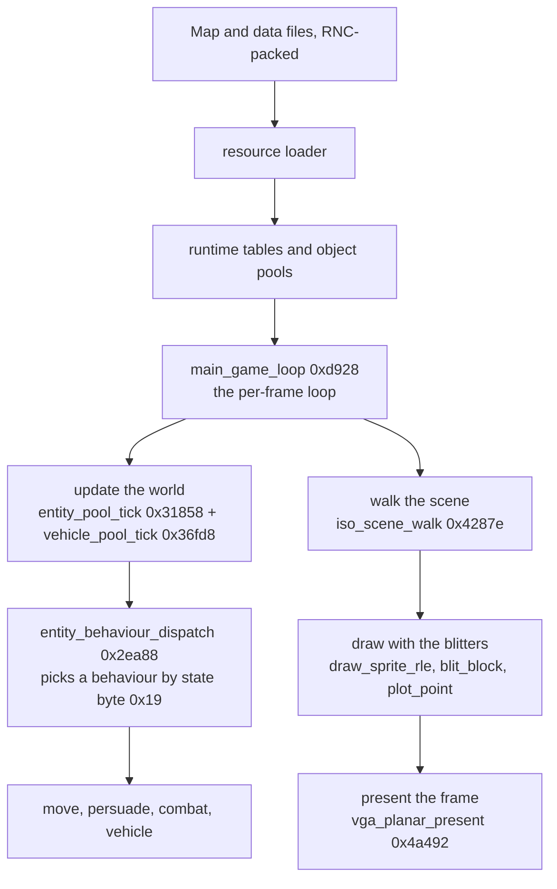
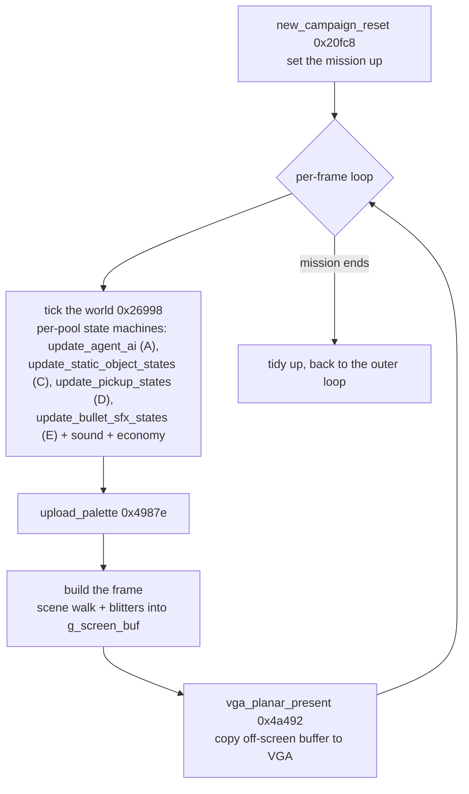
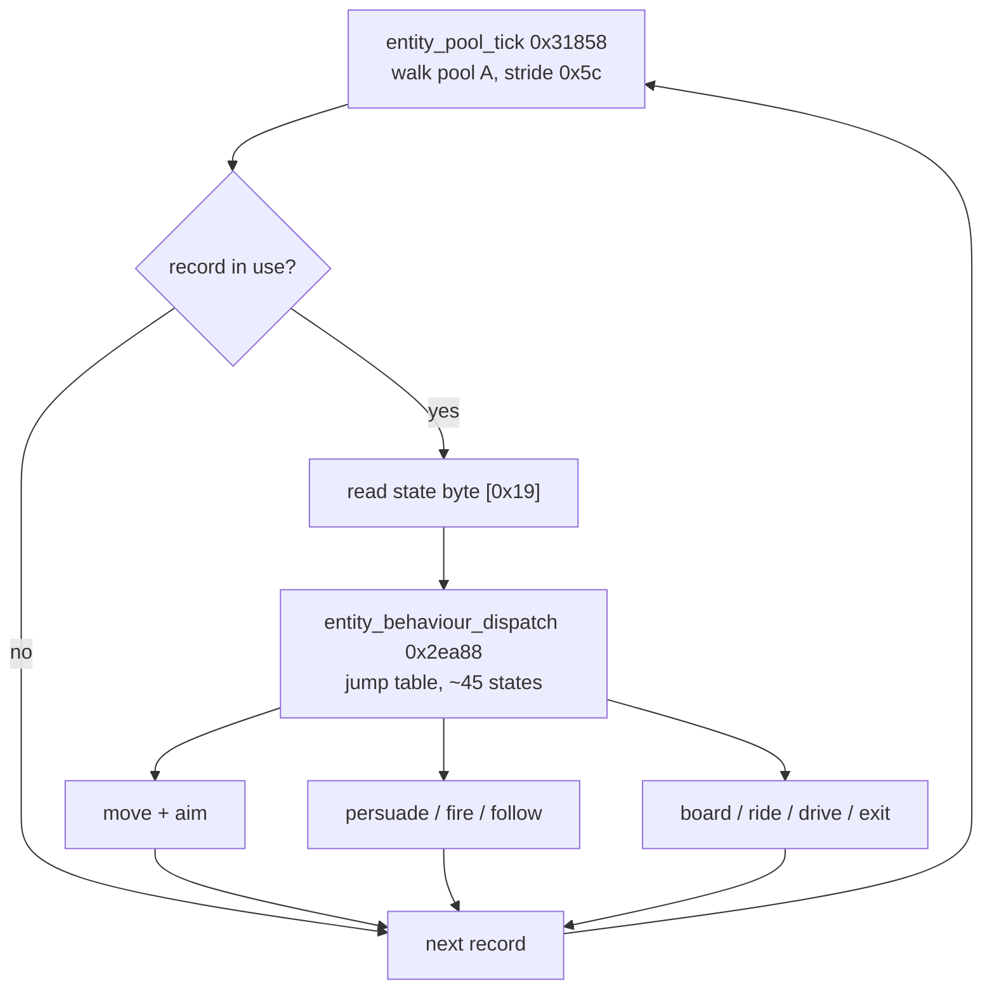
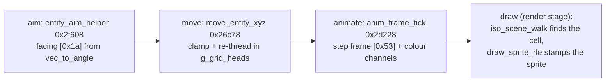
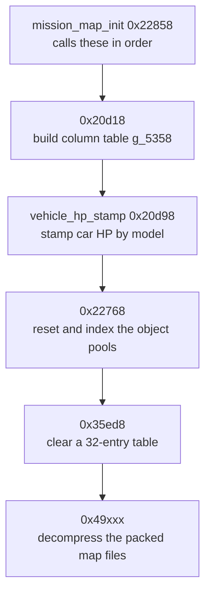
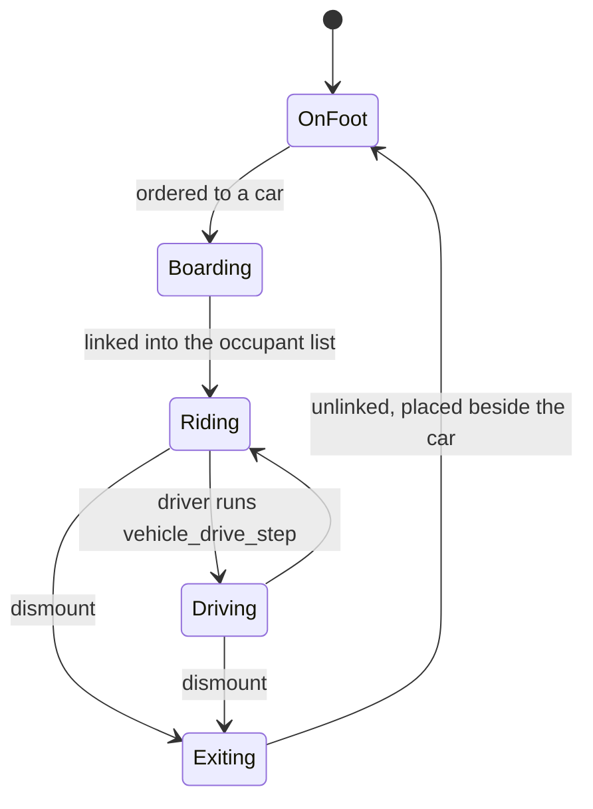
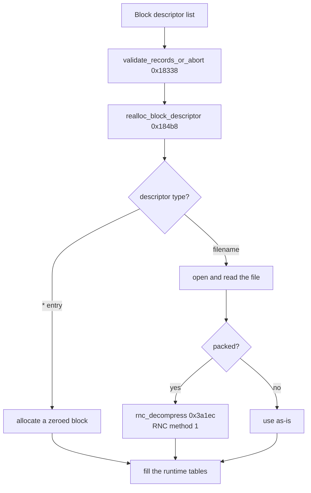

# How the game works, as we map it

Syndicate keeps its whole world in a handful of fixed object pools: people, cars, weapons,
and effects. Every frame each object runs a small behaviour chosen by its current state, and
the maps and game data load from compressed files on disk. This page maps those systems as
we decode them, starting with the shape of it and going down to the byte-level notes.



The [concept pages](README.md) are about how we rebuild the game. This page is about what
the game's code actually does: the systems that make Syndicate work, described as we come
to understand each piece.

It's the interesting half of the project. Every function we match is a small window into
how the game was built, and as those windows join up we can explain whole systems: how an
agent moves, how a weapon fires, how a mission is scored.

## Where the project is now

The page started as a scaffold, a list of systems we expected to find. It has grown past
that. The whole binary is decoded to readable C, the low-level drawing and sound code has
annotated listings, and the entity model is worked out field by field. So this page can now
follow the game as it actually runs, not just name the parts.

The next two sections do exactly that, end to end. First a frame: what the game does each
tick to turn the world into a picture on screen. Then an entity's turn: how one agent or car
is ticked, chooses a behaviour, moves, and gets drawn. Both name real functions and globals,
and where a claim is inferred rather than proven from matched bytes it says so.

As a function's purpose becomes clear it gets a note in the manifest and a mention here. When
a system is understood well enough it gets its own page, as the [blitters](blitter.md) and the
[object model](object-model.md) already have.

## A frame, start to finish

The short version: each tick the game updates the world, works out what is visible, draws it
into an off-screen buffer, then copies that buffer to the screen. Update, walk, draw, present.

The loop is `main_game_loop` (`0xd928`). It has an outer part that sets a mission up
(`new_campaign_reset` 0x20fc8) and an inner part that repeats every frame until the mission
ends. Reading the call sites out of its bytes, the inner frame does roughly this, in order:

- **Tick the world.** A batch routine (`0x26998`) runs the per-frame updates back to back.
  These are the object model's heartbeat: one state machine per object pool. `update_agent_ai`
  drives the people (pool A, the 45-state agent brain that acquires targets and picks a range),
  `update_static_object_states` the map statics (pool C), `update_pickup_states` the weapons and
  pickups (pool D), and `update_bullet_sfx_states` the bullets and effects (pool E). Each walks
  its pool, reads a state byte off every live record, and dispatches through that pool's own jump
  table to advance the animation and behaviour. `update_drift_vector` nudges a wandering
  velocity alongside them. The name in our tree, `init_subsystems`, predates this tracing and
  undersells it: it is the world update, called from inside the frame, not once at startup.
- **Advance sound and the economy.** `schedule_priority_sound` picks the highest-priority ready
  sound slot and plays it, `stop_current_sequence` handles music transitions, and the daily
  economy tick `economy_daily_tick` (0x15f58) runs each pass.
- **Push the palette and draw.** `upload_palette` (0x4987e) loads the current palette, then the
  frame is built: `render_sorted_sprites` walks the spatial grid, projects every visible entity
  to screen, depth-sorts the list, and draws each sprite back to front, while `draw_scanner_markers`
  and `edge_scroll_dispatch` handle the radar overlay and edge-of-screen scrolling.
- **Present.** The finished off-screen frame is copied to VGA memory by
  `vga_planar_present` (0x4a492).



The reason the game draws into an off-screen buffer first and only copies it at the end is
to avoid tearing. That whole idea, and the four-plane mode-X copy that
`vga_planar_present` does, is covered in [the blitters page](blitter.md). This section is
about the stage before it: deciding what to draw.

## The render pipeline, from what is visible to pixels

Drawing a frame is two jobs. First work out which map cells and objects are on screen and in
what order. Then stamp their pixels into the off-screen buffer. The first job is the
isometric scene walker, the second is the blitters.

The walker is `iso_scene_walk` (0x4287e). It visits about 36 cells in a diamond around the
view centre, working from the far cells inward so nearer things are handled last and sit on
top. For each cell it computes a screen column and drops the cell if it falls outside the
visible strip. Then it reads the object record parked in that cell, takes a type byte off the
record, and uses it to index a 24-byte-per-type table (`type * 0x18 + base`). That table entry
holds the draw data for this layer. If there is something to draw, the cell is folded into a
shared coverage accumulator by the mask merge `merge_cell_mask`, with a one-shot setup
`clear_occlusion_mask` that clears the accumulator on the first object drawn. The full commented
listing is at `src/lib/gfx/iso_scene_walk.asm`.

The walker does not push pixels itself. It decides what is visible and merges each object's
coverage into a 16-slot mask accumulator at `0xe144`. It looks like this accumulator is how
the game does the see-through effect, where a wall between the camera and an agent goes
transparent so you can still see your people. That reading fits the far-to-near order and the
per-object coverage merge, but we have not tied it to a running frame yet, so treat it as
inference.

The actual pixels come from the blitters, which run in the same frame. Map tiles are stamped
with `blit_block` (copy a rectangle across all four planes). Agents, cars, and objects are
drawn with `draw_sprite_rle`, which walks run-length-encoded sprite data and skips the
transparent runs so a sprite layers cleanly over what is behind it. Single pixels and HUD
marks go through `plot_point`. All of them write into the off-screen buffer `g_screen_buf`,
which `vga_planar_present` then shows.

The moving objects, agents, cars, and the like, go through a second pass we have now named,
`render_sorted_sprites`. It walks the spatial grid, projects each visible entity to a screen
position relative to the camera, writes a twelve-byte entry per sprite into a list, depth-sorts
that list, and then draws each sprite back to front so nearer ones cover the ones behind. So the
map cells come from `iso_scene_walk` and the entities from `render_sorted_sprites`, both feeding
the same blitters and the same off-screen buffer. Exactly how the two passes interleave in a
live frame we have not tied down yet, so read that ordering as the likely shape rather than a
confirmed one.

```mermaid
flowchart TD
    W["iso_scene_walk 0x4287e<br/>visit ~36 cells, far to near"] --> T["per cell: type byte -> 24-byte type entry<br/>-> draw-data for this layer"]
    T --> M["`merge_cell_mask`<br/>merge coverage into the mask accumulator 0xe144"]
    M --> B["blitters stamp pixels into g_screen_buf"]
    B --> B1["blit_block: map tiles"]
    B --> B2["draw_sprite_rle: agents, cars, objects"]
    B --> B3["plot_point: single pixels, HUD marks"]
    B1 --> PR["vga_planar_present 0x4a492"]
    B2 --> PR
    B3 --> PR
```

## An entity's turn

Every mobile thing in a mission, agent, ped, car, or projectile, lives in one of the five
fixed object pools described in [the object model](object-model.md). The per-frame world tick
walks them and gives each a turn. This section follows one pool-A entity through a single tick:
how its behaviour is chosen, how it moves, and how it is drawn.

**The pool walk.** `entity_pool_tick` (0x31858) is the pool-A tick. It steps through the
entity pool a record at a time (base `0x8110`, stride `0x5c`) up to a live bound, and for each
in-use record it reads the state/animation byte at `[0x19]` and dispatches on it through a jump
table, with values running 0 to 0x2c. This pass handles the per-state animation and
book-keeping for the record.

**The behaviour switch.** The behaviour proper is `entity_behaviour_dispatch` (0x2ea88), a
jump table over roughly 45 states, also keyed on the same state byte `[0x19]`. This is where
an entity's kind of turn is chosen: seek a target, aim, fire, persuade, follow a leader, board
or drive a car. The [object model](object-model.md) traces two of these behaviours in full,
the Persuadertron (`persuade_capture` 0x2fe68) and the vehicle handlers.



**How it aims and turns.** When an entity is engaging a target, `entity_aim_helper` (0x2f608)
does the orientation. It reads the target link at `[0x44]`, and if the target is alive it takes
the vector from self to target (`dx = target.x - self.x`, `dy = target.y - self.y`), turns that
into a facing byte with `vec_to_angle`, and stores it at `[0x1a]`. It does the same for the
vertical angle using the horizontal distance, sets the state byte `[0x19]` to `0x2b`, and
raises a flag. So facing is a 256-step byte angle computed straight from the geometry each tick,
not a stored heading.

**How it moves in the world.** Position changes go through `move_entity_xyz` (0x26c78). It
takes new world coordinates, clamps them to the map bounds, then re-files the entity in the
spatial grid. The grid is `g_grid_heads`, a 128 by 128 table of cell heads, and each entity is
threaded into a doubly-linked list for the cell it sits in, keyed by 16-bit ids rather than
pointers. If the move crosses a cell boundary, the routine unlinks the entity from its old
cell's list and head-inserts it into the new one, then writes the new coordinates at
`[0x4]/[0x6]/[0x8]`. That grid is what lets the game find "who is in this tile" cheaply, for
collisions, line of sight, and the scene walk.

**How its animation advances.** The frame counter and colour channels are stepped by
`anim_frame_tick` (0x2d228). It bumps the frame byte `[0x53]` (wrapping it while the entity is
in a slow state), advances an animation stage when the counter hits the cadence set by two bits
of a control word, and drifts the three colour or lighting channel triples at their own rates.
The animation frame the entity shows is read off `[0x19]` and its neighbours.

**How it gets drawn.** The entity is not drawn during its tick. It is drawn in the frame's
render stage, when `iso_scene_walk` reaches the cell it occupies and its type and frame bytes
index a sprite, which `draw_sprite_rle` then stamps into the off-screen buffer. Cars are a
small variation: `vehicle_pool_tick` (0x36fd8) runs over pool B each frame, places each car
body (if the car is anchored to a pool-A driver, the body is put at the driver's position plus
an offset and re-filed in the grid with `move_entity_xyz`), then draws it by model byte through
a sprite jump table.



Above these low-level steps sits a higher command layer. `entity_state_dispatch` (0x133a8) is a
command and animation state machine that reads an entity's orders, sets the coarse state codes,
and issues animation requests that the interpreter `run_mission_command` turns into actions. It is the
layer that decides an agent should be moving to a point or attacking, where the functions above
are the layer that carries a single state out for one tick.

## The behaviour state machine

Every object in a pool carries a one-byte state at offset 0x19, and that byte decides how it
behaves this tick. `entity_behaviour_dispatch` (0x2ea88) is the switchboard. It reads the state
byte, rejects anything above 0x2c, and jumps through a 45-entry table to the handler for that
state. So there are up to 45 distinct behaviours, and an object moves between them by having its
state byte changed.

Two layers meet here. The upper one is `entity_state_dispatch` (0x133a8), the orders machine
above, which decides an agent should be walking to a point or attacking and writes the coarse
state. The lower one is `entity_behaviour_dispatch`, which each tick carries out whatever state is
currently set. Most of the handlers are named now, so we can group them by what they do.

- **Aiming and target selection.** `find_target_for_agent` (0x2ee18) scans the object pool for a
  valid enemy, skipping the shooter's own squad. `entity_aim_helper` (0x2f608) turns the object to
  face its target, setting the facing byte 0x1a from `vec_to_angle` of the vector to the target.
  `combat_aim_update` (0x2d358) and `aim_step` (0x2d6c8) step the aim over time. `los_trace`
  (0x2e5f8) and `los_trace_far` (0x2e808) walk the line between shooter and target to check the
  shot is not blocked.
- **Shooting and projectiles.** `projectile_step` (0x2d738) advances a shot one unit along its
  direction, `find_projectile_step` (0x2e4f8) tries up to four directions for a valid step, and
  `homing_step` (0x2e408) steers a homing shot. `record_kill_stats` (0x2ed28) books a hit or kill.
- **Movement.** `move_entity_xyz` (0x26c78) applies a new position, clamps it to the map, and
  re-threads the object in the 128x128 spatial grid.
- **Persuasion.** This is the Persuadertron, the game's signature weapon. `persuade_capture`
  (0x2fe68) converts a target to your side, and `follow_leader` (0x30078) and `follow_leader_b`
  (0x301e8) are how a persuaded unit trails the agent who converted it.
- **Vehicles.** `vehicle_board` (0x2fa48), `vehicle_ride` (0x2fca8), and `vehicle_exit` (0x2fbc8)
  move an agent in and out of a car, and `vehicle_drive_state` (0x2f878) and `vehicle_move_drive`
  (0x2f908) drive it.
- **Damage and health.** `entity_apply_damage` (0x30708) subtracts from an object's HP by a code
  derived from its flags and marks it dead when the HP goes negative. `entity_halve_hp` (0x30508)
  is a lighter variant.
- **Animation.** `anim_frame_tick` (0x2d228) steps the frame counter at the cadence the object's
  control word asks for.

That 45-entry table at 0x21244 is now resolved. The table is stored with load-time relocations,
so its pointers are blank in the static image, but the executable's own fixup table
(`inputs/SYNDICAT_MAIN.LE`, parsed by `tools/lefixups.py`) records exactly where each entry
points. Reading them back gives a surprising answer: the 45 states do not fan out to 45 separate
handlers. They collapse to just two shared case-bodies, one at 0x3135f and one at 0x315d8, sitting
in the code just before `entity_pool_tick`. States 0 to 8, plus a scattered set (0x16 to 0x1b,
0x1d, 0x1f, 0x20, 0x23), run the first body, a facing-and-turn-toward-the-target routine. The
other twenty-six states run the second. The `update_agent_ai` table at 0x21774 works the same way,
its 45 states collapse to three bodies inside `entity_pool_tick`.

So the state byte is not an index into a menu of named behaviours. It selects a broad behaviour
class, and the fine distinction between states is made by the state value itself, used as a number
inside the shared body (in the facing arithmetic and the target checks), not by branching to
different code per state. That is why "state 7 is shoot" was the wrong question: shoot, walk, and
the rest are not separate table targets, they are the same body doing different things with the
value it was handed. The behaviour list above is still the right set of things the machine does,
it just reaches them through a couple of shared routines rather than a 45-way switch.

## The systems we expect to find

- **Agents and other people.** The four agents you control, plus civilians, police, and
  enemy syndicate agents. How they're stored, how they move, take damage, and die.
- **Weapons and mods.** The guns and cybernetic modifications, their stats, and what
  happens when one fires.
- **Missions and objectives.** The mission structure, targets, win and loss conditions, and
  the score.
- **The map and rendering.** The isometric world, how it's drawn, and how buildings become
  transparent when you enter them.
- **Pathfinding.** How a person works out a route across the map.
- **Input and the interface.** Mouse, keyboard, the mission screen, the menus.
- **Sound and music.** Effects and the dynamic soundtrack.
- **Persistence.** Saving and loading, and the research and money you carry between
  missions.
- **The platform layer.** The [DOS and hardware](dos-and-dos4gw.md) plumbing: graphics
  modes, the timer, file access.

## The modding angle

This is the longer-term payoff. Once a system is understood, we can explain not just how it
works but how you'd change it. When the weapons system is mapped, a page like "adding a new
weapon" could walk through the data and the code you'd touch to do it.

We can't write those yet, because we don't understand the systems well enough. That's the
direction though, and it's why understanding each function matters beyond matching its
bytes.

## What we've identified so far

A short, honest list. It'll grow.

- **A hardware timer being programmed** (`0x252d8`). Sets up the PC's programmable interval
  timer, part of the low-level platform layer that keeps game time ticking.
- **An object-slot allocator** (`0x22b38`). Scans a fixed table of 256 slots for a free
  one, fills in a few fields, and hands it back. This is the classic shape of an entity
  pool, so it's most likely how the game creates a person, a projectile, or a similar game
  object. Which one, we'll know when we match its callers.
- **Object pools, and a free-slot scan** (`0x22768`). This one revealed a big piece of the
  game's memory layout. The pools are contiguous fixed-size-record arrays back to back:
  pool A at `0x8110` (256 records of 92 bytes), pool B at `0xdd10` (64 records of 42 bytes),
  pool C at `0xe790` (400 records of 30 bytes). The full five-pool picture is below. In
  every record the byte at offset `0x18` is an "in use" flag. This function scans each pool
  from the top down and caches a pointer to the free boundary in a global, so later
  allocations are fast. It's called during map setup, which makes sense, since loading a map
  resets the world's objects. (Understood. The byte match is parked on register allocation.)
- **The map column-table initialiser** (`0x20d18`). Walks a 12,288-entry table, turning each
  stored offset into an absolute pointer, then publishes the table base in `g_5358`. This is
  the function that builds the table the passability check below reads. Understood but not
  yet byte-matched (it compiles to an alignment-padded loop). Part of the map and rendering
  system.
- **A map passability check** (`0x33fb8`). Given a world position, it finds the map tile
  there and returns whether it's walkable. Part of the map and rendering system. Understood
  but not yet byte-matched, one register-allocation byte short. See the [journal](journal.md).
- **A per-object status update** (`0x2d998`). Recomputes an object's state code from its
  flags. This is the function that led us to the 9.5 compiler.
- **A chain-length counter** (`0x377b8`). Given an object, it walks a linked chain from a
  16-bit id in one of its fields, following a link at each node, and returns how many nodes
  are in the chain. The shape of "count the items in a list", so it's most likely counting
  something attached to an object (inventory, a queue, or a group). It's byte-matched, and
  it's the function that cracked the [loop-rotation wall](journal.md).
- **A tile-type lookup** (`0x377e8`). Takes an id from an object's field, indexes a table to
  find a tile record, bounds-checks it, and translates a byte from the record through a
  second table into a type code. Part of the map and rendering system, the same table family
  as the passability check. Byte-matched.
- **A record-chain walk** (`0x14998`). Follows a linked list of fixed 15-byte records (a
  table indexed by id, each record holding the next id at a fixed offset) until the chain
  ends. Another "walk a list attached to an object" primitive. Byte-matched.
- **Per-type stat initialisation** (`0x20d98`). For every in-use record in pool B it reads a
  type byte at `+0x19` and writes a value to the word at `+0x14`. The values are hit points,
  and the types come in consecutive pairs (two variants of the same object): `1,2 → 600`,
  `5,6 → 100`, `9,10 → 80`, `13,14 → 30`, `17,18 → 40`, `28,29 → 10`, `36,37 → 120`,
  `40,41 → 115`. Pool B holds the vehicles (confirmed below), and this pass stamps each car's
  starting health from its model when a map loads. This is the table you'd edit to mod
  vehicle toughness. (Understood. The byte match is parked on Watcom's switch-tree
  balancing.)
- **The runtime library.** Dozens of functions in the top region are Watcom's own `strcpy`,
  `tolower`, `fopen`, and so on. Not game systems, but worth knowing they're accounted for.
  See [game vs library](game-vs-library.md).

## How a map loads (the picture so far)

Instead of matching functions by size, we started following the call graph to work a whole
system at once, and the map loader is the first one we mapped. A static scan of the code for
call instructions (`tools/callgraph.py`) shows that the column-table builder `0x20d18` is
called by one function, `0x22858`, a 415-byte routine that is the map initialiser. Its call
tree is the shape of "load and set up a map":



- `0x20d18`. Build the column table `g_5358` (offsets become pointers).
- `0x20d98`. A big sibling right after it, the vehicle HP stamp (above).
- `0x22768`. Reset and index the object pools (above).
- `0x35ed8`. Clear a small 32-entry table.
- A cluster of `0x49xxx` helpers. The decompressor, since the game's strings include
  `ERROR decompressing %s` and the map files (`data/map%02d.dat`, `data/col01.dat`,
  `data/hblk01.dat`) are packed.

None of this needed a debugger. The game's own strings name every asset file, and the call
graph links the loader to the routines that consume them. That's the method now: pick a
system, find its top function, and match down the tree, understanding each piece as part of
the whole rather than as an isolated puzzle.

## Mission/orders command interpreter, `run_mission_command` @ 0x23158 (cont. 24 decode)

**TRUE SIZE 5280 (0x14A0)**, 0x23158–0x245f7 (manifest was 107, fixed). Per-record command
interpreter: executes one queued command for record `idx` (u32 param), then clears the slot.
Entry: `ESI = 0x105d4 + idx*0xe` (14-byte command record, opcode at `record[+0xd]`).
`EDX = 0xe49c + idx*0x417` (the 0x417-stride equip/research template row consumed by matched
siblings `reequip_squad_row`/`build_equip_row`, and `[EDX+0xb5]` = `g_e551[idx*0x417]` = pool-A base-slot
header). Every case ends `MOV byte [ESI+0xd],0` (consume), `ADD ESP,0x34`, pops, `RET`.

Jump table: literal `CS:[EAX*4+0x15920]`, manifest **0x23068** (0x15920+0xd748),
`[table][4B pad @0x23154][code @0x23158]`. **59 dword entries, cases 0x00–0x3a** (switch =
`record[+0xd]`, `CMP AH,0x3a / JA default`). **Default = 0x245ec.** **41 distinct
non-default bodies.** Two-bank structure: opcodes 0x01–0x1a mirror 0x21–0x3a (the +0x20 bit
selects a variant), and 8 pairs share a body outright (0x01≡0x21, 0x02≡0x22, 0x06≡0x26,
0x0a≡0x2a, 0x12≡0x32, 0x13≡0x33, 0x17≡0x37, 0x18≡0x38), collapsing the work to about 33
unique opcodes.

Case map (case, body):
```
00→DFLT 01→231b7 02→2328d 03→23348 04→234bc 05→23567 06→2363d 07→23655
08→23767 09→23908 0a→239c4 0b→23a28 0c→23cda 0d→23d5e 0e→23de2 0f→23e66
10→23f06 11→243e0 12→24544 13→24592 14→23c10 15→DFLT 16→2447f 17→245dc
18→23303 19→23aaa 1a-20→DFLT
21→231b7 22→2328d 23→233a0 24→23504 25→235c6 26→2363d 27→2369b 28→23823
29→23959 2a→239c4 2b→23a5d 2c→23d0f 2d→23d93 2e→23e17 2f→23ea9 30→24160
31→24421 32→24544 33→24592 34→23c6c 35→DFLT 36→244c8 37→245dc 38→23303
39→23b56 3a→2341e
```
Sampled ops: 1/0x21 = broadcast `reequip_squad_row` (equip-template apply) + `FUN_000229f8`
across players (bound `g_10b0c`), single-player uses `FUN_00029d88`, per-player flags to
`g_e4ab`. op 3 = loop pool-A agents (0x8110 stride 0x5c, bound `(g_e551[idx*0x417]+4)`)
calling `entity_aim_helper` (aim/step). op 8 = squad broadcast (`[+0x20]==agent-id`, then
`entity_aim_helper`). op 0x16 = `node[0x44]=`best_weapon_select_typed`(node,0,cmd[0])` (sub-object spawn, banked
0x37d08). op 0x39 = per-agent `g_5358` map/tile scan, then `node[0x19]=7`, `node[0x58]=7`,
clear `+0xa` bit3. Dominant callee `entity_aim_helper`. To match: fix size (done), then go
body-by-body, reusing the cont.22 cross-jump law for the recurring merged `entity_aim_helper` call
tails.

## Tactical-map / radar renderer, `draw_tactical_map` @ 0x19608 (cont. 25 decode)

**TRUE SIZE 3474 (0x19608–0x1a399, manifest was 1544, fixed).** Full-screen minimap/radar
drawer, `FUN(cam_struct *p1, short zoom)`, frameless + 4 saved regs, 0x644 frame. In the
WALLED g_5358 cluster (reads g_5358 column table + g_10ac0 tile flags + g_810e pool + g_10e
grid), so byte-parity is blocked (g_5358 register wall + IDIV accumulator ties + about 20-slot
spill order). Three co-located jump tables (lefix rule L+0xd748):
- Table 1 @ 0x19564, 16 entries, index g_10ac0[tile]. Terrain-shape polygon draw via 0x3fb40
  (bodies 0x19800/0x19858/0x198b0/0x198ef, default 0x1994a).
- Table 2 @ 0x195a4, 6 entries, index entity type [node+0x18]. Blip draw
  (0x19b29/0x19b61/0x19edd, default 0x19f08).
- Table 3 @ 0x195bc, 17 entries, index word [rec+0x1be3e]. HUD/objective markers
  (0x1a13f/0x1a28c, several break to 0x1a38f, default-continue 0x1a384).
Phases: (1) nested 0x60×0x80 tile grid, column lookup + fixed-point corner projection + 0x3fb40
draw. (2) grid-cell entity chains (g_810e+id, 0x12c cap), type-dispatched blips. (3) two
0x18d18 blip loops + conditional 0x19318 + 8× stride-14 objective-marker records at 0x1be3a.
Callees: 0x3fb40/0x3f4b4/0x3f636/0x18d18(×2)/0x19318 (matched: 0x18d18, 0x19318).

## Drawing the isometric scene, `iso_scene_walk` @ 0x4287e (decode note)

This is the decode note behind the [render pipeline](#the-render-pipeline-from-what-is-visible-to-pixels)
section above, kept for the offset-level detail.

`iso_scene_walk` (`iso_scene_walk`) steps through roughly 36 neighbouring cells in an isometric
diamond, working from the far cells inward so nearer objects are handled last and sit on top.
For each cell it works out the screen column, drops the cell if it falls outside the visible
strip, then reads the object record parked there. A type byte on the record picks a 24-byte
entry in a per-type table, and that entry holds the draw data for this layer. If there is
something to draw, the cell is handed to the coverage merge at `merge_cell_mask`, which folds the
object into a shared visibility accumulator. So the walker decides what to draw and in what
order, and the actual pixels are pushed by the [blitters](blitter.md) elsewhere. The readable
listing, commented line by line, is at `src/lib/gfx/iso_scene_walk.asm`.

## Mission-cursor target-action resolver, `mission_target_resolve` @ 0x2ad58 (cont. 25 decode)

**TRUE SIZE 3694 (0x2ad58–0x2bbc5, manifest was 1737, fixed). Calls 8 not 4.** Resolves what
the mission cursor points at and writes an action order into `ushort *p` (p[0]=x/id, p[2]=y,
p[4]=z, p[0xd]=action-code, returns int via [esp] slot). Co-located 20-byte jump table at
0x2ad44 (literal 0x1d5fc + 0xd748): `switch(g_e120)` 5 entries, 3 targets (case0→return 0,
1,2→0x2b44c, 3,4,default→0x2b91e). Sequence: input-mode gates (g_e285/e2a4/e296/e297/e2a3 +
g_10b45, actions 2/0x10/0x17), selection from g_e286-9 into g_e124, already-selected fast
path, 4-ped-block shootable-target scan, move/attack order build (0x2c468 field-copy + 0x1ba48
cursor-line-draw), fresh-target pick via the R/G/B reticle-ramp interpolators
(0x2d7a8/0x2d808) + g_ab60/g_ad60, adjacency/LOS, cursor clamp to scroll bounds
(g_5390/5392/52f8) into reticle window g_10b1c/1e/20, final g_e120 dispatch. DOUBLY WALLED: it
indexes the 0x417-stride agent template records (g_e551/e552 via idx=g_10b16) AND the g_810e
pool (0x5c stride) about 12× each with mixed and-form/movsx byte loads, and it directly calls
the parked register-wall `interp_scale_a`. Park (decode-only).

## The entity model and the Persuadertron

Every mobile object (agent, ped, projectile, car) lives in one of **five fixed-size object
pools**, laid out back to back, one pool per class. A single kind byte at record offset
`+0x18` tells them apart wherever the shared spatial grid is walked, and the pool
record-counts line up exactly with the game's level-data arrays:

| pool | base | count | class | kind `[0x18]` |
|------|------|------:|-------|------|
| A | 0x8110 | 256 | people (agents / peds / projectiles) | 1, 2 |
| B | 0xdd10 | 64 | **cars / vehicles** | 5 |
| C | 0xe790 | 400 | statics | not observed |
| D | 0x11670 | 512 | weapons / pickups | 4 |
| E | 0x15e70 | 256 | sfx / bullets | 3 |

Each pool-A entity runs a behaviour selected by its state byte through a jump table
(`entity_behaviour_dispatch`, 0x2ea88), driven once per frame by the pool tick (0x31858).

The Persuadertron is one of those behaviours, `persuade_capture` (0x2fe68). On contact with
the target ped it sets the ped's leader link to the agent, chains the ped into the agent's
follower group, raises a "controlled" flag, and clamps the ped's amount by the per-type
maximum-quantity table `g_item_max_qty` (0xa73a). The converted ped then follows the agent.

Allegiance is otherwise positional (team = pool index & ~7). A persuaded ped is recognised as
friendly by that flag plus its leader link. Full field-level detail is in [the object
model](object-model).

## Vehicles and cars, pool B

Cars are pool B (kind 5). `vehicle_hp_stamp` (0x20d98) stamps each car's hit points from its
model byte when a map loads, which confirms the long-standing guess that pool B held "typed
HP objects". They are the vehicles. `vehicle_pool_tick` (0x36fd8) redraws every car each
frame, and if the car is anchored to a pool-A entity it places the body at that entity's
position plus an offset, so a driven car's body follows the driver.

Getting in and out is a small state machine over a doubly-linked occupant list hung off the
car. `vehicle_board` (0x2fa48) links an agent in and inherits the car's speed (hiding the
rider for trains and boats). `vehicle_ride` (0x2fca8) slaves each passenger's position to the
car every frame. `vehicle_exit` (0x2fbc8) unlinks and drops the agent beside it.



Driving is `vehicle_drive_step` (0x34858): a real speed model that accelerates, brakes into
corners, and steers by following directional road tiles. A road tile's value (6/7/8/9)
encodes which way traffic flows through it.

These four handlers were previously mislabelled `weapon_fire`, `formation_follow`,
`join_new_leader`, and `detach_entity_type`. The byte matches were fine, the names were wrong,
and they're corrected.

## Where the game's data lives, and RNC resource loading

Many of the tables the game reads (weapon quantities, direction vectors, the equipment
database) are zero in the shipped executable and filled at runtime. The stats were never
compiled in. They live in external `data/*.dat` files, whose names sit in a table in OBJECT2
next to the multilingual equipment descriptions, loaded by a descriptor-driven resource
loader:

- `validate_records_or_abort` (0x18338) walks a list of block descriptors and aborts with an
  error if any load fails.
- `realloc_block_descriptor` (0x184b8) loads one block. A `'*'` descriptor just allocates a
  zeroed block. Otherwise it opens the named file, sizes it (RNC-aware), reads it, and
  decompresses in place if the file was packed.
- `rnc_decompress` (0x3a1ec) is Rob Northen Compression, method 1: magic `RNC\x01`,
  big-endian sizes, Huffman tables plus an LZ back-reference copy. It's the standard packer
  of the era, and recognising it carries straight over to other Bullfrog and DOS-game
  decomps (noted in the [porting guide](porting-guide)).



So the answer to "is OBJECT1 the whole game" is that the logic is all here and the data (art,
sound, and the balance numbers) is external and RNC-packed. That's why a stat table can read
as all zeros with nothing actually missing.
