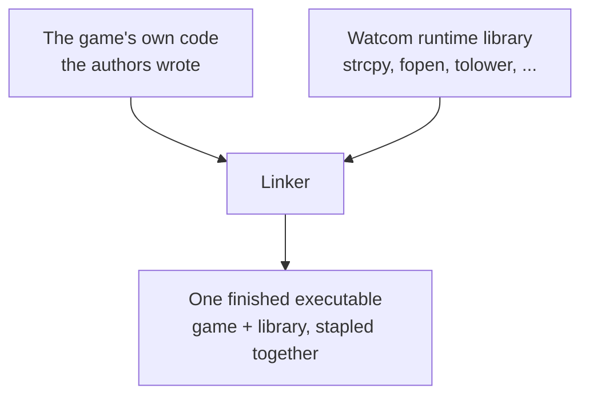
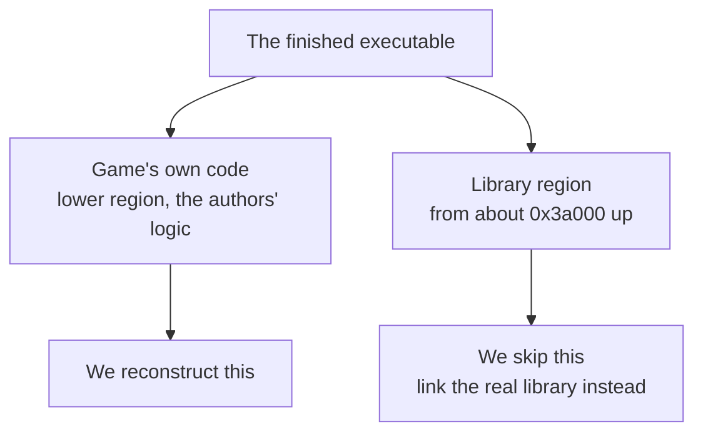

# Game code vs the library

A useful thing to realise early: the program we're decompiling isn't all "the
game". A good chunk of it is code the game's authors didn't write. The finished
binary is the authors' own code plus Watcom's runtime library, and the two sit in
different regions. This page shows how to tell them apart and why we only reconstruct
the game's half.

## Where a program actually comes from

When you build a C program, your own code is only part of what ends up in the
final file. The compiler also bundles in its **runtime library**, a collection of
ready-made functions for common jobs: copying strings, comparing text, reading and
writing files, converting numbers, and so on. Things like `strcpy`, `tolower`, and
`fopen` that C programmers use without thinking about where they come from.

Your code and the library get combined by a program called the **linker**, which
stitches all the pieces into one executable. So the finished game is the authors'
code plus Watcom's library, stapled together.

## The seam

We found that these two parts sit in different regions of the game's code. The
game's own functions are spread through the lower part, and the linked-in library
sits clustered near the top, from about address `0x3a000` onwards.

We didn't just guess this. We took the actual Watcom library files, the ones the
linker would have pulled from, and searched them for the exact bytes of each
function in that top region. The library functions' bytes are *literally present*
in the library files, which is proof they came from there rather than from the
game's source. That work is `tools/libmatch.py` and `tools/libname.py`, and the
results are named in `manifest/library_functions.md`.

## Why it matters

The seam is useful for both what we're doing now and what comes later.

For the matching decompilation, it tells us not to waste effort. There's no point
hand-writing C to recreate `strcpy`, because it isn't the game's code and we'd
never be reconstructing the authors' intent. When it comes time to build the whole
thing, we link the real library, exactly as the original did, and it drops in
identically. So the decompilation effort stays focused on the game's own logic.

For the future port, the seam is where the swap happens. On a modern system you
don't port Watcom's `strcpy`, you just use the modern compiler's own version, which
is there for free. The handful of genuinely DOS-specific bits, like the direct
hardware and file access, get replaced with modern equivalents. Everything above
the seam, the actual game, is what carries across.

## A note on hand-written assembly

A few functions in that region aren't C at all, they're hand-written assembly:
things that talk directly to the DOS operating system or to hardware ports. Those
were never going to come from a C compiler, so we don't try to match them from C
either. They're part of the runtime plumbing, not the game.

## What about the graphics and sound code?

Two other regions sit apart from the game's main logic: a block of graphics
routines around `0x40000` and a block of sound code around `0x39000`. It's
reasonable to guess these are Watcom libraries too, since Watcom did ship a
graphics library with the compiler. We checked, and they are not.

We extracted the actual 9.5-era Watcom 386 graphics and maths libraries from the
original install floppies (`GRAPH.LIB` and the `MATH` libraries, decompressed with
`tools/archive/wunpack95.sh`) and searched them for the bytes of every graphics and
sound function, the same way we did for the C runtime. Not one matched. As a
control, the C runtime functions score 100% against their own library. The graphics
and sound functions score zero.

So these are the game's own code, not the toolchain's. The graphics routines are
hand-written assembly, and the disassembly shows why: each one saves and restores
every register, including EAX, ECX, and EDX, which the compiler treats as scratch
and never preserves. That save-everything shape is an assembly convention, and it's
also why we couldn't reproduce these functions from C and transcribed their raw
bytes instead. The sound code is a third-party or in-house driver, working in the
XMIDI format, again linked in but not from Watcom.
