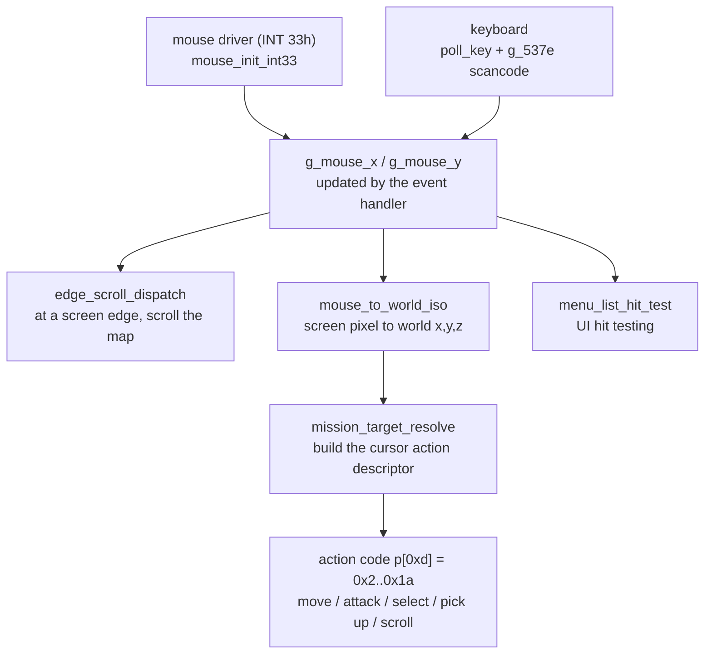
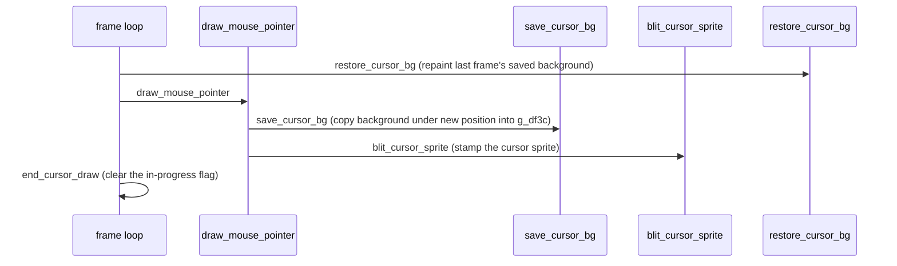
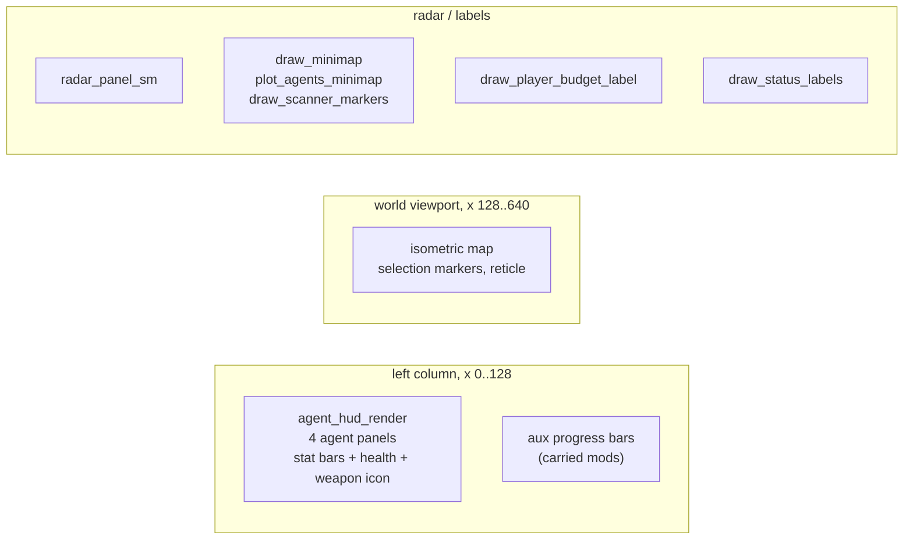

# Input, the HUD, and the UI

Syndicate reads two devices, the mouse and the keyboard, and paints one screen. This
page follows a pointer from the moment the mouse driver reports its position, through
the projection that turns a screen pixel into a spot in the isometric world, to the
click resolver that decides what a press actually means. It then walks the other half
of the same screen, the drawing side: the left-hand agent panels, the radar and
minimap, the funds and status labels, and the menu and text-entry widgets. The drawing
primitives themselves (the glyph blits, the rectangle fills) are covered in
[blitter.md](blitter), so this page names them and moves on.

The game runs at 640 by 400. The left 128-pixel column is the HUD. The world viewport
is everything to the right of it. That single split explains a lot of the constants
below: the clip rectangle the HUD clears is `(0, 0, 128, 400)`, and the mouse logic
only treats a click as a world click once the cursor x is at or past 128 (`0x80`).

## Reading the mouse

`mouse_init_int33` (`src/input/mouse_init_int33.c`, at `0x28b88`) is the driver bring-up.
It talks to the real-mode mouse driver through software interrupt `0x33` using the
DOS/4GW `int386` and `int386x` thunks. The sequence is: set the interrupt rate, reset
and detect the driver, and if a driver answers (its `ax` comes back `0xffff`), install
an event handler and hide the hardware cursor.

The event handler it installs lives at `0x1b290` (referenced here as `FUN_0001b290`). It
is registered with a call mask of `0x1f`, so the driver calls it back on move and on
button changes. From then on the game does not poll the mouse position by hand, it reads
the globals the handler keeps up to date. Throughout the code those are `g_mouse_x` and
`g_mouse_y`.

`mouse_init_int33` also allocates the cursor save-under buffer here, into `g_df3c`. Its
size depends on the video mode selector `g_105` (`0x1100`, `0x14b0`, or `0x1090` bytes).
That buffer is the backing store for the save-and-restore scheme described below. If the
allocation fails the routine reports an error and returns 0, which is the same failure
path as no driver at all.

`init_input_subsystem` (`0x25338`) is the tiny caller that wires input up at startup: it
runs `keyboard_hook_install` and then tail-calls `mouse_init_int33`.

## Reading the keyboard

The concrete keyboard read used by the interface is in `text_input_widget`
(`src/ui/text_input_widget.c`, at `0x36808`). It calls `poll_key` (`0x4d442`) for the next
character and then reads a separate global, `g_537e`, that holds the scancode of the last
special key. The widget dispatches on that scancode: Enter `0x1c`, Home `0x47`, End
`0x4f`, Left `0x4b`, Right `0x4d`, Delete `0x53`, Backspace `0xe`. So the keyboard path
is split in two, a character byte for printable input and a scancode byte for editing
keys, and both are cleared once consumed.

`keyboard_state_machine` (`src/input/keyboard_state_machine.c`, at `0x20c88`) is named for
the keyboard but its role is not pinned. The reconstructed body does not read a key
port. It scans a strided byte table (`g_squad_id`, row stride 1047, column stride 40)
keyed by `g_cur_player`, advancing a value fetched from a helper the file models as
`lcg_rand(0x45)`. It reads like a sequence or cheat-code matcher over per-player state
rather than a raw key reader, but that is inference from shape, not a confirmed
behaviour. Treat the name as provisional. This function is a documented near-miss (one
dead instruction apart from the target), so its bytes are trusted even though its
purpose is not.

## From screen pixel to world spot

`mouse_to_world_iso` (`src/lib/runtime/mouse_to_world_iso.c`, at `0xf5e8`) is the isometric
projection. Given the mouse position and the current scroll and scale, it produces the
world coordinate under the pointer. It is a hand-written assembly routine transcribed
byte-for-byte (a `db` block), so its behaviour is taken from its name and its place in
the pipeline, not from readable C. The exact projection formula is not reverse-engineered
to source level here. Flag it as unpinned at the arithmetic level.

`edge_scroll_dispatch` (`src/lib/runtime/edge_scroll_dispatch.c`, at `0x1bb48`) handles
screen-edge scrolling. It reads a set of edge flags (globals around `0xe2cc`) that say
which margin the cursor is touching, then pushes a direction code and calls a scroll
step. The direction codes it emits (1, 2, 4, 5, 6, 8, 9, 10) are the same eight-way
scheme that `sel_marker_dispatch` uses, so edge, marker, and scroll all share one
direction vocabulary. This too is a `db` transcription, so the flag-to-direction mapping
is inferred from the byte stream.

## The mouse cursor, and drawing without a trail

There is no hardware cursor once the driver's own cursor is hidden. The game draws the
pointer itself, into the same offscreen frame as everything else, which means it has to
undo that drawing before the next frame or the cursor would smear across the screen. The
save-under scheme solves this: before stamping the cursor, copy the pixels it will cover
into a buffer, and next time round put them back first.

The pieces, all in the hand-asm runtime and gfx regions:

- `draw_mouse_pointer` (`0x3eda6`) is the top-level stamp. It raises an in-progress flag
  (`0x506c`), and drives the save then the blit.
- `save_cursor_bg` (`0x3ea6b`, 826 bytes) copies the rectangle of background the cursor
  is about to overwrite into the save buffer at `g_df3c`, sized in `mouse_init_int33`. It
  has separate paths for the cursor shapes selected by the mode byte `g_105`.
- `blit_cursor_sprite` (`0x4a8d1`, 56 bytes) is the low-level sprite copy, with the
  segment setup (`push ds`, load `es`) that a far blit needs.
- `restore_cursor_bg` (`0x3e816`, 597 bytes) is the mirror of the save. It paints the
  saved pixels back so the cursor leaves nothing behind.
- `end_cursor_draw` (`0x3ee21`, 22 bytes) just clears the in-progress flag.

All five are `db` transcriptions, so the offsets and buffer names above are read off the
byte stream and the accompanying notes, not from decompiled C. The load-bearing fact
worth trusting is the shape: save, draw, restore, one buffer, sized by video mode.

## Turning a click into an action

The link from a resolved cursor to a game order is `mission_target_resolve`
(`src/input/mission_target_resolve.c`, at `0x2ad58`). It reads the cursor and the world
state and writes a small "cursor action descriptor" at `p`, whose byte `p[0xd]` is an
action code from `0x2` to `0x1a`: move, attack, select a ped, pick something up, scroll
the map, and so on. The caller turns that code into an actual order. The resolver is
large (3694 bytes) and its full case-by-case decode belongs with the mission logic, so
it is not re-explained here. See [game-systems.md](game-systems) for the action-code
breakdown.

One input-side detail is worth keeping on this page. The final dispatch in the resolver
clamps the cursor to the world only when `g_mouse_x >= 0x80` and `g_mouse_y >= 0x110`,
and its map-region hit test only fires when the cursor is inside the HUD band
(`g_10b22 < 0x80`). That is the same 128-pixel split again: past it is the world, inside
it is the HUD.

## The HUD

The HUD is data-driven. Panel positions come from tables (`g_hud_panel`,
`g_auxbar_panel`, `g_5114`) rather than hard-coded constants, so the sketch below is the
logical layout, not pixel-exact.

### The four agent panels

`agent_hud_render` (`src/ui/agent_hud_render.c`, at `0x2c578`) draws the left column, one
panel per squad agent. Each frame it clears the panel clip rectangle, ticks a blink
counter, and rebuilds an eight-entry table of phase-shifted blink flags. Then, for each
of the player's four agents that is active:

- Three horizontal stat bars, Adrenaline, Perception, and Intelligence, each read from a
  pair of entity bytes and scaled into a 55-pixel bar with a small change animation.
- A vertical health bar from the entity's health word.
- The agent's weapon or inventory icon.

If the agent is firing, the panel runs a short muzzle-flash state machine and draws only
the icon. Every bar is redrawn only when its cached value changes, tracked in a small
per-agent cache (`g_df48`), so a still HUD does almost no work. A second pass walks a
chain of up to eight auxiliary objects hung off the squad reference entity and draws a
thin progress bar for each, cached in `g_df76`.

The draw calls are the shared primitives `fill_rect_buf2`, `draw_vline_buf2`, and the
icon chain `draw_slot_record_chain`. See [blitter.md](blitter) for what those do.

`agent_hud_render` is a 77 percent match. The residue is a Watcom register and
stack-slot tie, not missing behaviour. Its true size (2387 bytes) is also larger than
the manifest recorded, because Ghidra's linear sweep desynced on a `movsx` mid-body.

### The inventory panel

`refresh_hud_inventory` (`src/ui/refresh_hud_inventory.c`, at `0x2cf28`) rebuilds the
selected agent's inventory slot state. It walks the agent's carried-item chain (head id
at ped `+0x3a`, next at item `+0x1c`) and, for each item type from 1 to `0x13`, feeds a
per-type sprite id into `entity_update_target_lock`, advancing a record cursor per item.
It is a parked near-miss, byte-identical apart from a couple of register-role residues.

`refresh_item_slots` (`src/ui/refresh_item_slots.c`) is the smaller helper it calls when
the selected ped is of the right type. It copies eight item-slot display records from
their source fields into the display table and zeroes the matching aux-bar cache entries.

### The radar and minimap

`radar_panel_sm` (`src/ui/radar_panel_sm.c`, at `0x2a288`) is the radar and status panel,
written as a small state machine. It computes a state from 1 to 6 based on what is under
the cursor and what target is selected (using line-of-sight checks), then in state 4 it
queues item-gauge draws and centres a localised label into the panel. It is a parked
near-miss with a fully recovered structure, held off an exact match by a register
colouring deadlock documented at length in the file.

Three `db`-transcribed routines draw the map blips:

- `draw_minimap` (`0x1aa08`) paints the minimap grid.
- `plot_agents_minimap` (`0x1b3f8`) plots the agents onto it.
- `draw_scanner_markers` (`0x1b658`) draws the scanner or blip markers.

Because these are byte-for-byte transcriptions, their pixel-level behaviour is taken from
the routine names, not from decompiled logic. Flag the detail as unpinned.

### The labels and the selection marker

`draw_player_budget_label` (`src/ui/draw_player_budget_label.c`, at `0x16678`) draws the
player's funds. It reads the budget dword from the per-player record, divides by 168 to
get an index clamped at 23, formats a string, and draws it. It is a near-miss whose only
divergence is a single push encoding (`imm8` versus `imm32`), a Watcom micro-version
peephole difference, not a source-reachable one.

`draw_status_labels` (`src/ui/draw_status_labels.c`, at `0x29a28`) draws two centred,
localised strings via `center_string_16`, one from each of two language-indexed tables.

`sel_marker_dispatch` (`src/ui/sel_marker_dispatch.c`, at `0x1bc28`) is the eight-way
selection marker stepper. It takes a direction code 1 to 10 (the same vocabulary as the
edge scroller) and moves the map cursor `(g_map_cursor_x, g_map_cursor_y)` one step,
drawing one or two markers. The four diagonal cases step the cursor on both axes and draw
a corner marker, and if a bound blocks the diagonal they fall through to an adjacent edge
case that steps two along one axis and draws two markers. `g_marker_phase_a` and
`g_marker_phase_b` are the cyclic animation phases.

## Menus and text

### Menu lists

`menu_list_draw` (`src/ui/menu_list_draw.c`, at `0x205f8`) and its twin `menu_list_draw_b`
(`0x20728`) draw a scrollable list of menu rows and handle the pick. They walk a record
pool (491-byte or 501-byte stride), draw a text row for every record whose state word is
`0x960`, stepping y by 12, then call `menu_list_hit_test` and, if the mouse picked a row,
redraw that row in the highlight colour. The two differ only in which pool and string
table they read. Both are near-misses held off by the same four-versus-three
callee-saved register wall.

`menu_list_hit_test` (`src/ui/menu_list_hit_test.c`, at `0x20018`) is the hit test. It
checks the mouse against a doubled-coordinate box, computes the row as
`(y - ytop*2) / 12`, then walks the record pool counting visible rows and returns the
one-based index where the row runs out, or 0 for a miss. A record counts as visible when
its state is `0x960`, or, in an alternate mode, when its state is in range 0 to 100.

### Drawing and measuring text

All of these fonts are 6-byte glyph records: byte `+4` is the advance width and byte
`+5` is the glyph height. A character code `c` indexes the table at
`(c - 0x20 + base) * 6`, where `base` selects the font and colour bank. Getting that one
layout right is what most of the text near-misses turned on.

`draw_ui_text` (`src/ui/draw_ui_text.c`, at `0x36698`) is the core string drawer. It walks
a NUL-terminated string a byte at a time. A newline resets the pen x and advances y by
the line height. A space just advances the pen by the bank-0 glyph width plus kerning.
Any other glyph is blitted with the RLE sprite blitter at `(x, y + 12 - height)`, with an
optional underline drawn first and an optional swap to the back buffer around the blit.
See [blitter.md](blitter) for the blit itself.

`draw_wrapped_text` (`src/ui/draw_wrapped_text.c`, at `0x363d8`) is the word-wrap engine.
It measures each word with `measure_text_width`, wraps inside the box, and draws glyph by
glyph. Its separators are space, newline, `\`, and `|`, with a double newline giving a
blank line and `|` acting as a terminator. On vertical overflow it can return the
remaining string pointer to the caller.

`center_string_16` (`src/ui/center_string_16.c`, at `0x299c8`) centres a string inside a
fixed 16-character field padded with spaces. It is a full match, cracked by letting the
Watcom headers inline `strlen` as `repne scasb`.

Width measurement comes in two closely related routines. `text_width_kern`
(`src/ui/text_width_kern.c`, at `0x36648`) sums glyph advance plus kerning over a string
until NUL or newline. `measure_text_width` (`src/ui/measure_text_width.c`, at `0x365e8`)
is its sibling with the extra word-wrap terminators (space, newline, `\`, `|`). Both are
near-misses whose residue is a 16-versus-32-bit widen and a load-schedule tie.

`center_draw_string` (`0x361a8`) and `measure_draw_text` (`0x36208`) are thin marshalling
wrappers: each measures a string, computes a centred or offset x, and hands off to
`draw_ui_text`, sharing the two calls' trailing stack arguments.

### The text-input widget

`text_input_widget` (`src/ui/text_input_widget.c`, at `0x36808`) is the keyboard line
editor described under "Reading the keyboard" above. Beyond the key dispatch, it clamps
the cursor to the string length, inserts printable characters at the cursor with a
right-shift of the tail (upper-casing a-z when caps is set), renders the horizontally
scrolled visible window through `draw_ui_text`, and, when the field is active, draws the
caret as a coloured underline under the character at the cursor. It returns 1 when a
recognised edit happened. It is a parked near-miss whose whole divergence cascades from
one `ESI`-versus-`EDI` index-register tie-break.

## What to trust, and what is still soft

The reconstructed C files (the resolver, the HUD renderers, the menu and text widgets)
are readable logic and their behaviour is trustworthy at the source level, even where the
byte match is short of exact. The `db`-transcribed routines (`mouse_to_world_iso`,
`edge_scroll_dispatch`, the whole cursor save-under set, and the three minimap drawers)
are byte-exact but opaque: their behaviour here is read off their names and their place
in the pipeline. The isometric projection maths and the exact pixel geometry of the
minimap and cursor are the parts to treat as not yet pinned. The role of
`keyboard_state_machine` is the one open question on the input side, its name is
provisional and its body does not obviously read a key.
