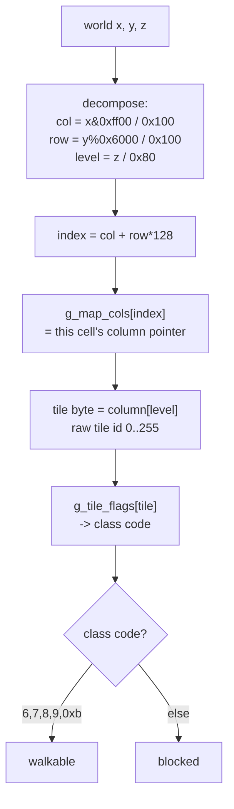
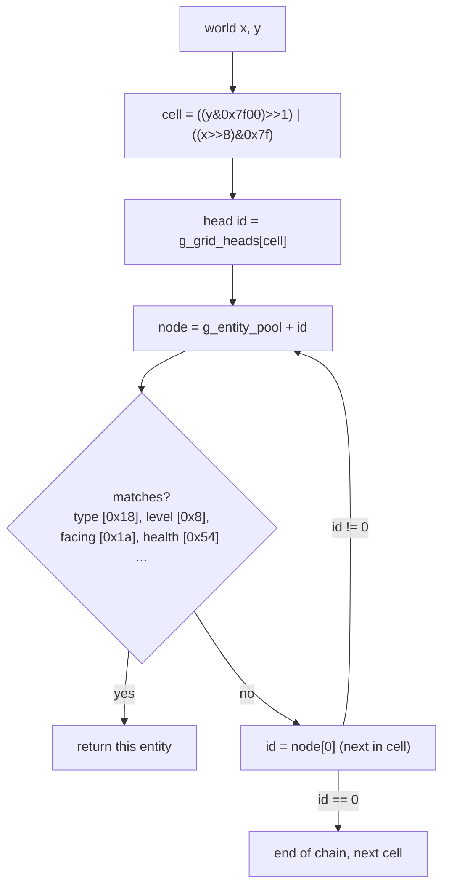
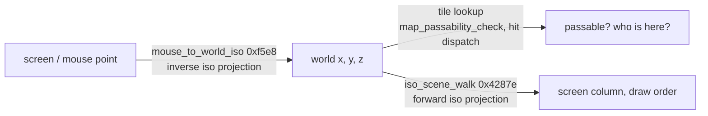

# The map, tiles and pathfinding

Syndicate's world is an isometric grid of tiles. A world position is three 16-bit
numbers, x, y and z. The high byte of x and y picks a tile column and row, the low byte
is the sub-tile position inside it, and z is height in units of 128. To answer "what is at
this position" the game splits the coordinate into a tile index, looks that index up in a
table of column pointers (`g_map_cols`), reads one tile byte at the right height, and
translates that byte through a small class table (`g_tile_flags`) into a class code it can
switch on. Passability, road following, height-stepping and the "who is standing here"
queries are all variations on that one lookup. Entities are found through a separate
128 by 128 spatial grid (`g_grid_heads`) of linked-id chains, described in
[the object model](object-model.md).

This page covers the coordinate model, the passability and z-probe checks, the spatial
grid lookups, and the screen-to-world conversion. The render side of the map (how tiles
and sprites are drawn) is in [the render pipeline section of game-systems](game-systems.md#the-render-pipeline-from-what-is-visible-to-pixels).

## Coordinates: world, tile and grid

There are three coordinate spaces in play and it is worth keeping them apart.

**World coordinates** are the raw `(x, y, z)` shorts stored on every entity at offsets
`0x04`, `0x06`, `0x08` (see the [pool-A record map](object-model.md#pool-a-record-the-central-entity-person--agent--projectile)).
They are fine-grained, 256 units per tile.

**Tile coordinates** come from the high bytes. Across the matched code the same arithmetic
recurs:

- column = `(x & 0xff00) / 0x100`, the high byte of x, so 0 up to about 127.
- row = `(y % 0x6000) / 0x100`, the high byte of y taken modulo 0x60, so 0 up to 95.
- level = `z / 0x80`, height in 128-unit steps. Several probes use `(z - 1) / 0x80`, which
  reads the tile the feet rest on rather than the one they occupy.

**The map index** is `col + row * 128`. The stride of 128 (the `<< 7` you see everywhere)
is the map's column count, and 128 by 96 gives exactly the `0x3000` entries the column
table holds. So the playable tile map looks like 128 columns by 96 rows, with height
stacked on top per column. Read the 96 as firm (it falls straight out of `% 0x6000`) and
the 128 as the addressing stride rather than a proven hard edge.

The **spatial grid** is a separate 128 by 128 table, indexed
`((y & 0x7f00) >> 1) | ((x >> 8) & 0x7f)`, which works out to the same `row * 128 + col`
tile addressing. It maps a tile cell to the first entity id sitting in it. That is a
different structure from the column table and is covered further down.

## The column table and how a map loads

The column table is `g_map_cols` (global `0x5358`), an array of pointers, one per tile
cell, each pointing at that cell's stack of tile bytes indexed by level. On disk the table
stores relative offsets, not absolute pointers, so it has to be relocated after the map
file is read.

That relocation is `relocate_map_columns` (`0x20d18`). It takes the loaded block base,
skips a 12-byte header, walks `0x3000` int entries adding the base to each so the stored
offset becomes an absolute pointer, then publishes the base in `g_map_cols`:

```c
char *base = (char *)param_1 + 0xc;
short i = 0;
do {
    int addr = i * 4 + (int)base;
    char *v = *(char **)addr;
    *(char **)addr = base + (int)v;   /* offset -> absolute pointer */
    i++;
} while (i < 0x3000);
g_map_cols = (char **)base;
```

This runs as part of map setup. The map initialiser `mission_map_init` (`0x22858`) calls
the column builder first, then stamps vehicle HP, resets the object pools and decompresses
the packed map files. The full load sequence is traced in
[how a map loads](game-systems.md#how-a-map-loads-the-picture-so-far). The higher-level
mission and briefing flow (`run_mission_briefing`) reaches this path when it sets a mission
up, though that function is a hand-assembly transcription and we have not pinned the exact
call site from its bytes, so treat the briefing link as the likely entry rather than a
confirmed one.

`relocate_map_columns` is understood but parked on a register-role tie, one of the
[matching near-misses](matching-ceiling.md). The passability check that reads the table it
builds is byte-matched.

## The passability lookup

Given a world position, the walkability test is `map_passability_check` (`0x33fb8`, matched
137 of 137 bytes). It is the clearest statement of the whole lookup shape:

```c
int row = (y % 0x6000) / 256;
int col = (x & 0xff00) / 256;
int index = col + row * 128;
char **slot = g_map_cols + index;                 /* the cell's column pointer */
unsigned char tile = *(unsigned char *)(z / 128 + (int)*slot);   /* tile byte at this level */
switch (g_tile_flags[tile]) {                     /* raw byte -> class code */
case 6: case 7: case 8: case 9: case 0xb:
    return 1;                                      /* walkable */
}
return 0;
```

Two tables chain here. `g_map_cols` turns a tile cell into a column, and the byte read from
the column at `z / 128` is a raw tile id, 0 to 255, effectively which art tile is placed
there. `g_tile_flags` then maps that raw id to a small **class code**, and the code is what
the game actually reasons about.



The class codes recur across the map functions, and the same code can mean different things
to different queries, so read the class as "what kind of tile" rather than a fixed
pass/block flag:

- `6, 7, 8, 9` are the four **road-flow directions** (W, E, N, S, see road following below).
  They read as walkable in `map_passability_check`.
- `0xb` also reads as walkable, and is the "try every direction" case in the hit dispatcher.
- `0` and `0xf` read as blocked in the path probes.
- `1, 2, 3, 4, 5, 0xa, 0xc, 0xd, 0xe` are the open floor classes in the path probes.

There is a second solidity table on the render or collision side. `passability_4corner`
(`0xf898`) tests four corners of a tile through a triple lookup
`g_a510[g_tile_flags[g_map_cols[cell][level]]]` and calls a corner impassable when that byte
is nonzero. So `g_a510` looks like a second-level "is this class solid" table layered on top
of `g_tile_flags`. It runs only for `z < 0x600`, which is the same roughly 12-level height
cap the map addresses. This one is decoded but parked, not byte-matched.

## Z-probing and height steps

Walking is not just "is this tile solid". The ground has height, so before a step the game
resolves the surface z at the destination and checks the height change is small enough to
climb. That is what the z-probes do.

The leaf backends are `tile_passability_test` (`0xfb48`) and `tile_passability_test_b`
(`0xfd38`), reached through the prefix entries `0xfa18` and `0xfa88`. Both are
hand-assembly transcriptions in the cut-off object prefix, so we read them from their
callers rather than from C. They take `(x, y, z)`, do the same column and `g_tile_flags`
lookup, and return a resolved z value for the surface at that position.

`z_probe_b` (`0xfa88`) wraps the backend into a small vertical search. It tries the test at
`z + 0x7f`, then `z - 1`, then `z - 0x81`, returns the first nonzero result, and otherwise
falls back to a floor-masked z. So it looks half a level up, at the current level, and a
level down to find the nearest passable surface.

The step probes are the twins `path_probe_y` (`0x2d468`) and `path_probe_0x40` (`0x2d5b8`).
Given an object `p` and a destination `(x, y, w)`, each looks up the tile class under the
object, switches on it to decide blocked versus open, calls the blocked backend (`0xfa18`)
or the open backend (`0xfa88`) to get the surface z, stores `surface - w` into
`g_level_step`, and returns 1 only if that height difference is within a threshold:

- `path_probe_0x40` allows a step within `[-0x40, +0x40]`.
- `path_probe_y` uses the tighter `[-0x20, +0x20]`, with an escape: a drop below `-0x20`
  still passes if the object's flag `p[0xb]` bit 1 is set.

The two differ only in that threshold and one extra blocked class (`path_probe_y` also
blocks class 0). Both are decoded and sit one register-role tie short of matching. It looks
like these are the per-tile step test a mover runs against a candidate neighbour, the
`0x20` versus `0x40` picking how steep a step the caller will accept, but we have not tied
them to a running route search yet.

## Road following and the compass probe

`compass_tile_probe` (`0x34368`) is a four-way neighbour test. Given a direction byte, N, E,
S or W as `0`, `0x40`, `0x80`, `0xc0`, it offsets the moving coordinate by the direction
vector table (`g_dir_dx` / `g_dir_dy`), does the column lookup on the neighbour one level
down, and returns 1 only if that neighbour's class equals the flow code for the direction:
N wants class 8, E wants 7, S wants 9, W wants 6. That is the game reading the directional
road tiles, and it is the primitive the vehicle drive step steers with (see
[road following](object-model.md#road-following)).

`pick_passable_shot_dir` (`0x34608`) uses the same compass probe to choose a line-of-fire
direction. For a vertical starting direction, if the point's x tile differs from the
target's x tile (`g_10b54`), it first tries the angle `vec_to_angle(dx, 0)` from the tile
delta, then the direction itself, then `dir - 0x40` and `dir + 0x40`, testing each with
`compass_tile_probe` at the shot cursor `(g_shot_x, g_shot_y, g_shot_level)`. Horizontal
directions mirror the same logic on the y tiles. It returns the first direction that passes,
or the original if none do. So a shot or scan nudges its aim onto a clear tile line rather
than firing straight into a wall. This one is a near-match, parked on Watcom cross-jump
decisions.

## The spatial grid and finding entities

Tiles answer "what is the terrain here". Finding entities uses the separate spatial grid
`g_grid_heads` (global `0x10e`), a 128 by 128 table where each cell holds the id of the
first entity in it. Entities are threaded into per-cell chains by 16-bit id, the same
id-not-pointer scheme the [object model](object-model.md#the-memory-model) describes:
`node = g_entity_pool + id`, and the next id is the word at `node[0]`. `move_entity_xyz`
keeps an entity filed in the right cell as it moves.

The grid cell index is `((y & 0x7f00) >> 1) | ((x >> 8) & 0x7f)`, the same tile addressing
as the column table. To scan an area the game walks a run of cells and follows each chain,
bounding the walk (commonly at `0x400` nodes) so a corrupt link cannot loop forever.



Four directional hit-scans share one template, each walking six cells and looking for a
type-2 entity (a vehicle body) that is on the right level, has a link at `+0x1c`, faces a
specific way, and whose linked node has health `> 0`:

- `grid_hit_x` (`0x33c38`) scans along x, facing `0x40`.
- `grid_hit_y` (`0x33cf8`) scans along y, facing `0`.
- `find_grid_entity_facing_0x80` (`0x33db8`) scans rows, facing `0x80`.
- `find_grid_entity_facing_0xc0` (`0x33b88`) scans columns, facing `0xc0`.

`map_tile_hit_dispatch` (`0x33e78`) ties the tile map and the grid together. It runs the
same column and `g_tile_flags` lookup as `map_passability_check`, but instead of returning a
bool it dispatches on the tile class to the matching directional scan: 6 to the `0xc0` scan,
7 to `grid_hit_x`, 8 to `grid_hit_y`, 9 to the `0x80` scan, `0xb` tries all four in order,
and anything else returns 0. In other words the road-flow class of the tile you are on
decides which direction to look for a blocking vehicle. The two `grid_hit_*` twins are
byte-matched, the two `find_grid_entity_facing_*` twins and the dispatcher are parked
near-misses (semantics verified, blocked on register-role ties).

Three broader-area finders scan a box of cells rather than a line:

- `find_nearby_ped` (`0x128b8`) walks a 3 by 3 block of cells for a live ped (type 1) whose
  coordinates fall inside a box around `(x, y, z)`, with a flag and link filter. It returns
  the node pointer or 0.
- `find_related_ped` (`0x12ae8`) walks a 2 by 2 block for an overlapping ped that also
  satisfies an ownership relation (same owner word `+0x20`, or one is the other's owner).
  This looks like the "is a related unit already standing here" overlap test.
- `find_blocking_entity` (`0x11d68`) is the line-of-sight blocker, the largest of the three.
  It sweeps a range of cells and dispatches on each candidate's type byte `+0x18`: peds,
  vehicles and pickups each get their own bounding-box slack, and statics (type 5) go through
  a further 43-entry switch on subtype `+0x19` that sets a per-object box and height reach.
  It returns the first entity whose box overlaps, and it is called by the
  `los_trace` family (`0x2e808`) with a `0x80` by `0x80` by `0x100` box to decide whether a
  shot is blocked. See the aiming and target-selection handlers in
  [the behaviour state machine](game-systems.md#the-behaviour-state-machine).

All three are parked near-misses. Their offsets, filters and box maths are transcribed and
verified against the target, so the behaviour above is solid even though the bytes are one
allocation choice short.

## Screen to world

The reverse direction, turning a screen or mouse point back into a world tile, is
`mouse_to_world_iso` (`0xf5e8`). It is a hand-assembly transcription in the cut-off object
prefix, so we describe it from its shape rather than from matched C: it takes a screen
point, applies the inverse of the isometric projection (the diamond-to-square unshear), and
produces a world position the rest of the code can feed into the tile lookups above. The
exact fixed-point steps are not pinned yet, so treat the inverse-projection description as
the likely reading.

The forward direction, world to screen, is the render walk `iso_scene_walk` (`0x4287e`),
which visits the tile diamond around the camera far-to-near and projects each cell to a
screen column. It is covered in
[the render pipeline](game-systems.md#the-render-pipeline-from-what-is-visible-to-pixels)
and has a commented listing at `src/lib/gfx/iso_scene_walk.asm`.



## What is pinned and what is not

Firm, from byte-matched code: the coordinate decomposition and map index
(`map_passability_check`, `map_row_col_index`), the column count of `0x3000` giving a
128 by 96 tile map, the two-table `g_map_cols` then `g_tile_flags` lookup, the walkable
class set `{6,7,8,9,0xb}`, the grid cell index and chain walk, and the two `grid_hit_*`
scans.

Decoded and consistent but not byte-matched (parked near-misses): `relocate_map_columns`,
the `path_probe` step tests, `compass_tile_probe`, `pick_passable_shot_dir`,
`passability_4corner`, the `find_grid_entity_facing_*` scans, `map_tile_hit_dispatch`, and
the `find_nearby_ped` / `find_related_ped` / `find_blocking_entity` finders. Their logic is
transcribed from the target, so the behaviour is reliable even where the bytes are a tie or
two short. See [the matching ceiling](matching-ceiling.md).

Read as inference: `mouse_to_world_iso` and the `tile_passability_test` backends are
hand-assembly transcriptions, described from their callers, not from decompiled C. And we
have not yet watched a live route search drive the step probes, so the pathfinding reading
of `path_probe_y` / `path_probe_0x40` is the likely shape rather than a confirmed one.
