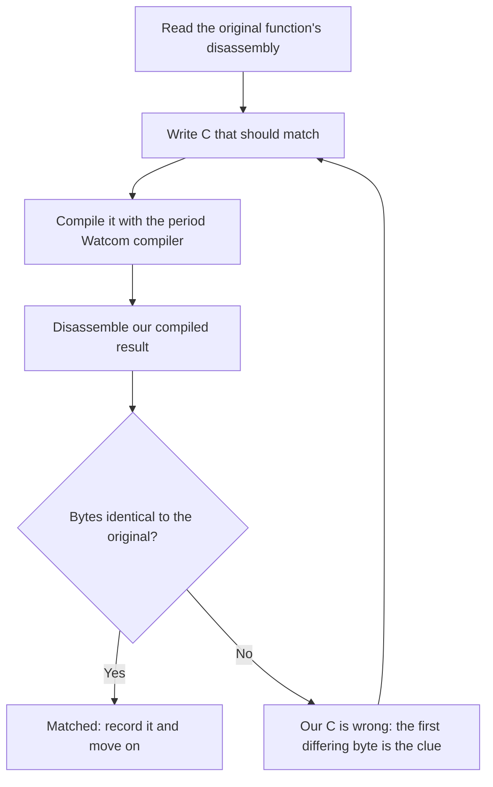

# What a matching decompilation is

This page explains what a matching decompilation is and why we're doing one for
Syndicate. The short version is that we rewrite the game in C that compiles back to
the exact bytes of the 1995 binary, one function at a time, so the result is provably
the original and not a lookalike. The rest covers why that strictness is worth it,
how we check a match, and the clean-room rule we work under.

## The short version

We have the original *Syndicate* game as a compiled program from 1995. That's a
big block of **machine code**, the raw bytes a CPU runs. We don't have the source
code it was built from. Our job is to write C source that, when compiled with the
same old compiler (see [the Watcom toolchain](watcom.md)), produces the *exact same
bytes*, one function at a time.

Not code that plays the same. Code that *is* the same, byte for byte.

## Why byte-for-byte, and not just "works the same"

There are two different things you could mean by "recreate the game".

One is a **reimplementation**: write fresh, modern code that behaves like the
original. That's what the old FreeSynd-style port did. It's a perfectly good goal,
but it's a new program that happens to act like the old one. You can never be sure
you got every detail right, because there's no way to check your behaviour against
every situation the original could be in.

The other is a **matching decompilation**, which is what we're doing. Here the
original binary is the source of truth. If our C compiles to the same bytes, then
by definition it does exactly what the original does, in every case, because it
*is* the original. There's no guessing. The proof is mechanical: compile, compare
the bytes, and either they're identical or they're not.

That's the appeal. It's slower and stricter, but when a function matches, you're
genuinely done with it. No behaviour to test, no edge cases to worry about.

## The oracle

We call the comparison step the **oracle**, the thing that tells you whether
you're right. Ours is simple: line up the bytes our compiler produced against the
bytes in the original, and check they're the same. A green light means you
reconstructed that function correctly. A red light, with the first differing byte
pointed out, tells you your C is not quite what the original author wrote, and
often hints at how.

The whole thing is a loop, one function at a time:

## Two phases

1. **Now: match.** Rebuild the game as C that compiles to the original bytes. When
   this is finished, the whole game builds from source and plays identically,
   because it's the same program.
2. **Later: port.** Once it builds from source and we understand it, move it onto
   modern operating systems and add quality-of-life improvements. The matching
   phase is what makes a faithful port possible, because by then we actually
   understand every line.

## Clean room

We only ever look at the compiled binary and its disassembly. We never use any
leaked or original source code, because we don't have it and wouldn't want to rely
on it. Everything is reconstructed from the machine code outwards. That's the
"clean room" part, and it's the normal, well-established way these projects work.
