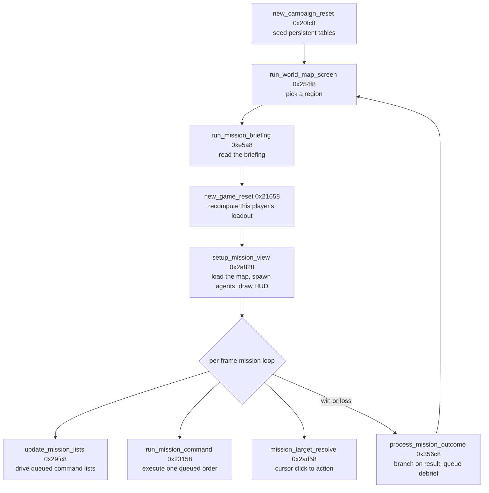
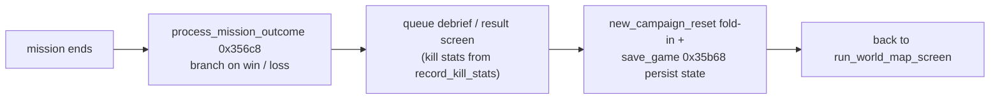

# Missions and the campaign loop

A Syndicate campaign is a chain of tactical missions strung across a world map. You start a
campaign, pick a region to attack, read its briefing, drop four agents into the map, play the
mission out, and then the game scores the result and sends you back to the map for the next
one. Between missions the important things persist: your money, your researched weapons and
mods, and the state of the rival syndicates. This page follows that loop through the
reverse-engineered code, from the reset that seeds a new campaign to the routine that resolves
each mission and loops back.

The tactical layer itself, how an agent moves, aims, fires, and is drawn, is covered in
[How the game works](game-systems.md) and [The object model](object-model.md). This page does
not repeat that. It focuses on the flow between screens and the tables that carry state from
one mission to the next.

A caveat before the detail. Several of the screen-level routines here, the world map, the
briefing, the map setup, the per-frame list driver, and the outcome handler, are stored in the
tree as db-transcriptions: hand-assembled or library code we have byte-transcribed rather than
decompiled to readable C. For those we know the entry address and can read the role from the
task the caller hands them and from the strings and tables they touch, but the internal logic
is not reconstructed line by line. Where that is the case the section says so, and the claim
should be read as the traced shape rather than proven C.

## Starting a campaign

A new campaign is seeded once by `new_campaign_reset` (`0x20fc8`). This is fully decoded C. It
walks a handful of fixed-address record tables and stamps their starting values, and it is the
single place every persistent per-player and per-syndicate table gets its opening state.

The tables it initialises are:

- **8 player command records** at `g_command_recs` (`0x105d4`, stride `0xe`). Each is a 14-byte
  slot with an owner id and a seed. These are the same records the mission interpreter later
  reads orders from, see below.
- **8 player equip and research templates** at `g_player_recs` (`0xe49c`, stride `0x417`). Each
  holds the player's money, roster, and 18 weapon or mod slots (40-byte slots at `+0x11d`).
  Player 0 is flagged human and active, the other seven are AI syndicates.
- **50 syndicate records** at `g_syndicate_recs` (`0x539c`, stride `0xa`), each given a random
  starting balance.
- **18 research records** at `g_5788` (`0x1eb` stride) and **20 mod/equip records** at `g_7bf4`
  (`0x1f5` stride), each with a 10x24 word progress grid.
- **a flat state block** at `g_5594`, cleared to zero.

Starting funds are `30,000` normally, or `100,000,000` when `g_unlimited_funds` is set (a
network or debug flag). `g_keep_synd_colours` controls whether syndicate colours are
randomised. `g_cur_player` is reset to 0.

The record strides are worth noticing because they recur throughout the mission code. The
`0x417`-stride player template and the `0xe`-stride command record are indexed the same way in
`run_mission_command` and `mission_target_resolve`, so the tables laid out here are exactly the
ones the tactical layer consumes. `record k` of the template table lives at
`g_player_recs + k*0x417`, and byte `+0xb5` of that row is the player's first pool-A agent slot.

`new_game_reset` (`0x21658`) is the companion, run per player rather than per campaign. It
recomputes equipment and research availability for the current player by probing six research
tiers (ids `0x1a0`, `0x1ac`, `0x1bc`, `0x1c8`, `0x1d4`, `0x1e0`) against two owned-research
bitsets in that player's `0x417` row. The higher tiers, once owned, reset the player's funds
and rebuild the squad, conveyor, and equipment-template tables from defaults. It looks like this
runs when the loadout or research screen needs the current player's available kit recomputed,
which is why it sits between the briefing and the map in the loop above, though the exact call
site is not pinned here.

## The world map

`run_world_map_screen` (`0x254f8`) is the region-select screen. The player picks which
territory to attack next, and the choice sets which map and briefing the following screens load.

This is a db-transcription, so the internal logic is not decoded. From its role and the tables
it sits next to it looks like a standard menu loop: draw the world map, poll the cursor over the
region hotspots, and write the selected region out for the briefing and map loader to pick up.
Treat that as the traced shape rather than reconstructed code.

## The briefing

`run_mission_briefing` (`0xe5a8`) is the briefing screen for the selected region. It loads a
pipe-delimited briefing table, the text and parameters for the mission, and presents them before
the player commits. This is where the mission's objectives and the price of intel or equipment
would be shown.

Like the world map this is a db-transcription. We know it consumes a pipe-delimited table from
the task and its data layout, but the parsing and layout code is transcribed, not decompiled.

## Entering the map

`setup_mission_view` (`0x2a828`) is the hand-off from the strategy screens into a live mission.
Its job is to load the selected map's resources, spawn the player's agents into pool A, and draw
the mission HUD. After it runs, the world exists and the per-frame loop can take over.

Two things are worth flagging. First, it is a db-transcription, so the resource-load and
spawn steps are traced from the role, not decoded. Second, its declaration carries the `aborts`
pragma, meaning it is treated as not returning normally in the usual sense, consistent with a
routine that sets up the world and then falls through into or hands control to the mission loop.
Agents land in pool A (base `0x8110`, stride `0x5c`), the people pool described in
[The object model](object-model.md), at the slots the player template reserved with its `+0xb5`
first-slot byte.

## Playing the mission

Once the map is live, three routines carry the mission each frame: the list driver, the command
interpreter, and the cursor resolver. The render and behaviour half of a frame is described in
[How the game works](game-systems.md), so this section is only about how orders flow.

**`update_mission_lists` (`0x29fc8`)** is the per-frame command-list driver. It is a
db-transcription (704 bytes) with a small internal jump table. From its role it looks like the
routine that walks the queued command lists and advances each one, the tick that keeps the
orders machine moving, but the byte-level logic is transcribed rather than decoded.

**`run_mission_command` (`0x23158`)** is the mission and orders interpreter, and this one is
decoded to readable C. It executes one queued command for a given record index and then clears
the opcode byte to consume it. The command comes from `rec = g_command_recs + idx*0xe`, with the
opcode at `rec[0xd]`, and the acting agent template is `tpl = g_player_recs + idx*0x417`, the
same two tables `new_campaign_reset` seeded.

The interpreter is a 59-entry jump table (cases `0x00` to `0x3a`), with a two-bank structure:
opcodes `0x01`-`0x1a` mirror `0x21`-`0x3a`, the `+0x20` bit selecting a variant, and eight pairs
share a body outright. That collapses roughly 59 cases to about 33 distinct behaviours. The case
families cover squad re-equip, per-agent aim and step (walking pool-A records for the player's
four agents), target and weapon selection, and projectile scatter. The full case map and the
per-opcode notes are in the `run_mission_command` section of
[How the game works](game-systems.md).

**`mission_target_resolve` (`0x2ad58`)** turns a cursor click into an action. It reads the input
mode and what the cursor points at, then writes an action descriptor into an output word block:
`p[0]` is the target x or id, `p[2]` the y, and the byte at `p[0xd]` is the action code. It emits
around 21 distinct action codes (`0x2` to `0x1a`) covering move, attack, select ped, pick up, and
map scroll, chosen through a final `switch(g_e120)` dispatch. The action-code map and the record
families it walks are documented in the `mission_target_resolve` section of
[How the game works](game-systems.md).

It looks like the pipeline runs cursor to order to execution: `mission_target_resolve` reads the
click into an action descriptor, that becomes a queued command in the acting agent's command
record, `update_mission_lists` keeps the queues moving, and `run_mission_command` executes each
queued opcode and consumes it. The exact wiring from an action code to a command opcode is not
pinned down here, so read that chain as the likely shape.

## Scoring a kill

While the mission runs, `record_kill_stats` (`0x2ed28`) books each hit or kill. Given the pool
record of a dying entity, it follows the target link at `+0x16` to the victim and the cause flags
at `+0x1c`, works out whether the victim is one of the current player's own four agents (the
pool-A block `[g_pool_a + c*0x5c, g_pool_a + (c+4)*0x5c)` where `c` is the player's first-agent
slot), and bumps a per-cause counter: friendly fire, enemy kills, and so on, into the
`g_10af4`-`g_10afa` group. These counters are the raw material for the mission debrief. This
routine is decoded C and is called from the combat behaviour, see the behaviour state machine in
[How the game works](game-systems.md).

## Resolving the outcome

When the mission ends, `process_mission_outcome` (`0x356c8`) takes over. Per the role it handles:
branch on the mission result, queue the appropriate result or debrief screen, and call back into
`new_campaign_reset` to fold the outcome into the campaign before returning to the world map. It
is a db-transcription (1184 bytes) carrying the `aborts` pragma, so the branch structure is traced
from the role rather than decoded byte by byte.

The persistence step that carries state between missions is `save_game` (`0x35b68`), which is
decoded C. Before writing, it taxes the current player's cash by 10% when it is above `30,000`
(an unsigned read-modify-write on the dword at `g_player_recs + p*0x417`). It then builds the save
path and, if the file opens, writes the campaign state in order: the 20-byte name, the player
records `g_player_recs`, the syndicate records, the mod and conveyor records `g_7bf4`, the list
records, the flat state block `g_5594`, and the 4-byte roster index. That is the same set of
tables `new_campaign_reset` seeds, which is what makes a campaign resumable: the persistent tables
are the campaign.

## What is solid and what is inferred

Decoded to readable C, so the claims are firm: `new_campaign_reset`, `new_game_reset`,
`run_mission_command`, `mission_target_resolve`, `record_kill_stats`, and `save_game`. The record
tables, strides, starting funds, research tiers, kill-stat counters, and save layout come
straight from those bytes.

Traced from role rather than decoded, so read as the likely shape: `run_world_map_screen`,
`run_mission_briefing`, `setup_mission_view`, `update_mission_lists`, and
`process_mission_outcome` are db-transcriptions. Their place in the loop and their jobs are known,
but the internal logic is byte-transcribed. The action-code to command-opcode wiring between the
cursor resolver and the interpreter is likewise inferred, not pinned.
