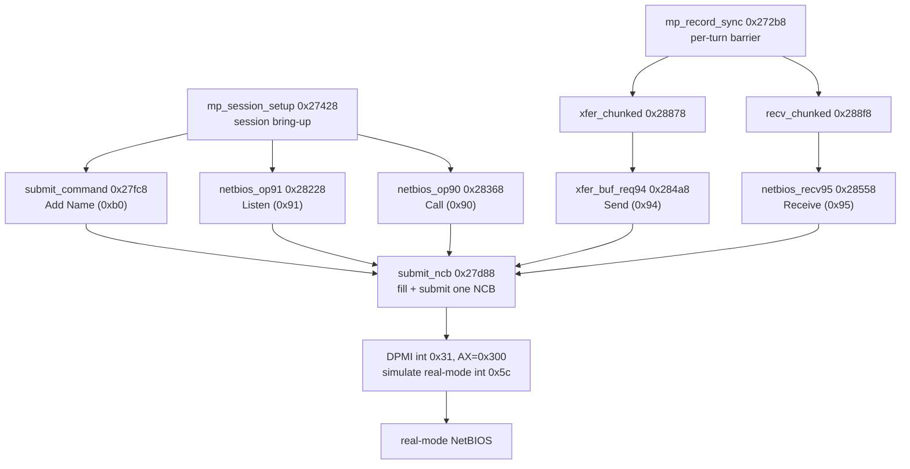
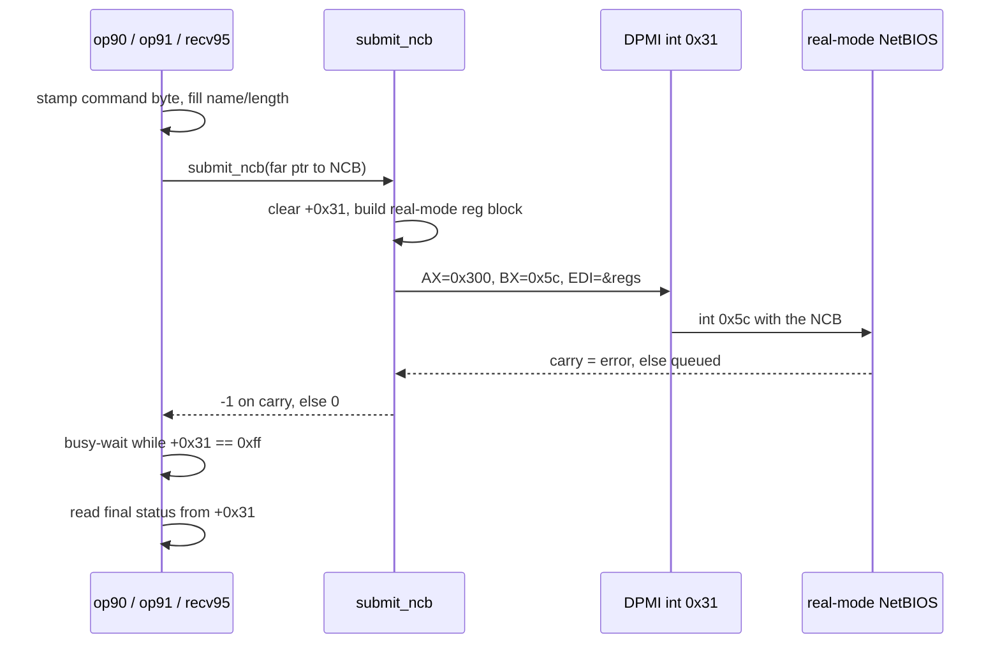

# Multiplayer and network play

Syndicate's multiplayer runs over NetBIOS, the old LAN protocol built into DOS network
stacks. The game does not talk to NetBIOS directly. It runs in 32-bit protected mode, so it
reaches the real-mode NetBIOS entry point through DPMI, the DOS protected-mode interface.

Every network action is a NetBIOS Network Control Block, an NCB. The game fills one in, hands
it down to real mode through a DPMI call, then polls a status byte until the operation
finishes. On top of that sit two layers: a session-setup handshake that gets two to eight
machines talking, and a per-turn sync that ships each player's game-state record to the others.

This page works from the reverse-engineered C in `src/multiplayer/`. Some of those functions
are byte-matched to the original and some are parked near-misses, but the behaviour below is
read straight from the code either way. Where something is guessed rather than proven it says
so.

## The NCB, and the layout the code reveals

A NetBIOS NCB is a fixed 64-byte structure. Reading which offsets the code touches, the layout
lines up exactly with the standard IBM/DOS NCB, which is a good confirmation that this really is
NetBIOS and not some lookalike.

| Offset | Field | How the code uses it |
|-------:|-------|----------------------|
| `+0x00` | command | opcode byte stamped before every submit (`0x90`, `0x91`, `0x94`, `0x95`, `0xb0`, `0xb1`, `0x35`) |
| `+0x02` | local session number | read as the "connected" marker (`p[2]`) |
| `+0x03` | name number | copied peer to peer during the name broadcast |
| `+0x04` | buffer pointer | cleared as a word in a couple of tails |
| `+0x06` | callname number / buffer | set from `g_df1c` / `g_df28` before send and receive |
| `+0x08` | length | set to the transfer length, read back as the received count |
| `+0x0a` | callname | 16-byte name field for Call, Listen, Send, Receive |
| `+0x1a` | name | 16-byte name field for Add Name and Delete Name |
| `+0x2a` | receive timeout | set from the `rto` parameter |
| `+0x2b` | send timeout | set from the `sto` parameter |
| `+0x31` | command-complete | `0xff` while pending, final status when done |
| `+0x40` | real-mode segment | not standard NCB, stashed here by the allocator for DPMI |

The high bit of the command byte matters. In NetBIOS, adding `0x80` to a command asks for the
asynchronous, no-wait form. So `0x90` is Call (`0x10`) no-wait, `0x91` is Listen (`0x11`),
`0x94` is Send (`0x14`), `0x95` is Receive (`0x15`), `0xb0` is Add Name (`0x30`) and `0xb1` is
Delete Name (`0x31`). `0x35` is Add Group Name, submitted in its plain waiting form.

The game always submits the no-wait variant, then does its own busy-wait on the completion byte
`+0x31` when it wants to block. That side-steps the POST callback, which would be awkward to run
across the real-mode boundary. It looks like polling was simply easier than wiring an interrupt
handler back up into protected mode.

## Submitting one NCB through DPMI

`submit_ncb` (`0x27d88`) is the choke point. Every operation ends up here.

It clears the completion byte `p[0x31]`, then builds a DPMI real-mode register block on the
stack. The NCB offset goes into the block's EBX slot, the flags word is set to `0x100`, and the
real-mode segment stored at `p+0x40` goes into the DS and FS slots. That segment was recorded by
the allocator when the block was created, so the real-mode side sees the NCB at the right
address.

Then it zeroes the WATCOM `REGS` and `SREGS` input and output structures, calls `segread`, and
fires `int386x` on `int 0x31` with EAX `0x300` and EBX `0x5c`. DPMI function `0x300` is
"simulate real-mode interrupt", and `0x5c` is `int 5Ch`, the NetBIOS entry vector. So this one
call reaches down from protected mode and invokes real-mode NetBIOS on the block.

If the carry flag comes back set, the return-code slot `out[6]` is non-zero, it reports the error
through `report_net_status` and returns `-1`. Otherwise it returns `0`. It does not itself wait
for the NetBIOS command to finish. The caller polls `+0x31` for that.

## DOS memory for the NCB

An NCB has to live in memory that real-mode NetBIOS can address, so it cannot sit in the game's
protected-mode heap. `dpmi_alloc_5para` (`0x27f08`) handles that.

It calls `int 0x31` function `0x100`, "allocate DOS memory block", asking for five paragraphs,
which is 80 bytes, enough for the 64-byte NCB plus a little slack. DPMI hands back a real-mode
segment in AX and a protected-mode selector in DX. The function zeroes the first `0x42` bytes
through the selector, writes the real-mode segment into the block at `+0x40` for `submit_ncb` to
find later, and returns the far pointer `selector:offset`.

`dpmi_free_dos_mem` (`0x287e8`) is the mirror. It calls `int 0x31` function `0x101`, "free DOS
memory block", guarded so it does nothing on a null block.

The allocated blocks are held in a connection table at `0x10644`, referred to in the code as
`g_conn` or `g_10644`. It is an array of six-byte far pointers, a four-byte offset then a
two-byte selector, one slot per player. That six-byte stride is why the code walks it with `lgs`
loads at multiples of six.

## The session-setup handshake

`mp_session_setup` (`0x27428`) is the whole join sequence, from the player-count prompt to a
table of connected peers. It returns the number of players it connected, or `-3` if the user
asked for a single-player game, or `-2` if they pressed ESC to abort. The ESC flag is `g_e285`,
polled at several points so a stuck handshake can always be broken out of.

It runs in roughly six steps.

**Prompt.** It switches to video mode `0x12`, reads a line, and parses a player count with
`atol`. Anything outside two to eight is rejected. One returns `-3`, zero or over eight loops
back to the prompt.

**Register our name.** It walks the connection table trying to claim a player slot. For each slot
it builds a name from the base `g_name_buf` plus a digit, "name0", "name1" and so on, and submits
an Add Name with `submit_command` (`0x27fc8`, opcode `0xb0`). A zero result means the name was
accepted, so that index becomes our own player index `g_cur_player`. A `-13` result means the
name is already taken, so it issues a Delete Name through `xfer_buf_req_b1` (`0x28118`, opcode
`0xb1`) and retries the same slot. In effect each machine grabs the lowest free player number.

Worth flagging: the header on `xfer_buf_req_b1` guesses "open file by name". Read alongside the
`-13` retry here, it is far more likely Delete Name, the natural partner to the Add Name it
undoes.

**Broadcast our name.** Once we have a slot it fills in the other connection records so they know
who we are. For each other slot it far-copies our name field at `+0x1a` and the name-number byte
at `+3` into that record, then posts a Listen with `netbios_op91` (`0x28228`, opcode `0x91`).
The Listen is asynchronous, so it just arms each record to accept an incoming Call.

**Connect to peers.** It then walks the table again and, for any peer not already up, issues a
Call with `netbios_op90` (`0x28368`, opcode `0x90`). On a successful Call it runs
`xfer_buf_req35` against the peer, copies the peer's callname field at `+0xa` into place, marks
the slot ready in `g_df30`, and bumps the connected count. What `xfer_buf_req35` (Add Group Name,
opcode `0x35`) contributes here is not fully pinned down. It copies the real-mode segment word
from the peer record's `+0x40` into a separate global buffer and submits, so it looks like a
group or addressing step tied to the freshly connected session.

**Wait for everyone.** A spin loop counts how many records are ready, our own included, and keeps
looping until the count matches the player total. ESC still aborts. Then it marks our own status
ready and returns the connected count.

`conn_status_scan` (`0x279f8`) is the same readiness check factored out. It scans the table, marks
each slot live or dead in `g_df30`, reports any status change, and returns the live count.

## Session operations: Call, Listen, Send, Receive

Four functions share almost the same shape. Each stamps its command byte, copies a NetBIOS name
into the callname field at `+0xa`, pads the name to fifteen characters with `g_name_pad`,
optionally sets the timeout bytes, and submits.

- `netbios_op90` (`0x28368`) is Call, opcode `0x90`. It connects to a named peer.
- `netbios_op91` (`0x28228`) is Listen, opcode `0x91`. It waits for an incoming Call.
- `xfer_buf_req94` (`0x284a8`) is Send, opcode `0x94`. It copies the payload into the shared
  transfer buffer first, then submits.
- `netbios_recv95` (`0x28558`) is Receive, opcode `0x95`. After completion it copies the answer
  out of the transfer buffer into the caller's near buffer, using the length reported back in the
  NCB at `+0x08`.

All four take an `async` flag. When it is set they return `0` the moment the NCB is queued. When
it is clear they busy-wait on `p[0x31]` until it stops being `0xff`, then read the final status.
A non-zero status is reported through `report_net_status`, and the function returns the negated
status so the caller can tell success (`0`) from a specific NetBIOS error. Send and Receive move
their data through a global transfer buffer, a far pointer whose offset and selector are stored
as separate words (`g_df2afp` for send, `g_df1e` for receive), with `g_df38` holding the chunk
size.

The name copies and buffer copies are hand-written far-string and far-memcpy routines, spelled
out as `#pragma aux` byte sequences in the source. They exist to reproduce the original's inlined
far-pointer string handling exactly. They are a matching device, not new behaviour.

## The per-turn sync

Once a game is running, `mp_record_sync` (`0x272b8`) keeps the machines in step. It only does
work in a real multiplayer game (`g_num_players > 1`) and only when it is the local player's turn.

For the local player it sends our own record to every other active player. For every other active
slot it receives that player's record. Each record is `0x417` bytes, 1047 bytes, held in
`g_player_recs`.

The record is larger than a single NetBIOS send can carry, so the transfer is chunked.
`xfer_chunked` (`0x28878`) sends the record in whole chunks of `g_df38` bytes, then a final
remainder chunk, stopping early if any Send fails. `recv_chunked` (`0x288f8`) is the receive
side. It pulls the same chunks and checks each one, only reporting the full length once every
chunk arrived complete. The chunk size `g_df38` is re-read on each iteration, so a call that
changes it mid-transfer is handled. The receive loop in `mp_record_sync` spins until a full 1047
bytes have landed, which is a hard barrier: a turn will not advance until the peer's record is in.

`net_sync_build` (`0x14078`) builds the outgoing game-state messages that actually flow during
play. The first time it sees an object it emits a spawn message (type 4) carrying the object's
id, worked out from its pool pointer minus the pool base. After that it runs a line-of-sight
check, `los_trace_far`, and only when the target is visible does it emit a burst of update
messages: type `0x18`, type 7 carrying an object field, type `0x14` with fixed marker values,
and type 8 carrying node coordinates with a height offset. Each message goes out through
`run_mission_command`. So the network stream is line-of-sight gated, machines only tell each other
about things a player could actually see.

## The parts still opaque

Two higher-level drivers sit above all this and are not yet decompiled to readable C.
`sync_network_players` (`0x27158`) and `refresh_netgame_map` (`0x22cc8`) are both carried as
db-transcribed byte blocks, hand-assembly or library code we have reproduced exactly but not yet
read as logic. From their names and their place in the call graph they most likely drive the
per-frame player sync and rebuild the shared map state, but that is inference from naming, not
proven from decoded control flow.

`report_net_status` (`0x289a8`) is the small shared reporter the whole subsystem funnels errors
through. It is a thin wrapper that prints a format string at `0x37d8` with a message string, a
line number, and a status code. Every NetBIOS failure path in the files above lands here, which
is why the same `g_376c` string and a source-line-like number turn up again and again.

## See also

- [How the game works](game-systems.md) for the frame loop and object pools these records sync.
- [Relocations and the OMF differ](relocations-and-omf.md) for why the far-pointer loads and the
  hand-written `#pragma aux` blocks are shaped the way they are.
