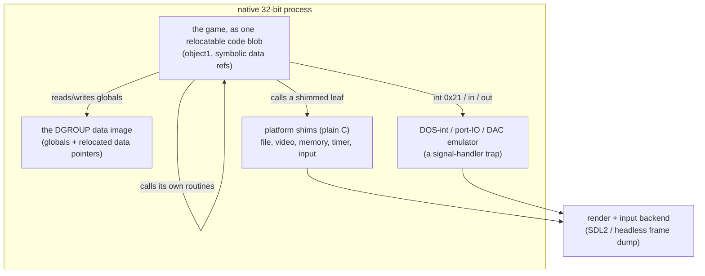
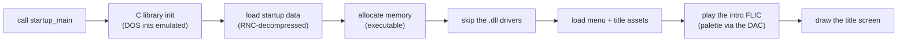

# Running the game natively

The matching decompilation proves the code is right by rebuilding the original DOS binary
byte for byte. This page is about a different goal on the `port` branch: taking that recovered
code and running it as a real native program, with no DOS and no DOSBox underneath it.

It works. The game boots through its own startup, loads its data from the user's own copy,
plays the intro, and draws the Syndicate title screen, all in a native Linux process. The same
render path also builds to a real Windows `.exe`.

The rest of this page explains why that was hard, the shape of the solution, and how the pieces
fit together.

## Why it is hard

The obvious plan for a port is "keep the C, replace the platform layer". That plan has a hole.
The parts of the game that actually matter at runtime, the main loop, the rendering, the menus,
the entity tick, and every one of the low-level blitters, are not C. They are hand-written
assembly, carried in the build as byte-for-byte transcriptions (see
[game vs library](game-vs-library.md)).

Those transcriptions have addresses baked into them. A `call` inside them points at a fixed
offset, and a read from a global points at a fixed data address, both fixed for the original
memory layout where the code loads at 0x10000 and the data sits at its DOS/4GW addresses. The
DOS build works because [`origbuild.py`](matching-playbook) forces exactly that layout. A modern
operating system will load the program somewhere else entirely, so every baked address points at
nothing.

So a native port has two problems to solve at once. It has to make the game's own assembly run
at a native address, and it has to give that assembly a platform to talk to that is not DOS
hardware.

## The shape of the solution

The port runs the game's real machine code and replaces only the edges. Three layers do the work.

The blob is the game. The data image is its world. The shims and the emulator are the DOS
platform, rewritten. Nothing here is a reimplementation of the game logic. It is the original
code, relocated, given somewhere to run.

## Making the assembly relocatable

The enabling trick is to stop treating the transcriptions as fixed bytes and start treating them
as relocatable code the native linker can place anywhere.

`tools/asm_symbolize.py` (on the `port` branch) rewrites a function so that its two kinds of
baked reference become symbolic. Every absolute data reference, which we already know from the
game's own relocation table, becomes `__obj<N> + offset`. Every call to another function becomes
a symbol the linker resolves. Everything else stays as raw bytes, so the internal layout is
untouched and self-relative jumps inside the function stay correct.

The proof this is right is a round trip. Assemble the rewritten function, link it at the original
address, and the bytes come back identical to the original. Across the whole binary, 273 of 275
transcriptions reproduce byte for byte. The two that don't are jump-table dispatchers, which the
next idea handles anyway.

That next idea is what actually runs. Rather than link functions one at a time, the port emits
the entire code segment as one contiguous blob at its original relative offsets
(`tools/asm_emit_blob.py`). Keeping the layout means every jump and call inside the code stays
valid without any work, and every absolute code pointer, including the switch-jump tables that
defeated the per-function approach, resolves as a simple `__obj1 + offset`. Only the data
references need symbols. This is the model the DOS build uses, rebuilt as a native object.

## The data the code reads

The code addresses its globals as offsets into one big data segment, DGROUP.
[`tools/port_dgroup.py`](resources-and-data-files) builds that segment from the original data
pages and places the per-object bases at their true offsets, so overlapping views of the same
memory still line up.

Data holds pointers too. String tables and other data-to-data pointers are stored, like the code
references, as unrelocated placeholders. The same fixup pass that the DOS loader would run has to
run here. So the data image is emitted with each of those 851 pointers rewritten to `__obj<N> +
offset`, exactly like the code, and the native linker relocates them. Without this, the first
pointer the game follows at startup is null and it crashes on a message string.

## The platform, rewritten

With the code relocated and the data placed, the game runs. It then immediately tries to talk to
DOS hardware, which is where the shims come in.

A useful discovery made the shims simple. The game was compiled with Watcom's stack calling
convention, not the register one, so its routines take their arguments on the stack just like
ordinary cdecl C. That means a shim is a plain C function. There is no need for assembly glue
between the game and the platform.

The port redirects the low-level leaves to C. Each one has its entry in the blob overwritten with
a jump to a `shim_` function.

- **File I/O** maps onto POSIX file descriptors. The game's `open`, `read`, `write`, and `seek`
  become the obvious system calls.
- **Video** routes the frame to the render backend. The game composites into a linear offscreen
  buffer and calls a present routine (see [blitters](blitter.md)). The shim hands that buffer to
  SDL as a texture instead of pushing it through mode-X VGA.
- **Memory** hands out real memory. Crucially it uses executable mappings, because the game loads
  code overlays into allocated buffers and jumps into them.
- **Timer** runs a background thread that advances the tick the game waits on, the way the
  hardware timer interrupt used to.

The blob symbols are all prefixed so they cannot collide with the C library. Without that, the
game's own `open` shadows the real one and the file shim calls itself forever.

## The DOS calls that are left

Some of the game's own library helpers still issue a raw `int 0x21`, or read and write hardware
ports directly. In a native process those instructions fault. Rather than shim every one of those
functions, the port catches the fault and services the instruction in place
(`port/dosint.c`).

A signal handler sits on the segmentation fault. When the faulting instruction is a DOS call, a
BIOS call, a port read or write, or a privileged instruction like `cli`, the handler does the
small thing that instruction meant, updates the registers, steps the instruction pointer past it,
and returns. Execution carries on as if the hardware had answered.

Two parts of this earn their keep for the picture on screen. The port reads and writes are mostly
ignored, except the VGA palette registers, which the handler captures so colours are right. And
the intro copies its frames straight to the old VGA memory address, so the port maps a page there
for the writes to land in.

## The drivers the game loads

Syndicate ships two loadable drivers, `gamedg.dll` for graphics and `gamefm.dll` for sound. They
are not native libraries. They are DOS executables the game reads off disk, relocates, and runs.
Running them natively would mean building a small DOS program loader, and their code reaches for
real hardware anyway.

The port takes the simpler road. It fails the driver open, and the game degrades to its own
built-in render path, which is exactly the path the shims already cover. This is why the title
screen appears without the graphics driver ever loading.

## How the boot actually goes

Put together, a run walks this path, and each step was a wall cleared in turn.

The build script `port/build_boot.sh` runs the whole thing and drops the rendered frame to a
file. It reads the game's data from a folder of the user's own files, so no assets are shipped,
the same rule the DOS build follows.

## The render layer on its own

Before any of the boot worked, the render backend was built and proven on its own. It reads a
real Syndicate screen and its palette from the user's data, decompresses the palette with a C port
of the game's own RNC depacker, converts the 8-bit image through the palette, and shows it as a
GPU texture in an SDL2 window. Its output is byte-identical to a reference renderer.

That same demo cross-compiles with MinGW to a genuine Windows `.exe` plus `SDL2.dll`, which opens
a real window on Windows with no WSL and no DOSBox. See `port/build_win.sh`.

## Building and running it

The port branch carries the scripts. From a checkout of `port`, with a 32-bit toolchain and the
user's own *Syndicate* data to hand:

- `bash port/build_boot.sh` boots the game and renders the title screen to `frame.ppm`.
- `bash port/build_video.sh` drives the game's own present path with a loaded screen.
- `bash port/build_win.sh` cross-compiles the render demo to a Windows `.exe`.
- `bash port/build_asm_native.sh` runs the game's own RNC decompressor natively, as the smallest
  proof that the relocated assembly executes.

## What is left

The frame today is a headless snapshot. The next step is a live window: wire the same shims to an
interactive SDL surface with keyboard, mouse, and timing, so the title advances to the menu, the
menu to the world map, and the world map into a mission. The whole platform underneath that,
the relocated code, the data fixups, the shims, and the DOS emulation, is already carrying a real
frame, so what remains is breadth, not a new wall.

The branch model is deliberate. The byte-exact decompilation stays on `main` as the reference.
The port lives on `port` and is free to stop matching bytes, because its job is to run, not to
prove. See [the branch notes](https://github.com/WildPress/vibesynd/blob/main/BRANCHES.md).
