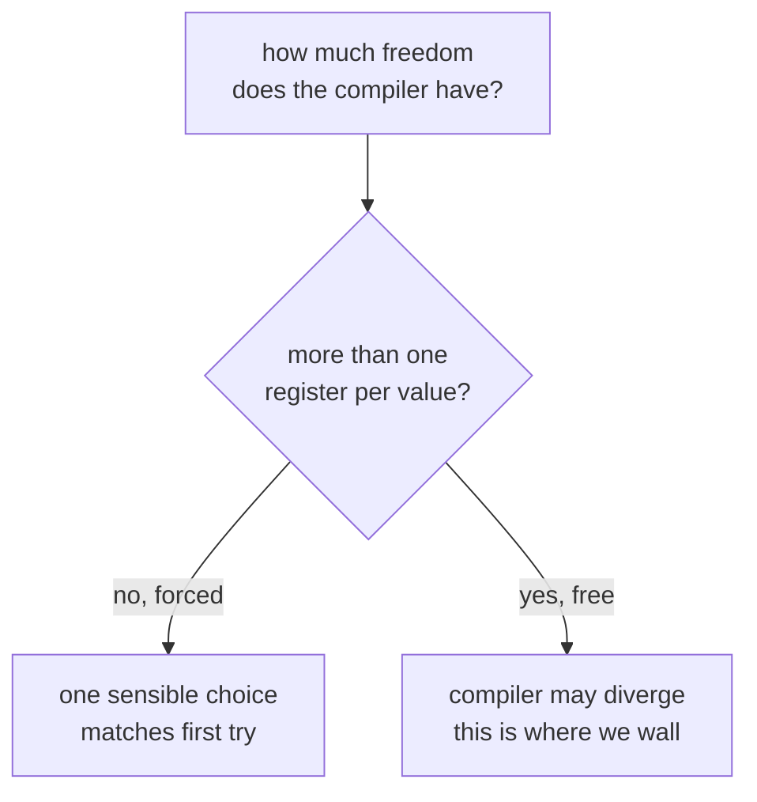

# Register allocation

This page is about the biggest obstacle to matching the game byte for byte: which
CPU register the compiler chooses to hold each value. The same C can compile to two
versions that behave identically but name different registers, and that alone
changes the bytes. Below is a real function that misses by a single byte because of
one register, and a rule for spotting which functions will match easily and which
will fight.

This is the single hardest thing to match in the game's own code, so it's worth
understanding why.

## What registers are, again

A [**register**](cpu-basics.md) is a tiny storage slot inside the CPU, much faster
to use than memory. The x86 chip has only a handful of general-purpose ones: EAX,
EBX, ECX, EDX, ESI, EDI, and EBP. A function juggles its values between these
registers and memory as it runs.

## The allocation problem

When the compiler turns your C into machine code, it has to decide **which
register holds which value** at each moment. A function might have a pointer, a
loop counter, and a running total all live at the same time, and only so many
registers to put them in. Choosing the assignment is called **register
allocation**, and it's one of the cleverer jobs a compiler does.

What matters for us is that there's often more than one *correct* answer. Putting
the counter in EBX and the total in ESI works just as well as the other way round.
The program behaves the same. But the *bytes* are different, because the
instructions name different registers.

## Why it's our main wall

The compiler is deterministic. Give it the same C and the same flags and it makes
the same choices every time. So if our compiled function puts a value in a
different register than the original does, that isn't randomness. It means our C is
different enough that the compiler's allocation logic went a different way.

Sometimes we can nudge it back by rewriting the C. Sometimes we can't, because the
allocation hangs on something subtle that's hard to express in source. That's the
wall: the logic is right, the behaviour is right, but the compiler parked a value
in EBX where the original used ESI, and everything downstream shifts.

## A worked example: one byte apart

Here's the wall in its purest form. The map passability check at `0x33fb8` (see
[how the game works](game-systems.md)) reconstructs to **136 bytes against the
original's 137**, and every byte matches except one region in the middle. The whole
disagreement is a single register.

At that point the function has a table index in EAX and needs the address of a table
slot, `&g_5358[index]`, to read the base offset stored there. Both versions compute
the same address and both leave it in EBX. They just get there differently.

The original loads the table base into EDX, then folds in the scaled index with a
three-register `lea`:

```
mov edx, [g_5358]        ; base into a scratch register
lea eax, [eax*4]         ; scale the index (4 bytes per int)
lea ebx, [edx+eax]       ; ebx = base + index  (3 bytes)
```

Ours loads the base straight into EBX and adds the index in place:

```
mov ebx, [g_5358]        ; base into ebx directly
lea eax, [eax*4]         ; scale the index
add ebx, eax             ; ebx = base + index  (2 bytes)
```

Same address in EBX at the end, same behaviour, but `add ebx,eax` is one byte
shorter than `lea ebx,[edx+eax]`, and that's the whole size difference. The original
kept the base in a separate scratch register (EDX) and combined into a third. Ours
reused EBX as both source and destination. One byte, one register.

We couldn't move it. We tried seven structurally different ways of writing the same
C, swapping the order of the two operands being added, swapping the
order inside the index expression, introducing an explicit pointer local, hoisting
the divide into its own variable, retyping the table as a pointer-to-pointer, and
pinning the base in a named local. Every single one still put the base in EBX. A few
made the diff worse by shifting it earlier. None produced the EDX form.

That tells us something precise about the wall. The compiler is deterministic, so the
EDX choice isn't luck, some C shape *does* produce it, the original's did. But it
isn't reachable by the ordinary reshufflings that fix most allocation mismatches. So
this function sits at ninety-nine percent, understood completely and wrong by one
byte, parked until we either find the exact C shape or decide the last byte isn't
worth it.

## The pattern that predicts success

Here's the useful rule we found. It comes down to how much *freedom* the compiler
has.



- **Forced allocation**: when there's really only one sensible place for each
  value, the compiler has no choice, so it makes the same choice the original did.
  These functions match on the first try. Forwarders that hand their arguments
  straight on, initialisers that fill in a struct, linear sequences of calls,
  simple setters. There just isn't room to diverge.
- **Free allocation**: when two or more values could each go in several registers,
  the compiler picks, and it might pick differently than the original's compiler
  did from our slightly different C. These are the ones that wall us.

So the practical strategy is to target the forced-allocation shapes, where success
is reliable, and treat the free-allocation ones as the slow tail, where we have to
work the C carefully or accept that some won't yield.

## Why we don't just change flags

It's tempting, when a register is in the wrong place, to try a different flag and
see if it shifts. We learned not to. The flags are pinned (see
[compiler flags](compiler-flags.md)), so bending them to force a register into
place would just be papering over a wrong reconstruction. The honest signal is that
our C differs from the original's, and the fix, when there is one, is in the C.

## The floor, measured

We wanted a number rather than a feeling, so we ran a register-normalised diff over
every function still short of a match. The tool decodes both our output and the
original to instructions and compares them modulo a consistent register renaming and
a consistent stack-slot renaming. That splits the near-misses into honest buckets: a
pure renaming that a mechanical tool could rewrite, a structural difference where the
instructions themselves differ, or a register-role split where the original keeps a
value in one register and we spread it across two.

Across all 111 non-matched functions the tally was blunt. Not one was a pure renaming.
Ninety were structural, six were register-role splits, and fifteen were dropped by a
flaky compiler harness rather than a real failure. Zero were the clean case a renamer
could fix.

We then pushed on the very closest ones, because if the floor gives anywhere it gives
there. The nearest function is byte-identical to the original except for nine bytes,
where the original keeps a multiply's result in one register and we keep it in another.
The author of that reconstruction had already tried every spelling of the multiply. The
next nearest differs by a single choice: the original writes `y + 1` as a copy followed
by an increment, and Watcom writes it as one `lea`. We tried the copy-then-increment
form, the compound-assignment form, a named temporary. Every one folds straight back to
`lea`. The compiler canonicalises it and no source reaches the other shape.

The conclusion is worth stating plainly, because it is easy to keep grinding past it. A
matching decompilation against a period compiler has a floor. The compiler makes
register-allocation and instruction-selection choices that our source cannot steer, so a
fraction of functions will not match from compiling C, however the C is written. For us
that fraction is real and measured, not a gap in effort. It is also worth keeping in
perspective: those functions are already decoded to correct, readable C, and the
reconstructed binary is byte-exact because it is built from the original bytes. The floor
is a limit on one specific claim, that our C recompiles to the exact bytes, and not on
the decompilation being complete or the build being faithful.
