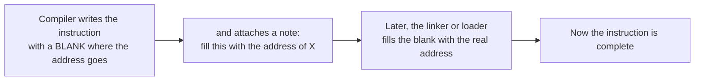

# Relocations and the OMF differ

This is the trickiest concept so far, but it's central to how we compare bytes, so
it's worth taking slowly.

## The problem: addresses you don't know yet

When we compile one function on its own, it often needs to refer to things that
live elsewhere: another function it calls, or a global variable it reads. At the
moment of compiling, the compiler has no idea what address those things will end
up at, because they're in other files that haven't been combined yet.

So the compiler leaves a **blank**. It writes the instruction, but where the
address should go, it puts a placeholder, and it attaches a note that says "fill
this spot in with the address of function X once you know it". That note is called
a **relocation**, and the filling-in happens later, either when all the pieces are
linked together, or when the program is loaded to run.

An analogy: it's like writing a letter that says "meet me at ADDRESS at noon" and
leaving ADDRESS blank because you haven't booked the venue yet. You mark the blank
so you remember to fill it in before you post the letter.

## Why relocations complicate our byte comparison

Here's the snag for us. The *original* game has already been linked, so its blanks
are filled in with real addresses. Our freshly compiled function has *not* been
linked, so its blanks are still placeholders.

That means even a perfectly correct function will differ from the original at every
relocation spot. The original might have `call 0x0003b239` while ours has `call`
followed by a placeholder. The instruction is the same, the target is the same
function, but the bytes at that spot differ because one is filled in and one isn't.

If we compared bytes naively, every function with a call or a global reference
would look wrong. So the comparison has to **ignore the relocation spots** and only
check everything else. When the non-relocation bytes all match, we've reproduced
the function, and the relocations will fill in identically once linked, because
they point at the same things.

We call this a **relocation-aware match**, or say the spots are **masked**, meaning
we blank them out on both sides before comparing.

## Finding the spots: what OMF is

To mask the relocation spots, we have to know exactly where they are. That
information lives in the object file our compiler produces.

**OMF** stands for **Object Module Format**. An object file (the `.obj` our
compiler spits out) is not just raw machine code. It's a structured file, made of
tagged records, that holds the code bytes plus a lot of bookkeeping: what the
function is called, what other things it refers to, and, crucially, a list of every
relocation and exactly which bytes it covers. OMF is the specific format Watcom
uses for those files. It dates from the DOS era and it's well documented.

Inside an OMF file, the relocations are stored in records called **FIXUPP**
records (short for "fix up"). Each fixup entry says: at this byte offset, for this
many bytes, there's an address that needs filling in. That's precisely the map we
need.

## What we built

At first our comparison used a shortcut. Unfilled relocations usually show up as
four zero bytes, so the tool just masked any run of four zeros. That worked for
simple cases.

But it had a hole. Some relocations aren't a plain address, they're an address
plus a small fixed number, called an **addend**. For example, "the start of this
array, plus 0x1e00 for the end of it". In that case the placeholder isn't four
zeros, it's the addend, `00 1e 00 00`. The four-zeros shortcut walked straight past
it, so those functions couldn't match.

The proper fix, which is now in place, is to read the OMF FIXUPP records directly
and mask exactly the spots they list, whatever's written in them. The tool that
parses the object file is `tools/omf.py`, and the comparison uses it in
`tools/match_reloc.py`. This unblocked a class of functions that use arrays,
tables, and indexed data, which is a lot of real game logic.

## The takeaway

- A relocation is a blank for an address that gets filled in later.
- The original's blanks are filled, ours aren't, so we mask those spots and compare
  everything else.
- OMF is the format of the object file, and its FIXUPP records tell us exactly
  where the blanks are.
- Reading them properly, rather than guessing, is what makes the comparison
  trustworthy.
