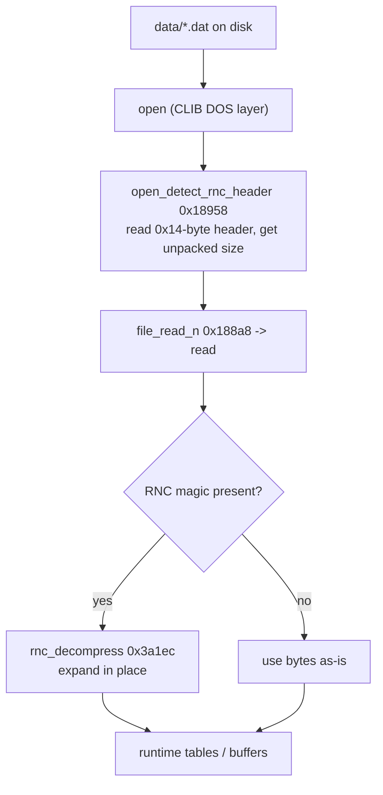
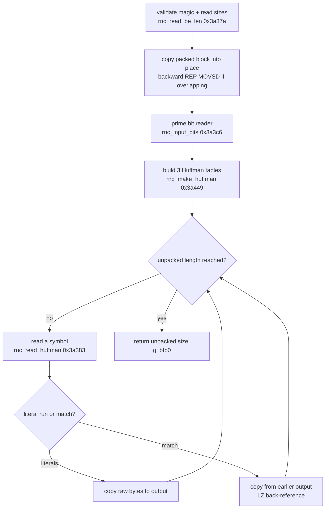
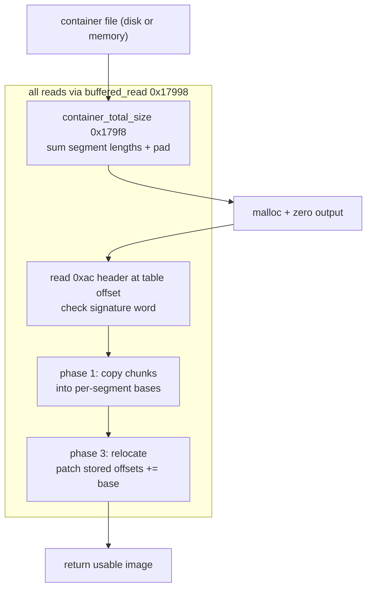

# Resources and data files

Most of what Syndicate shows you does not live in the executable. The maps, sprites, palettes,
the sound driver and the balance tables all sit in external files under `data/`, and a lot of
them are compressed. This page follows one of those files from the disk into usable memory.

There are two loading paths, and they are worth keeping apart. The first is the flat path. A
descriptor names a file, the game opens it, reads it whole, and if it is compressed expands it
in place. The second is the structured-container path, used for the sound driver, where the
file is a small linked image with its own segment, chunk and relocation tables that the loader
walks and patches.

Underneath both sits the Watcom C runtime's DOS file layer (`open`, `read`, `close`,
`filelength`, `lseek`, `tell`). That layer is documented in [c-runtime.md](c-runtime.md), so
this page links to it rather than repeating it. The FLIC and XMIDI playback paths are a
separate subject again and live in [sound-and-cutscenes.md](sound-and-cutscenes.md).

## The shape of the pipeline



The size step comes before the read on purpose. The game needs to know how big the unpacked
data will be so it can size the destination, and for a packed file that number is not the file
length, it is a field in the header. `open_detect_rnc_header` returns exactly that.

## The CLIB seam

Every raw byte transfer bottoms out in the Watcom runtime. `open` takes a path and a mode
(the game always passes `0x200`, binary), `read` and `lseek` and `tell` move and report the
file position, `close` releases the handle, and `filelength` measures a file by seeking to the
end and back. These are vendor functions matched against the shipped library, not game code.
See [c-runtime.md](c-runtime.md) for the handle layer and the stdio layer above it.

Two thin game-side wrappers sit directly on that seam.

`file_read_n` (0x188a8, matched, 26 bytes) is a three-argument forwarder onto `read`. It
exists only to present a fixed calling shape, it adds no logic.

`file_open_read_close` (0x180f8, matched, 85 bytes) opens a file, measures it with
`filelength`, closes it, and returns the size. It records a status in the global `g_3eec` (3
for open-failed, 5 for a bad length). It looks like a "how big is this file" probe used to
size a buffer before a separate read.

## Path one: flat files and the RNC detector

### Detecting and sizing a packed file

`open_detect_rnc_header` (0x18958, matched, 195 bytes) is the size probe for the flat path. It
opens the file, reads a 20-byte (`0x14`) header, and compares the first four bytes against the
literal `"RNC\1"`.

```c
h = cond_3call(fn, 0x200);          /* open */
file_read_n(h, buf, 0x14);          /* read the header */
if (strncmp(buf, magic, 4) == 0) {  /* "RNC\1" */
    r = buf[4]; r = (r << 8) + buf[5];
    r = (r << 8) + buf[6]; r = (r << 8) + buf[7];   /* big-endian u32 */
} else {
    r = filelength(h);              /* plain file: size is the file length */
}
```

If the magic matches, the return value is the big-endian unpacked size from bytes 4 to 7. If
it does not, the file is plain and the return value is its length. Either way the caller gets
the number of bytes the unpacked data will occupy. A failed open returns `-1` and prints an
error via message code `0x164`.

### The one-shot loader

`load_unpack_file` (0x188e8, matched, 99 bytes) is the standalone version of the flat path. It
opens the file, reads it into a caller-supplied buffer sized by `open_detect_rnc_header`, then
calls `rnc_decompress` in place. A negative decompress result prints an error (message code
`0x14c`, most likely the `ERROR decompressing %s` string noted in
[game-systems.md](game-systems.md)).

```c
int fd = cond_3call(path, 0x200);
if (fd != -1) {
    file_read_n(fd, buf, open_detect_rnc_header(path));
    if (rnc_decompress(buf, buf) < 0)
        printf(0x14c, path);
    file_close(fd);
}
```

Note the `rnc_decompress(buf, buf)` call decompresses the buffer onto itself. The mission map
init (`mission_map_init`) uses this to pull a map file whose name it builds with `sprintf`, so
the flat path is what loads the packed map data. See [map-and-pathing.md](map-and-pathing.md)
for what happens to that data once it is in memory.

### The descriptor-driven loader

The larger flat-path clients do not call `load_unpack_file`. They run a descriptor list. Each
descriptor is a fixed-stride record naming a file (or a `'*'` for a plain zeroed allocation),
and the loader walks the list. This machinery is already written up end to end in
[object-model.md](object-model.md) (the "Resource loading architecture" section) and
[game-systems.md](game-systems.md), so here is only the seam into this page.

`validate_records_or_abort` (0x18338, matched, 163 bytes) walks the record list at stride
`0x2c` while the load-target field at `+0x1c` is non-zero. For each record it calls
`realloc_block_descriptor`, tallies any failure, and if the tally is non-zero at the end it
prints a count and calls `exit(1)`. It is the "load these blocks or die" gate run during
startup on two record tables (`g_4d9c` and `g_4ea4`).

`realloc_block_descriptor` (0x184b8) loads one block. For a real file it calls
`open_detect_rnc_header` to get the RNC-aware size, allocates through DOS DPMI or the heap
depending on a flag bit, reads, and decompresses in place if packed. This is the same detect
then read then decompress shape as `load_unpack_file`, wrapped around a per-block allocator.

## The RNC codec

`rnc_decompress` (0x3a1ec, matched, 398 bytes) is Rob Northen Compression, the packer common to
Bullfrog and many DOS games of the period. Recognising it carries straight over to other
decompilations, which is why the [porting guide](porting-guide.md) flags it.

The whole routine and its four helpers are hand-written assembly carried as byte transcriptions
under `#pragma aux`, not reconstructed C. See [game-vs-library.md](game-vs-library.md) for why
some functions are kept as bytes.

### The container header

What the code reads directly from the stream is the magic and two sizes.

- Bytes 0 to 3, the magic. The driver checks it as two words via `LODSW`, `'RN'` (`0x4e52`)
  then `0x0143`, which is the byte sequence `R N C 0x01`. This is RNC format 1, the
  Huffman-coded scheme.
- Bytes 4 to 7, the unpacked length, big-endian, read through `rnc_read_be_len` into the global
  `g_bfb0`.
- Bytes 8 to 11, the packed length, big-endian, read the same way into `g_bfb4`.

The standard RNC format-1 header carries a few more fields after these (CRCs, a leeway byte and
a chunk count). The decompressor touches header bytes beyond offset 8, so those fields are most
likely present here too, but this code does not label them and I have not confirmed their exact
roles from these bytes alone. Treat the magic and the two big-endian sizes as read directly and
the rest as inferred.

### The decode loop

After the header the driver copies the compressed block into place (a backward `REP MOVSD`
under `STD` when source and destination overlap), primes the bit reader, and builds three
Huffman decode tables at `g_be30`, `g_beb0` and `g_bf30`. Then it runs the format-1 outer and
inner loops, emitting literal bytes and LZ back-references until the unpacked length is
reached, and returns `g_bfb0` on success.



The exact back-reference arithmetic (the note in [object-model.md](object-model.md) records
distance+1 and length+2, in line with standard RNC format 1) is not something I re-derived from
these bytes, so take it as the documented RNC behaviour rather than a fresh reading of this
disassembly.

### The four helpers

Each of these is its own matched function that `rnc_decompress` calls.

- `rnc_read_be_len` (0x3a37a, matched, 9 bytes). A big-endian dword reader. It pulls the next
  four bytes from the stream and byte-reverses them (a `BSWAP`-equivalent) so an on-disk
  big-endian size lands native in a register. Used for the two header sizes.
- `rnc_input_bits` (0x3a3c6, matched, 131 bytes). The bitstream extractor. It pulls a requested
  number of bits out of a little-endian bit buffer held across three globals (`g_bfbe`,
  `g_bfbc` and a bit-count byte at `g_bfc1`), refilling from the compressed pointer when a
  request crosses the current word boundary.
- `rnc_make_huffman` (0x3a449, matched, 153 bytes). The decode-table builder. It reads a 5-bit
  count of code lengths, then a 4-bit symbol count per length, and walks the lengths building
  the (mask, first-code, base) triples that the symbol reader consumes. It is called three
  times, once per table.
- `rnc_read_huffman` (0x3a383, matched, 67 bytes). The symbol lookup. It scans a table's
  (mask, code) pairs against the current bits until one matches, reads that entry's length, and
  consumes that many bits, reconstructing the decoded value.

These four names all appear in `tools/names.py` and the manifest, so they are settled
identities, not guesses.

## Path two: the structured container

The sound driver is not a flat blob. It is a small linked image, and `container_load` (0x17b48)
plus `container_total_size` (0x179f8) are the loader for it. Where the flat path reads bytes and
maybe decompresses, this path parses a header with segment, chunk and relocation tables and
patches addresses as it copies.

### Reading from disk or from memory

Both container functions do all their I/O through one helper, and that is the neat part.

`buffered_read` (0x17998, matched, 86 bytes) reads `len` bytes at offset `off` into `dst`, but
it has two modes chosen by a flag bit. With bit 0 set, the "source" is already a memory image
and it does a plain `memcpy` from `base + off`. With bit 0 clear, the source is a real file
handle and it does `lseek` then `read` then `tell`. Either way it returns the next position, so
callers can chain reads by feeding the return value back in as the next offset.

```c
if (flags & 1) {                    /* memory-resident */
    memcpy(dst, h + off, len);
    return off + len;
}
lseek(h, off, 0);                   /* file-backed */
read(h, dst, len);
return tell(h);
```

That single abstraction is why the container loader can run identically against a file on disk
or against an image already sitting in RAM. The sound path uses the memory mode, having first
slurped the raw file in.

### Sizing then loading

`container_total_size` (0x179f8, matched, 321 bytes) is the size pass. It reads a table offset
from `0x3c`, checks a signature word at that offset against a global-seeded value (`strcmp`
against a string at `0xb0`), reads the container header there, then walks the segment records
and sums each record's length field. It returns that total plus a small pad (`0xf`). This is
the amount of memory the unpacked container will need.

`container_load` (0x17b48, unmatched near-miss, 1433 bytes) is the load pass, and it is the one
big function on this page that has not matched. Its structure and logic are believed correct,
but the register allocation diverges from the target throughout the body, which the header
comment records as a register-allocation wall rather than a logic error. It does three things.

1. It sizes the container with `container_total_size`, and if the malloc flag is set it
   allocates and zeroes that much output.
2. Phase one, it walks the segment records, and for each one walks its chunk entries, copying
   each chunk out of the packed body into the running output pointer (16-aligning the first
   chunk of a segment when a flag asks for it) and recording per-segment base pointers.
3. Phase three, it runs a relocation pass, walking relocation tables and patching stored
   offsets in the copied segments by adding the resolved segment base addresses.



The signature check and the segment/chunk/relocation layout read like a linker-style overlay
format. The [architecture](architecture.md) notes call the sound driver resource out by its
`"Copy"` marker at offset 4 and a dispatch-table pointer, which fits this loader. I am
describing the layout at the level the code reveals and have not pinned every header field.

### Loading the raw file first

`alloc_init_with_errcode` (0x18158, unmatched near-miss, 191 bytes) is the step that gets the
raw container bytes into memory before `container_load` parses them. It opens a named file,
measures it with `file_open_read_close`, allocates a buffer (either a caller-supplied one or one
from an internal allocator), reads the whole file in, and returns the buffer. It records
progress in `g_3eec` (3 open-failed, 2 alloc-failed, 5 short-read). It is a near-miss on an
encoding tie, the target routes each error code through a register while Watcom folds our C to a
direct store, so the logic matches but the bytes do not.

The sound driver init shows the two steps together. `alloc_init_with_errcode` loads the driver
file into `g_11df0`, `container_load(g_11df0, 5, 0)` parses that in-memory image (flag bits for
memory-resident and malloc-output), then the raw buffer is freed once the parsed image is built.

## What flows through each path

| Path | Loader | Asset types |
| --- | --- | --- |
| Flat, one-shot | `load_unpack_file` | mission map files (name built at `mission_map_init`), other packed `data/*.dat` |
| Flat, descriptor list | `validate_records_or_abort` then `realloc_block_descriptor` | the startup block tables (`g_4d9c`, `g_4ea4`): sprites, fonts, palettes, the balance and equipment data |
| Structured container | `alloc_init_with_errcode` then `container_load` | the sound driver resource |

The flat path is the common one, and almost everything the game loads (art, maps, the stat
tables that read as zero in the executable) comes through it RNC-packed. The structured
container is the specialised one for the driver image. Both end in the same place, usable bytes
in a game buffer.

## What is solid and what is inferred

Solid, read straight from the code: the RNC magic and the two big-endian header sizes, the
detect-size-read-decompress order on the flat path, the dual-mode `buffered_read`, and the
segment then relocation phases of `container_load`.

Inferred and hedged: the RNC header fields past offset 8, the exact back-reference arithmetic
(taken from the standard format and the existing note in [object-model.md](object-model.md)),
and the precise field roles in the container header. Where a detail is not recoverable from
these bytes it is called out above rather than filled in.

## See also

- [c-runtime.md](c-runtime.md), the CLIB `open`/`read`/`close` layer under all of this.
- [object-model.md](object-model.md) and [game-systems.md](game-systems.md), the
  descriptor-loader and data-file name table written up from the object side.
- [map-and-pathing.md](map-and-pathing.md), what the decompressed map data becomes.
- [sound-and-cutscenes.md](sound-and-cutscenes.md), the separate FLIC and XMIDI playback paths.
- [porting-guide.md](porting-guide.md), why spotting RNC helps on other decompilations.
