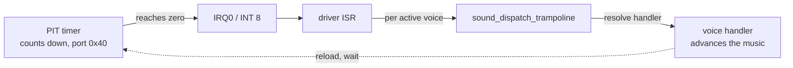
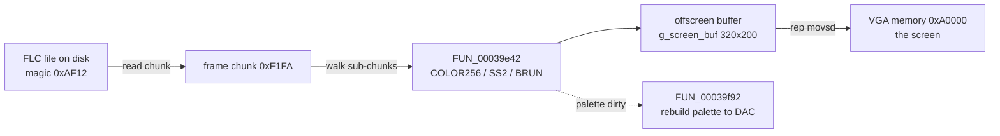

# Sound, and how the cutscenes play

The files under `src/lib/sound/` are two quite different things that happen to share one
object in the build. One is a music and sound-effect driver. The other is the animation
player that shows the intro and the mission cutscenes. They sit together because the
linker packed them into the same module, not because they do the same job.

So this page is really two pages. The first half is the sound driver: how it makes the
PC's timer chip fire an interrupt over and over so music can be timed. The second half is
the FLIC player: how it reads an animation file off disk, unpacks each frame, and pushes
it to the screen.

Both are hand-written assembly, kept as commented `.asm` listings next to the raw bytes
the build uses. See [game code vs the library](game-vs-library.md) for why these
functions are carried as bytes rather than rebuilt from C.

## Part one: the sound driver

This is an AIL/Miles-style driver, the sort of thing DOS games licensed to play music.
It plays XMIDI, a MIDI variant, by keeping a set of independent voices and calling a
handler for each one on a steady beat. That steady beat comes from the PC's timer chip.

### The timer chip, and why music needs it

Every PC has a small chip called the Programmable Interval Timer, the 8253 or 8254 PIT.
It counts down from a number you give it, and when it reaches zero it raises a hardware
signal called IRQ0. The CPU sees IRQ0 as interrupt number 8, stops whatever it was doing,
and runs a handler. Then the timer reloads and counts down again, forever.

The number you load sets the speed. The chip's input clock ticks about 1.19 million times
a second, so loading a smaller count means it hits zero sooner and the interrupt fires
more often. Left alone, DOS runs it slow, about 18 times a second. Music needs finer
timing than that, so the driver reloads the timer with a much smaller count and gets a
faster, steadier tick to drive playback.

`reprogram_pit_ch0.asm` is the routine that writes a new count into the chip. It sends a
command byte to I/O port `0x43`, then the low and high halves of the count to port `0x40`.
It does this with interrupts switched off so a tick cannot land halfway through and catch
the chip with only half its new count.

### Taking over interrupt 8

A faster tick is no use unless the driver's own code runs on it. `install_timer_isr.asm`
does that swap. It asks DOS for the address of the current interrupt-8 handler and saves
it, then points interrupt 8 at the driver's own routine instead. From that moment every
timer tick runs the driver. When the last sequence stops, `FUN_0003942f.asm` puts the
original handler back, so the machine is left as it was found.

### One timer, many voices

There is only one timer chip, but several voices may each want to be serviced at their own
rate. The driver's answer is to run the single timer at the fastest rate anyone asks for,
and to derive the slower voices from it by counting ticks.

`recompute_timer_period.asm` is where that decision is made. It scans every active slot,
finds the smallest requested period, which is the fastest, and only reprograms the chip if
that has changed. `timer_rate_critsec.asm` shows a caller setting a rate in plain hertz.
It turns the frequency into a period in microseconds, one million divided by the frequency,
and hands it on so the shared rate can be worked out again.

### The voice tables and the dispatch trampoline

The driver keeps its state in parallel 16-entry tables, one row per voice: which handler
owns the voice, its handle, and whether it is active. `init_voice_tables.asm` sets these to
empty at start-up, and `clear_voice_tables.asm` resets the separate timer-scheduling tables
that the rate scan reads. Both run with interrupts off so a tick cannot see a half-built
table.

The heart of the driver is `sound_dispatch_trampoline.asm`, a tiny stub. A caller puts a
command code in a register and the voice index on the stack, and the trampoline looks up
that voice's handler for that command and jumps straight into it, leaving the arguments in
place. This is the classic driver-command pattern: every voice owns a small table of
command-and-handler pairs, and commands like `0x64`, `0x66`, and `0x68` mean things like
"initialise", "play", and "stop". If a voice has no handler for a command the trampoline
just returns zero.

### Starting and stopping

The first time anything allocates a sequence (`FUN_00039625.asm`) the driver brings the
whole timer subsystem up: it clears the tables and installs the interrupt-8 handler. When
the last sequence is released (`FUN_000396d5.asm`) it stops the timer and restores the old
handler. So the driver only holds the timer for as long as something is actually playing.
`FUN_000399bd.asm` starts a voice by dispatching the play command, and `FUN_00039a82.asm`
stops one by clearing its active flag and dispatching the stop command.

## Part two: the FLIC animation player

The intro and the cutscenes are Autodesk FLIC animations, the `.FLC` format from Animator
Pro. The player lives in the same module as the sound driver but has nothing to do with it.
Its entry point is `FUN_00039ca0.asm`. It opens the file, walks through it, unpacks each
frame into an offscreen buffer, and copies that buffer to the screen.

### What a FLIC file is

A FLIC file is a header followed by a run of frames. The header starts with a magic number,
`0xAF12` for an FLC file, and carries the frame count, width, and height.
`FUN_00039ee2.asm` reads those fields out. After the header comes one chunk per frame, each
marked with the magic `0xF1FA`, and inside a frame are smaller sub-chunks that each describe
part of the picture.

`FUN_00039e42.asm` decodes one frame by walking its sub-chunks and dispatching on type:

- **Type 4, COLOR256.** A new 256-colour palette. It flags the palette as needing a rebuild.
- **Type 7, SS2.** A delta. It changes only the pixels that differ from the previous frame,
  which keeps most frames small.
- **Type 15, BRUN.** A full frame packed with run-length encoding.
- **Anything else.** Skipped.

### What run-length encoding means

Run-length encoding stores repeated pixels compactly. Instead of writing out a hundred
identical pixels one by one, it writes "a hundred of this colour". Pictures with flat areas
shrink a lot. BRUN uses this to pack a whole frame, and the palette is packed the same way,
which matters below. The SS2 delta goes one better: between two frames most pixels do not
change at all, so it records only the parts that moved.

Each frame is decoded into an offscreen buffer, `g_screen_buf`. Only once the frame is
whole does `FUN_00039ca0` copy it, all 64000 bytes of a 320x200 picture, to VGA memory at
address `0xA0000` in one sweep. As with the game's blitters, building the frame off-screen
first means the viewer never sees it half-drawn.

### The palette and the VGA DAC

In 256-colour VGA a pixel is a single byte, a number from 0 to 255. That number is not a
colour itself, it is an index into a table of 256 colours. The table lives in a chip called
the DAC, the digital-to-analogue converter, which turns each index into the red, green, and
blue voltages the monitor draws. Each entry is three bytes, one each for red, green, and
blue. Change the table and every pixel using that index changes colour at once, without
touching the picture.

`FUN_00039f92.asm` rebuilds the palette when a COLOR256 chunk has marked it dirty. The
palette data in the file is itself run-length packed: a count of runs, then for each run a
number of entries to skip and a number to copy, followed by the raw red-green-blue bytes.
The routine walks that script to reassemble the full 768-byte table (256 colours times
three bytes), then streams it to the DAC. It sets the starting index through port `0x3c8`
and writes the colour bytes one after another through port `0x3c9`.

### Waiting for the retrace

Writing to the DAC while the monitor is actively drawing produces visible sparkle, called
snow. To avoid it the routine waits for the vertical retrace, the brief moment when the
monitor's beam has finished the frame and is travelling back up to the top, so nothing is
being drawn. It watches port `0x3da` and spins until bit 3 says the retrace has begun, then
writes the palette in that gap. It also asks the BIOS to hold video refresh off while it
writes.

### Pacing and skipping

`FUN_00039ca0` reads the clock at the start of playback and paces the frames so the
animation runs at the right speed rather than as fast as the CPU can manage. If the caller
marks the animation skippable it checks for a keypress between frames and stops early. The
listing flags some of this input and abort state as inferred, so it appears to be the abort
path rather than something confirmed. When a pass finishes the player can reopen the file
and play it again, which is how a looping cutscene works.

## Where to read the code

The named listings are the clearest way in. For the sound driver, start with
`install_timer_isr.asm`, `reprogram_pit_ch0.asm`, and `recompute_timer_period.asm` for the
timer, then `sound_dispatch_trampoline.asm` and `init_voice_tables.asm` for the voices. For
the animation player, read `FUN_00039ca0.asm` top to bottom, then `FUN_00039e42.asm` for
the frame decode and `FUN_00039f92.asm` for the palette. All of them live in
`src/lib/sound/`.
