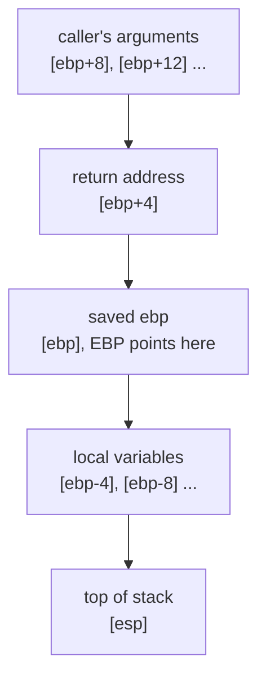
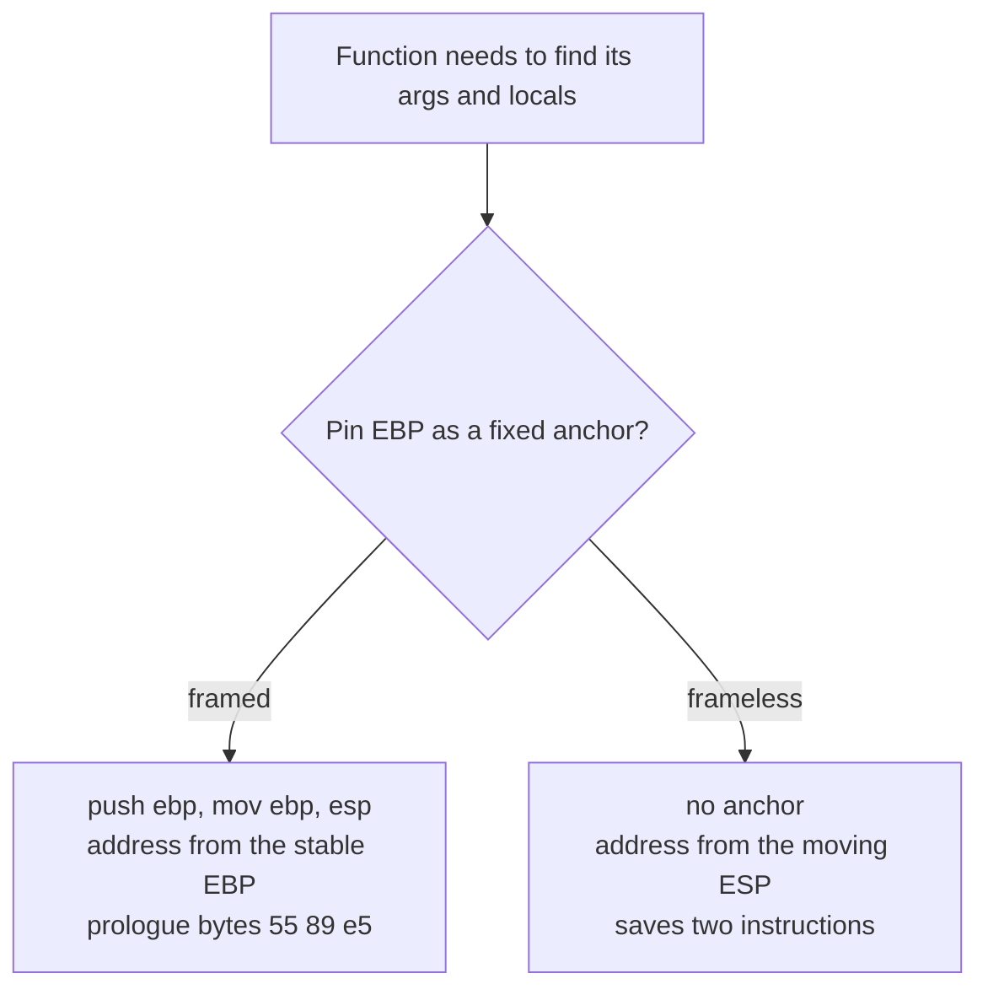

# Stack frames: framed vs frameless

A stack frame is the bookkeeping a function uses to find its arguments and locals on
the stack. This page covers what a frame is, why some functions have one and some
don't, and how that split held up our matching for a while. The short version is that
a framed function pins a register as a fixed reference point, and a frameless one goes
without and does the sums itself.

This one comes up constantly, so it's worth getting comfortable with.

## The stack

When a program runs, it needs somewhere to put temporary things: the arguments
passed into a function, its local variables, and bits of saved state. That
somewhere is the **stack**, a region of memory that grows and shrinks as functions
call each other.

There's a CPU register called [**ESP**](cpu-basics.md), the stack pointer, that
always points at the current top of the stack. A register is just a tiny, extremely
fast storage slot inside the CPU itself. The x86 chip this game runs on has a
handful of them, with names like EAX, EBX, ECX, EDX, ESI, EDI, EBP, and ESP. The
[CPU basics](cpu-basics.md) page has the full list and what each one is for.

The catch is that ESP moves around while a function runs. Every time the function
stashes something on the stack, ESP shifts. So if the function wants to reach
"argument number two", its position relative to ESP keeps changing. That's awkward
to keep track of.

## What a frame is

A **stack frame** is a fix for that awkwardness. At the very start, the function
grabs a second register, [**EBP**](cpu-basics.md) (the base pointer), and pins it to
the stack position at that moment:

```
push ebp        ; save whatever the caller had in EBP
mov ebp, esp    ; point EBP at the current top of the stack
... do the work ...
pop ebp         ; restore the caller's EBP
ret             ; return
```

Now EBP doesn't move for the whole function, even as ESP shifts around. So the
function can reach everything relative to EBP: argument two is always "EBP plus 8",
a local is "EBP minus 4", and so on. Stable and easy.

The frame is a slice of the stack, laid out from the caller's arguments at the top
down to the working area at the bottom, with EBP pinned in the middle:



That opening pair, `push ebp; mov ebp, esp`, is the **prologue**, and the closing
`pop ebp; ret` is the **epilogue**. In raw bytes the prologue is always `55 89 e5`,
which is why you'll see that number treated as a fingerprint.

A good way to picture it: framed is like hammering a stake into the ground at the
corner of your worksite and measuring everything from the stake. It's a bit of
setup, but then every measurement is easy.

## Frameless

A **frameless** function skips the stake. It addresses everything relative to the
moving ESP directly and just does the extra arithmetic itself. It saves two
instructions and frees up the EBP register, at the cost of slightly more
bookkeeping inside. Measuring from wherever you happen to be standing, rather than
from a stake, and doing the sums in your head.

So the two styles are a fork on one decision, whether to pin EBP as a fixed anchor
or work from the moving ESP:



The game's compiler was aggressive about this, so *most* of the game's functions
are frameless. Only a minority have a frame.

## Why this mattered for us

The two styles need different instructions, so we have to reproduce whichever one
the original used. For a while a whole class of framed functions refused to match,
and we thought they were impossible. The real cause turned out to be a compiler
flag. We were asking the compiler for frames in a slightly too-forceful way
(`-of+`), which added one extra instruction the original doesn't have. Asking more
gently (`-of`) produced the exact frame. A one-character difference in a flag
unblocked dozens of functions.

When a function won't match, the difference is real and specific, and finding it is
the whole job. See [compiler flags](compiler-flags.md) for more on that.
