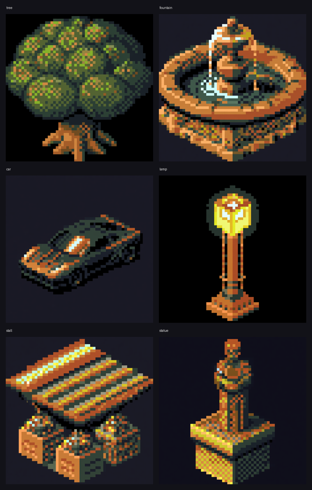
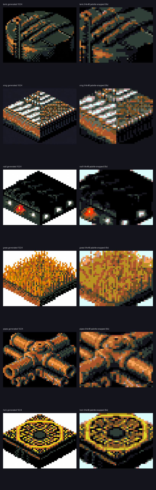
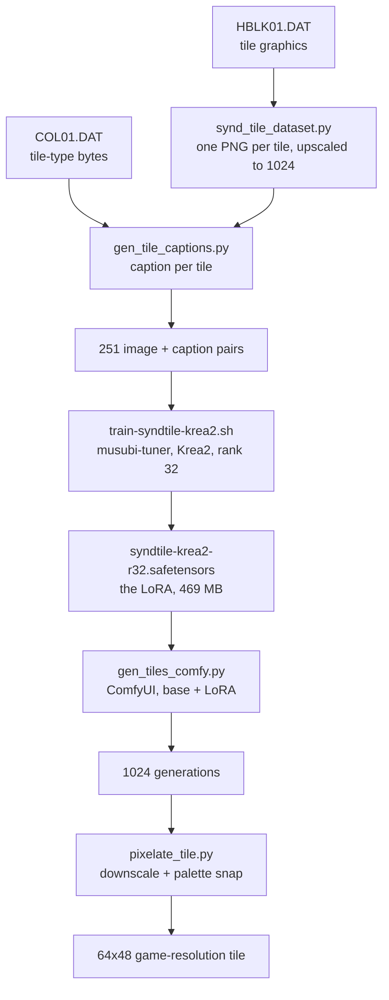

# A LoRA that draws new Syndicate tiles

This is a side experiment, not part of the game. We trained a small image model on the game's own map tiles so it can draw new ones in the same style. Ask it for a tree or a fountain and it gives you back something that looks like it belongs in Syndicate: the same isometric shape, the same dark palette, the same chunky pixels.

Nothing here touches the decompilation or ships in the game. It's a proof that the extracted art is good enough to teach a model, and a note on how it was done so we can pick it up later.

The trained weights aren't in the repo yet. They're a 469 MB file, so if we commit them they'll go in Git LFS. For now this page keeps the method and the results.

## What it does

The game's terrain is built from 251 distinct 64x48 tiles: roads, walls, rooftops, grass, pipes, fences. We pulled them out of `HBLK01.DAT`, described each one, and trained a LoRA (a small style adapter) on top of Krea2, a Qwen-Image model.

The trained adapter carries the look. At generation time you load the base model, add the adapter, and prompt for whatever you want. The model has never seen a tree, but it knows what a Syndicate tile looks like, so it draws the tree as one.

Here are six subjects the tileset doesn't contain, drawn by the LoRA:



These are the raw 1024-pixel generations. A real game tile is 64x48, so a post-process brings them down to size and snaps every pixel to the game's 16-colour palette. That step suits chunky subjects better than fussy ones, a fountain loses detail at 64x48, a wall or a road holds up fine.



## How it fits together



## Building the dataset

`tools/synd_tile_dataset.py` exports each non-empty tile as its own PNG. The tiles are tiny, so it upscales them with nearest-neighbour to 1024x768. That keeps the pixel edges hard through the model's VAE, which would otherwise blur a 64x48 image into mush.

`tools/gen_tile_captions.py` writes a caption for each tile. A caption is four parts:

- The trigger phrase, `syndtile isometric pixel-art tile`. This is the handle you type to summon the style.
- A visual description, written by eye from the tile art, for example "a tall cylindrical metal fuel storage tank with a vent pole".
- A gameplay function, read from `COL01.DAT`. That file holds one type byte per tile, so the model learns that this tile is a wall, that one is walkable ground, another is a rooftop you walk behind. See [the object model](object-model.md) for the tile-type list.
- A fixed style tail, `dark dystopian city, retro dos-game pixel art`.

The function tag is what lets you steer by role later, "solid wall" versus "walkable ground" versus "rooftop, upper z-layer".

## Training

Training runs on [musubi-tuner](https://github.com/kohya-ss/musubi-tuner) against Krea2. The launcher is `tools/lora/train-syndtile-krea2.sh` and the dataset config is `tools/lora/config-syndtile-krea2.toml`.

It's three steps: cache the VAE latents, cache the text-encoder outputs, then train. The run is rank 32, 2000 steps, saving a checkpoint every 250. On a 24 GB card the full run took about three and a quarter hours. The base model is 26 GB so it's loaded in fp8 to fit, and the final loss settled around 0.024.

One gotcha: a 1024 run can edge-deadlock near the end on a 24 GB card. If it does, drop the resolution to 896 in the config. This run finished 1024 clean.

## Generating

`tools/lora/gen_tiles_comfy.py` drives a running ComfyUI through its API. It builds the graph, base model in fp8, the `krea2` CLIP type, the LoRA at full strength, and queues one job per prompt.

```
python3 tools/lora/gen_tiles_comfy.py \
  "a large leafy tree with a thick trunk" \
  "an ornate stone water fountain" \
  --prefix mytest --seed 1111
```

Settings that worked: 28 steps, cfg 4.0, shift 3.1, euler with the simple scheduler. The style transfers strongly. Object coherence is the variable, a prompt that names a clear silhouette (a crossing, a lamp, a car) resolves into a clean tile, a vaguer one drifts towards texture. Naming the shape and picking the best of a few seeds covers most of it.

## The palette snap

`tools/pixelate_tile.py` turns a generation into a game-resolution tile. It area-averages the image down to 64x48, then snaps every pixel to the 16 colours the tiles actually use, which strips off-scheme noise. It can key a flat background out to transparency too.

```
python3 tools/pixelate_tile.py in.png out.png --bg 26,26,38 --scale 8
```

Two things to know. Background keying is unreliable on very dark tiles, because near-black tile pixels land on the same palette index as the keyed background, so they vanish too. Generating on a chroma key that can't collide, magenta, say, would fix that. And fine detail doesn't survive 64x48, so the technique favours bold shapes over intricate ones.

## Reproducing it

Everything except the trained weights and the copyrighted source art is in the repo:

- `tools/synd_tile_dataset.py`: export tiles as training images.
- `tools/gen_tile_captions.py`: write the captions.
- `tools/lora/config-syndtile-krea2.toml`: dataset config.
- `tools/lora/train-syndtile-krea2.sh`: the training run.
- `tools/lora/gen_tiles_comfy.py`: generate through ComfyUI.
- `tools/pixelate_tile.py`: downscale and palette-snap.

The tile art itself is Bullfrog's and never goes in the repo. Extract it from your own copy of the game with the tools above. The trained `.safetensors` will go in Git LFS if and when we decide to commit it.
